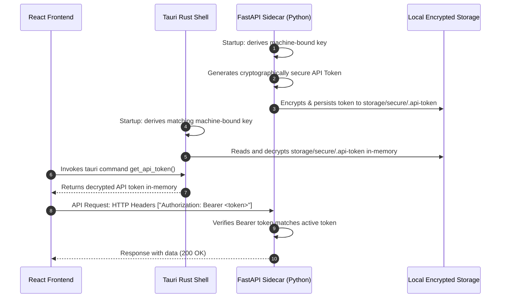

# AI-2D-Checker Security & Infrastructure Architecture

This document describes the security protocols, storage systems, database integrations, and logging structures implemented in **Phase 2** of the AI-2D-Checker enterprise monorepo.

---

## 🛡️ 1. Security & Authentication Flow

AI-2D-Checker employs a local-first, loopback-only isolation security model, ensuring that the standalone Python sidecar is fully private and untrusted web agents cannot compromise local resources.



### Key Pillars:
1. **Loopback Binding Isolation**: The sidecar strictly binds to a local loopback interface (`127.0.0.1` or `localhost`). Any incoming requests containing external Host headers are immediately rejected with `403 Forbidden`.
2. **Dynamic In-Memory Token Authentication**: On every startup, a random 256-bit authentication token is generated. No static tokens are used.
3. **No Plaintext Secrets on Disk**: The dynamic token is encrypted using **AES-256-GCM** before being written to `storage/secure/.api-token`.
4. **Machine-Bound Key Derivation**: Both the Rust desktop shell and Python sidecar dynamically derive the *identical* 256-bit encryption key by hashing system environment markers (`COMPUTERNAME`, `USERNAME`, OS). The key itself is never written to disk, preventing compromise from physical file access.

---

## 🔒 2. Dual-Layer Path Traversal Protection

All filesystem-related operations are strictly validated using a zero-trust model implemented in both **Rust** (desktop shell) and **Python** (FastAPI sidecar).

1. **Sandboxed Root Enforcement**: A storage root directory is defined at startup. All files must resolve strictly within this folder.
2. **Canonical Resolution**: Paths are resolved to their absolute canonical format (`Path.resolve()` / `fs::canonicalize()`), resolving all relative operators (`../`, `./`) and symbolic link escapes.
3. **Prefix Validation**: The resolved absolute path must strictly start with the prefix of the canonical storage root directory.
4. **Lexical Filtering**: Immediate rejection of any path arguments containing the `..` traversal operator string sequence.

---

## 💾 3. MongoDB & Beanie ODM Architecture

The database integration has been hardened to support robust offline-first operations.

- **ODM Engine**: `Beanie` paired with standard asynchronous `Motor` driver.
- **Failover Mode**: If the local MongoDB server is offline, the backend does *not* crash; instead, it boots into **offline/disconnected fallback mode**, allowing the user to configure settings or review static items while logging diagnostic failures.
- **Bootstrapping**: Upon connection, Beanie maps standard typed models:
  - Drawing
  - AuditResult
  - Comparison
  - Report
  - Standard
- **Automatic Indexing**: Bootstrapping programmatically inspects and creates performance/uniqueness indexes on startup, such as unique SHA-256 hashes on drawings to block duplicate uploads.

---

## 📁 4. Local Storage Hierarchy

```text
storage/
├── secure/                   # 🔑 Encrypted local tokens and config keys
│   └── .api-token            # AES-256-GCM encrypted dynamic sidecar token
├── uploads/                  # 📤 Temporary uploaded CAD engineering drawings
├── cache/                    # ⚡ Cached drawing segments and image tiles
├── temp/                     # ⏳ Transient files (converted dxf, overlays)
├── quarantine/               # ☣️ Quarantined files failing traversal/malware check
├── reports/                  # 📊 Offline generated audit PDF reports
└── logs/                     # 📝 Rotated application logs
    ├── backend/
    │   └── backend.log       # Rotated structured JSON API logs
    └── app/
        └── app.log           # Rust shell logs and persistent panic logs
```

---

## 📝 5. Hardened Logging Subsystem

Both front-end, sidecar, and Rust desktop layers feed into a consistent logging paradigm:

1. **Rotating File Handlers**: The Python backend rotates logs at `5MB` size bounds, retaining up to 5 historical log backups.
2. **Correlation ID Tracking**: Middleware generates a unique `X-Correlation-ID` UUID for every request. Using `contextvars`, all sub-routines (database, storage, encryption) automatically tag logs with the corresponding request ID to ease concurrent troubleshooting.
3. **Structured JSON Logging**: Production backend logs are generated as clean serialized JSON objects for clean integration with external analysis tools.
4. **Rust Panic Logging Hook**: A global panic catcher interceptor intercepts any native Rust shell crashes, formatting and appending diagnostics directly to `storage/logs/app/app.log`.
5. **Automatic Secret Redaction**: Both Rust and Python logging wrappers run regex-based scrubbing to replace sensitive API Keys (`GEMINI_API_KEY`) and bearer auth tokens (`API_TOKEN`) with mask sequences (`********`).
