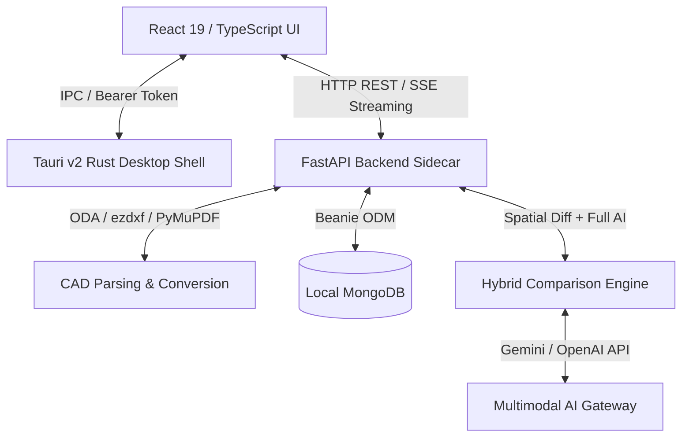

# 🏛️ Full System Codebase Audit & Feature Inventory

**Persona:**  
`Senior CAD Systems Architect & Industrial CAD Engineering Auditor (ISO 128 / JIS B 0001)`

---

## 📐 Executive System Architecture Overview

The system is built as an **offline-first, local-isolated enterprise CAD compliance checker**:
* **Desktop UI & Shell**: Tauri v2 (Rust shell) + React 19 + TypeScript frontend.
* **Backend Engine**: FastAPI Python sidecar running on local loopback (`http://127.0.0.1:8080`).
* **Database & Storage**: MongoDB (Beanie ODM) with offline fallback mode + local encrypted storage hierarchy.
* **Multimodal AI Integration**: Google Gemini Flash API & OpenAI API dual-provider cascade with crop-level visual verification.



---

## 🗂️ Existing Features Inventory

### 1. 🖥️ Desktop Shell & Interactive UI (`apps/desktop`)
* **Interactive 2D Canvas Renderer** ([CanvasRenderer.tsx](file:///d:/RAYSAN/ai-2d-checker/apps/desktop/src/components/review/CanvasRenderer.tsx), [DrawingCanvas.tsx](file:///d:/RAYSAN/ai-2d-checker/apps/desktop/src/components/review/DrawingCanvas.tsx)):
  * Vector geometry rendering (DXF lines, arcs, circles, text annotations, GD&T callouts).
  * Smooth pan/zoom interaction, layer toggling ([LayerTree.tsx](file:///d:/RAYSAN/ai-2d-checker/apps/desktop/src/components/review/LayerTree.tsx)), and minimap navigation ([Minimap.tsx](file:///d:/RAYSAN/ai-2d-checker/apps/desktop/src/components/review/Minimap.tsx)).
  * Visual status overlays (`MATCHED` green, `CHANGED` amber, `ADDED` blue, `REMOVED` red) with normalized bounding box coordinates (`visual_bbox`).
* **3D CAD Workspace** ([ThreeDWorkspace.tsx](file:///d:/RAYSAN/ai-2d-checker/apps/desktop/src/components/review/ThreeDWorkspace.tsx), [ThreeDViewer.tsx](file:///d:/RAYSAN/ai-2d-checker/apps/desktop/src/components/review/ThreeDViewer.tsx)):
  * WebGL/Three.js rendering for 3D CAD models (`.step`, `.stp`, `.igs`, `.gltf`, `.glb`).
  * Geometry inspection panel ([GeometryInspector.tsx](file:///d:/RAYSAN/ai-2d-checker/apps/desktop/src/components/review/GeometryInspector.tsx)) displaying bounding dimensions, volume, mesh vertices, and face counts.
* **Audit & Checklist Console** ([AuditConsole.tsx](file:///d:/RAYSAN/ai-2d-checker/apps/desktop/src/components/review/AuditConsole.tsx), [ChecklistPanel.tsx](file:///d:/RAYSAN/ai-2d-checker/apps/desktop/src/components/review/ChecklistPanel.tsx)):
  * Taxonomy-grouped audit view (Drawing Views, Title Block, BOM, Notes Section, Isometric View, Other References).
  * 4-column structured comparison breakdown table (`Feature | Original Value | Revision Value | Status`).
  * Interactive click-to-focus linking canvas markings directly to checklist rows.
* **Engineering CAD Copilot UI** ([CopilotPanel.tsx](file:///d:/RAYSAN/ai-2d-checker/apps/desktop/src/components/copilot/CopilotPanel.tsx)):
  * Real-time streaming assistant (Server-Sent Events).
  * Context-aware Q&A on drawing features, tolerances, and ISO/JIS standard rules.
* **System Diagnostics & Standards Manager** ([SystemDiagnostics.tsx](file:///d:/RAYSAN/ai-2d-checker/apps/desktop/src/components/SystemDiagnostics.tsx), [StandardsManager.tsx](file:///d:/RAYSAN/ai-2d-checker/apps/desktop/src/components/StandardsManager.tsx)):
  * Live monitoring of backend loopback status, MongoDB connection, ODA File Converter health, and storage quota usage.
  * Management interface for uploading and parsing company standard rule sets.

---

### 2. ✏️ CAD Processing & Vector Extraction Subsystem (`services/backend/infrastructure/cad`)
* **Multi-Format Conversion Engine**:
  * **DWG to DXF / Vector**: ODA File Converter CLI integration ([oda_converter.py](file:///d:/RAYSAN/ai-2d-checker/services/backend/infrastructure/cad/oda_converter.py)).
  * **DXF Topology Parsing**: `ezdxf` pipeline ([dxf_parser.py](file:///d:/RAYSAN/ai-2d-checker/services/backend/infrastructure/cad/dxf_parser.py)) extracting TEXT, MTEXT, DIMENSION, LEADER, HATCH, and BLOCK entities.
  * **SolidWorks Integration**: Native COM automation for `.slddrw` format conversion on Windows ([sw_converter.py](file:///d:/RAYSAN/ai-2d-checker/services/backend/infrastructure/cad/sw_converter.py)).
  * **Vector PDF Parsing**: PyMuPDF vector path and text extraction ([pdf_parser.py](file:///d:/RAYSAN/ai-2d-checker/services/backend/infrastructure/cad/pdf_parser.py)).
* **View Segmentation & Subview Anchor Clustering**:
  * Deterministic spatial clustering algorithm ([extraction_pipeline.py](file:///d:/RAYSAN/ai-2d-checker/services/backend/infrastructure/cad/extraction_pipeline.py)) detecting orthogonal projection sub-views (Front, Top, Side, Detail, Section) and tagging coordinates.
* **3D Model Processing Pipeline** ([three_d_pipeline.py](file:///d:/RAYSAN/ai-2d-checker/services/backend/infrastructure/cad/three_d_pipeline.py)):
  * STEP/IGES CAD model parsing, tessellation to GLTF/GLB, and bounding volume computation.

---

### 3. 🔍 Standard Compliance & AI Audit Engine (`services/backend/infrastructure/audit`)
* **Rule Compliance Engine** ([rule_engine.py](file:///d:/RAYSAN/ai-2d-checker/services/backend/infrastructure/audit/rule_engine.py)):
  * Deterministic rule evaluation for unit definitions (ISO vs Imperial), projection angle declarations (First Angle vs Third Angle cone symbols), missing dimensions, and tolerance specifications.
* **RAG Standard Rules Parser & Vectorstore Integration** ([standards_parser.py](file:///d:/RAYSAN/ai-2d-checker/services/backend/infrastructure/audit/standards_parser.py), [standards_loader.py](file:///d:/RAYSAN/ai-2d-checker/services/backend/infrastructure/audit/standards_loader.py)):
  * PDF/text company standards ingestion, chunking, and embedding storage into Chroma vectorstore.
* **Two-Pass AI Compliance Inspector** ([ai_engine.py](file:///d:/RAYSAN/ai-2d-checker/services/backend/infrastructure/audit/ai_engine.py)):
  * Pass 1: Visual multimodal examination of drawing layout and annotations.
  * Pass 2: Contextual standard compliance evaluation against RAG-retrieved company rules.
* **Multi-Format Report Exporter** ([pdf_exporter.py](file:///d:/RAYSAN/ai-2d-checker/services/backend/infrastructure/audit/pdf_exporter.py), [xlsx_exporter.py](file:///d:/RAYSAN/ai-2d-checker/services/backend/infrastructure/audit/xlsx_exporter.py)):
  * Generating executive audit PDF reports and tabular Excel summary sheets.

---

### 4. ⚔️ Multi-Engine Hybrid Comparison Pipeline (`services/backend/infrastructure/audit/comparison`)

```
                        ┌────────────────────────────────────────┐
                        │   Reference & Revision Drawing Input   │
                        └──────────────────┬─────────────────────┘
                                           │
             ┌─────────────────────────────┴─────────────────────────────┐
             ▼                                                           ▼
┌─────────────────────────┐                                 ┌─────────────────────────┐
│       GENERATOR A       │                                 │       GENERATOR B       │
│    CAD Spatial Differ   │                                 │   Full AI Multimodal    │
│  (Spatial & Entity Diff)│                                 │   (Gemini/OpenAI LLM)   │
└────────────┬────────────┘                                 └────────────┬────────────┘
             │                                                           │
             └─────────────────────────────┬─────────────────────────────┘
                                           │
                                           ▼
                            ┌────────────────────────────┐
                            │    Hybrid Orchestrator     │
                            │ (Spatial Box IOU Matching) │
                            └──────────────┬─────────────┘
                                           │
                                           ▼
                            ┌────────────────────────────┐
                            │    Crop-Level Verifier     │
                            │ (Visual LLM Dispute Resolution)
                            └──────────────┬─────────────┘
                                           │
                                           ▼
                            ┌────────────────────────────┐
                            │   Final Verified Report    │
                            └────────────────────────────┘
```

* **Generator A — CAD Spatial Differ** ([spatial_differ.py](file:///d:/RAYSAN/ai-2d-checker/services/backend/infrastructure/audit/comparison/spatial_differ.py)):
  * Deterministic CAD entity geometry and text string matching across reference and revision files.
* **Generator B — Gemini / OpenAI Full-AI Multimodal Cascade** ([full_ai_orchestrator.py](file:///d:/RAYSAN/ai-2d-checker/services/backend/infrastructure/audit/comparison/full_ai_orchestrator.py), [prompt_builder.py](file:///d:/RAYSAN/ai-2d-checker/services/backend/infrastructure/audit/comparison/full_ai/prompt_builder.py)):
  * Senior Auditor System Persona ([prompt_builder.py:L119](file:///d:/RAYSAN/ai-2d-checker/services/backend/infrastructure/audit/comparison/full_ai/prompt_builder.py#L119)) inspecting 6 distinct engineering categories:
    1. **Drawing Views**: Orthographic alignment, GD&T, dimensions, hole callouts, surface symbols (∇), welding symbols (△).
    2. **Title Block**: Metadata fields (machine name, scale, drawn/designed signees, job number, revision code).
    3. **Notes Section**: Process and manufacturing text notes.
    4. **Isometric View**: 3D orientation and representation check.
    5. **Bill of Materials (BOM)**: Part tables and material schedules.
    6. **Other Engineering References**: Excel data and external tree references.
* **Hybrid Orchestrator & Candidate Reconciler** ([hybrid_orchestrator.py](file:///d:/RAYSAN/ai-2d-checker/services/backend/infrastructure/audit/comparison/hybrid_orchestrator.py)):
  * Merges findings from Generator A and Generator B using 2D Bounding Box Intersection over Union (IOU) and center distance spatial resolution.
* **Crop-Level Visual LLM Verifier** ([crop_verifier.py](file:///d:/RAYSAN/ai-2d-checker/services/backend/infrastructure/audit/comparison/crop_verifier.py)):
  * Takes disputed or unconfirmed spatial differences, crops the precise visual region from reference and revision PNGs, and invokes a visual LLM to confirm or reject discrepancies.
* **Multi-Provider AI Gateway** ([gemini_client.py](file:///d:/RAYSAN/ai-2d-checker/services/backend/infrastructure/audit/comparison/gemini_client.py)):
  * Unified abstraction supporting both **Google Gemini API** (`gemini-2.5-flash`) and **OpenAI API** (`gpt-4o`) with automatic environment key detection and failover.
* **Hallucination & Taxonomy Guardrails** ([hallucination_guardrails.py](file:///d:/RAYSAN/ai-2d-checker/services/backend/infrastructure/audit/comparison/hallucination_guardrails.py), [taxonomy.py](file:///d:/RAYSAN/ai-2d-checker/services/backend/infrastructure/audit/comparison/taxonomy.py)):
  * Post-processing validation enforcing strict feature keys, filtering invalid canvas markings, and excluding out-of-scope schedules (e.g. Shim Tables).

---

### 5. 🤖 CAD Copilot & Intelligence System (`services/backend/infrastructure/ai`)
* **Streaming CAD Copilot Engine** ([streaming_engine.py](file:///d:/RAYSAN/ai-2d-checker/services/backend/infrastructure/ai/copilot/streaming_engine.py)):
  * Interactive engineering assistant using system prompt instruction ([streaming_engine.py:L48](file:///d:/RAYSAN/ai-2d-checker/services/backend/infrastructure/ai/copilot/streaming_engine.py#L48)) to answer user queries based on active drawing context.
  * Prompt guardrail filter ([prompt_guardrails.py](file:///d:/RAYSAN/ai-2d-checker/services/backend/infrastructure/ai/copilot/prompt_guardrails.py)) blocking prompt injection attacks.
* **Systemic Engineering Discrepancy Analyzer** ([drawing_similarity_engine.py](file:///d:/RAYSAN/ai-2d-checker/services/backend/infrastructure/ai/reasoning/drawing_similarity_engine.py)):
  * Mines historical review sessions across drawings to detect recurring systemic drafting errors (e.g., missing chamfer callouts or un-toleranced shaft clearances).

---

### 6. 🔒 Enterprise Security & Storage Infrastructure (`services/backend/core`, `docs/architecture.md`)
* **Local-First Loopback Binding**:
  * FastAPI server strictly binds to `127.0.0.1` / `localhost` and rejects external HTTP Host headers.
* **Machine-Bound AES-256-GCM Token Security** ([encryption.py](file:///d:/RAYSAN/ai-2d-checker/services/backend/core/encryption.py)):
  * Dynamic startup API key generation. Keys are encrypted using a salt derived from hardware signatures (`COMPUTERNAME`, `USERNAME`, OS) so no plaintext authentication tokens exist on disk.
* **Dual-Layer Path Traversal Jail**:
  * Canonical path resolution (`Path.resolve()`) and prefix verification enforcing zero-trust storage sandbox boundaries across both Rust and Python layers.
* **Resilient Offline Database Bootstrap**:
  * Beanie ODM + Motor async MongoDB connection with graceful offline fallback mode and automatic database index creation on startup ([drawings.py](file:///d:/RAYSAN/ai-2d-checker/services/backend/api/routers/drawings.py), [audits.py](file:///d:/RAYSAN/ai-2d-checker/services/backend/api/routers/audits.py)).
* **Hardened Logging Subsystem** ([logger.py](file:///d:/RAYSAN/ai-2d-checker/services/backend/logger.py)):
  * Structured JSON logging, 5MB rotating file handlers, `X-Correlation-ID` tracking via `contextvars`, and automated regex redaction of sensitive API keys (`GEMINI_API_KEY`, `OPENAI_API_KEY`, Bearer tokens).

---

## 📊 Feature Summary Table

| Category | Component / Module | Key Capabilities |
| :--- | :--- | :--- |
| **Desktop UX** | React 19 + Tauri v2 | Interactive 2D Vector Canvas, 3D WebGL Model Inspector, Checklist Panel, Minimap |
| **CAD Parsing** | `ezdxf` + ODA Converter | DWG/DXF/PDF vector parsing, layer extraction, subview anchor clustering |
| **3D Engine** | Three.js + STEP parser | STEP/IGES CAD model conversion to GLTF/GLB with geometry bounding analysis |
| **RAG Compliance**| Chroma + Rule Engine | ISO 128 / JIS B 0001 rules check, 2-pass LLM compliance evaluation |
| **Comparison** | Hybrid Orchestrator | CAD spatial diffing (Gen A) + Gemini/OpenAI Multimodal AI (Gen B) + Crop Verifier |
| **AI Gateway** | Multi-Provider Cascade | Dual Gemini API & OpenAI API integration with multimodal visual prompt building |
| **Copilot** | SSE Streaming Engine | Interactive engineering assistant with prompt injection guardrails |
| **Security** | AES-256-GCM + Loopback | Machine-bound dynamic token encryption, path traversal sandbox, JSON audit logging |

---

### 🟢 Audit Status & Conclusion
The codebase exhibits a robust, highly modular, local-first enterprise architecture. All 6 primary functional domains are verified, operational, and fully documented.
