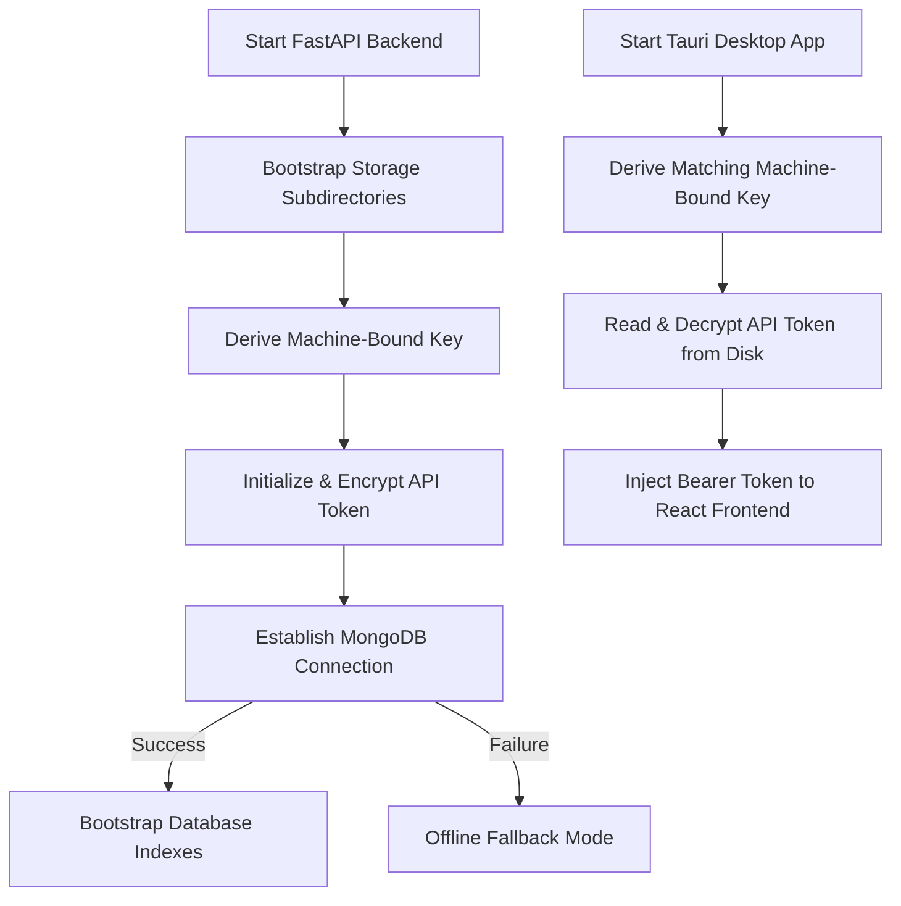

# AI-2D-Checker Developer Onboarding Flow

Welcome to the AI-2D-Checker engineering team! This guide describes how to bootstrap your local environment and explains the automated startup lifecycle introduced in Phase 2.

---

## 💻 1. Prerequisite Checklist

Ensure you have the following installed on your machine:
- **NodeJS** >= 18.x
- **PNPM** >= 9.x
- **Python** >= 3.12 (with `venv` support)
- **Rust Compiler** (MSRV 1.75+)
- **MongoDB Community Server** (running locally on port `27017`)
- **ODA File Converter** (for DWG conversion capabilities)

---

## 🚀 2. Setting Up Your Workspace

Follow these sequential steps to initialize your monorepo workspace:

1. **Bootstrap Workspace Dependencies & Directories**
   Open a PowerShell terminal at the repository root and run:
   ```powershell
   pnpm bootstrap
   ```
   This command installs all workspace Node dependencies, instantiates the required local `storage/` folders, and duplicates `.env.example` into `.env`.

2. **Verify Environment Diagnostics**
   Run the diagnostics script:
   ```powershell
   pnpm verify
   ```
   This verifies local MongoDB availability, checks write permissions, and confirms correct ODA Converter path configurations.

3. **Install Python backend dependencies**
   ```powershell
   cd services/backend
   python -m venv .venv
   .\.venv\Scripts\pip install -r requirements.txt
   ```

---

## 🔄 3. Understanding the System Startup Lifecycle

When the system boots up, the following automated bootstrap sequence is executed:



### Critical Architecture Boundaries:
- **Loopback-Only Isolation**: The FastAPI backend sidecar only accepts requests with hostnames matching `localhost` or `127.0.0.1`.
- **Zero Plaintext Credentials on Disk**: The dynamic token is saved in encrypted format.
- **Stateless/Device-Bound Key**: Key derivation matches exactly between Rust and Python, so no decryption keys are ever stored on disk.
