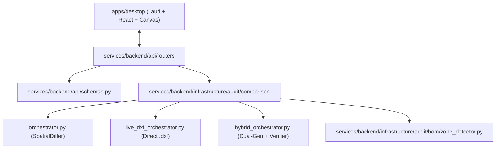

# 🧭 AI Agent Navigation & System Gap Analysis

> **DIRECTIVE FOR ALL AI AGENTS**:
> Every concept, schema, and rule in this Second Brain vault is derived directly from verified source files in `ai-2d-checker`. Do NOT guess variable names, file paths, or system behaviors without inspecting the authoritative source files listed below.

> [!NOTE] About this note
> Until 2026-07-29 this file contained only the codebase map below, while its filename, the MOC
> and `CLAUDE.md` all promised a gap analysis. That analysis is now written here. The earlier
> phrase "the four V2 gaps" appears in `CLAUDE.md` and in a session handoff but **has no source
> in this vault** — no such list was ever written down. What follows is the state the evidence
> supports, not a reconstruction of that phrase.

---

## 📊 System Gap Analysis

### What is measured, and on what

All figures below come from the 4 DXFs in `storage/uploads`, re-measured **2026-07-29**.

> [!WARNING] The corpus is weaker than "4 drawings" sounds
> Entity counts are 508 / 508 / 562 / 562, and the two references produce *identical* zone boxes
> while the two revisions produce near-identical ones. It is effectively **two distinct layouts
> duplicated** — one customer, one drawing standard, two authoring toolchains (AutoCAD-native and
> SolidWorks-derived). Every spread number rests on n≈2. Treat conclusions from it as
> consistent-with-the-data, not established-by-it.

| Zone | Spread | Detected | Mean area |
| :--- | ---: | :--- | ---: |
| bom | 1.7pp | 4/4 | 2.7% |
| iso | 1.8pp | 2/4 (the two that have one) | 8.6% |
| views | 0.0pp † | 4/4 | 100.0% |
| notes | 11.3pp | 4/4 | 27.8% |
| tolerance | 11.3pp | 4/4 | 28.5% |
| title | 11.6pp | 4/4 | 21.0% |
| title_upper_left | 25.8pp | 4/4 | 6.0% |

† `views` is the sheet by definition, so it cannot vary. **That is not a stability measurement** —
the same trap as `iso`'s old 0.0pp reading. See [[Gotcha - Zone Detection Accuracy & Stability]].

`title_upper_left` at 25.8pp is a **corpus change, not a detector regression**: the spread is
bimodal between the two authoring toolchains, and the earlier 3.8pp figure was measured on a
different corpus. Comparing spread across corpora measures the corpora.

### What is reasoned but NOT measured

Flagged explicitly, because this vault's own directive is to keep the two apart:

- **Every heuristic constant is a judgement call.** The geometry differ's cluster and tolerance
  thresholds, the marking reconciler's four fuzzy-pass guards (calibrated against **one** observed
  case), the zone detector's `MIN_ISO_ELLIPSES` and `ISO_BLOCK_DOMINANCE`. None are measured optima.
- **The fixes have never run together end-to-end.** Each was verified in isolation against stored
  entities, several against pre-fix cached output. The combined effect on a live run is unknown.
- **The toolchain explanation for `title_upper_left`** is consistent with the data, not proven by it.

### ⛔ The gap that matters most: false negatives are unmeasured

Everything achieved so far reduces **false positives** — noise fell from roughly half of all
findings to a small remainder. **Nothing has ever measured whether the engine catches the changes
a human checker would flag.** There is no drawing pair with a known, deliberate change list to
score against. For an inspection tool that is the number that matters, and we do not have it.

Closing this gap needs **ground truth, not more code**.

> [!TIP] A plan now exists for this — 2026-08-05
> [[AI Maturity Ladder — Staged Plan]] makes closing this gap **Stage 0**, ahead of all other AI
> work, on the reasoning that every rung of the intended
> *Basic RAG → Fine-Tuned RAG → End-to-End Trainable → Agentic & Adaptive* ladder is defined by
> optimising against a metric that does not yet exist. Ground truth comes **mutation-first** (an
> `ezdxf` mutator injecting known changes into real DXFs, so recall is known by construction, plus
> a `null_mutation` operator whose truth is *zero findings* and so measures precision directly),
> with hand-labelled pairs as the held-out gate.
> Decisions: [[ADR-003 AI Maturity Ladder]]. Live status: [[00 - AI Maturity Status]].

### 🏛️ The four Self-Learning pillars — actual state

Documented in [[Self-Learning AI Engine & 4 Pillars]]. Verified 2026-07-29:

| Pillar | State | Test coverage |
| :--- | :--- | :--- |
| 1 — Vault→runtime sync | ✅ **Fixed 2026-07-29.** Was reading the entire vault and producing 36 markdown-blob "keywords"; now scoped to `08 - Client Domain & CAD Rules/` with fenced blocks stripped. 62 keywords → 18, injected prose → 0. | ✅ `tests/test_vault_sync_scope.py` (11 tests) |
| 2 — Feedback persistence | Unverified | ❌ test file **errors on collection** |
| 3 — Auto-doc rule induction | ✅ **Loop closed 2026-07-29.** Wrote `Learned_Rules_{client}.md` that nothing read back; `safe_filter` now consumes the patterns. | ✅ covered by the above |
| 4 — Few-shot memory | Unverified | ❌ test file **errors on collection** |

Pillars 2 and 4 are still documented as verified by tests in `services/backend/tests/`, which sits
outside `pyproject.toml`'s `testpaths = ["tests"]` and fails collection with
`ModuleNotFoundError: No module named 'infrastructure'`. **Those have never run.**

> [!IMPORTANT] Only `08 - Client Domain & CAD Rules/` is a runtime input
> Architecture notes, gotchas and ADRs are documentation *about* the system and must not steer it.
> Before the fix, writing a gotcha that quoted a Japanese anchor changed what the comparison engine
> excluded from comparison.

### 🧪 Test state (2026-07-29)

- Backend **444 passing** of 446 collected. Two known failures in `tests/test_vision_ocr_grounding.py`
  (`MockEntity` lacks a `layer` attribute).
- Frontend **135 passing** of 136. One known failure in `RoomsView.test.tsx` (asserts a literal
  colour that is now a CSS variable).
- Not counted: the three files in `services/backend/tests/` that cannot be collected at all.

---

## 🗺️ Codebase Architecture & File Mapping

---

## 📂 Codebase Source Inventory

### 1. Comparison & Audit Orchestrators
- **Deterministic RAG Engine**: [`services/backend/infrastructure/audit/comparison/orchestrator.py`](file:///d:/RAYSAN/ai-2d-checker/services/backend/infrastructure/audit/comparison/orchestrator.py)
  - `generate_deterministic_candidates()`: Runs SpatialDiffer & BOMAnalyzer end-to-end.
  - `safe_filter()`: Filters title block, BOM, and static General Tolerance tables (`指示外公差`, `12.5S ~ 50S`). Connected live to `VaultSyncManager`.
- **Self-Learning AI Engine & 4 Pillars**:
  - **Pillar 1 (Vault Sync)**: [`services/backend/infrastructure/knowledge/vault_sync.py`](file:///d:/RAYSAN/ai-2d-checker/services/backend/infrastructure/knowledge/vault_sync.py) (`VaultSyncManager`).
  - **Pillar 2 (Feedback Store)**: [`services/backend/domain/models/audit_feedback.py`](file:///d:/RAYSAN/ai-2d-checker/services/backend/domain/models/audit_feedback.py) (`AuditFeedbackDocument` & `POST /api/v1/audits/feedback`).
  - **Pillar 3 (Auto-Doc Engine)**: [`services/backend/infrastructure/knowledge/auto_doc.py`](file:///d:/RAYSAN/ai-2d-checker/services/backend/infrastructure/knowledge/auto_doc.py) (`AutoDocEngine`).
  - **Pillar 4 (Few-Shot RAG Memory)**: [`services/backend/infrastructure/audit/comparison/few_shot_retriever.py`](file:///d:/RAYSAN/ai-2d-checker/services/backend/infrastructure/audit/comparison/few_shot_retriever.py) (`FewShotRetriever`).
- **Hand-Aligned Editable Zone Template Resolver**: [`services/backend/infrastructure/audit/bom/zone_template_resolver.py`](file:///d:/RAYSAN/ai-2d-checker/services/backend/infrastructure/audit/bom/zone_template_resolver.py)
  - Resolves user-pinned `ZoneTemplateDocument` records from MongoDB, taking 100% priority over keyword fallbacks.

---

### 2. CAD Infrastructure & Zone Detection
- **Zone Bounding Box Segmentation**: [`services/backend/infrastructure/audit/bom/zone_detector.py`](file:///d:/RAYSAN/ai-2d-checker/services/backend/infrastructure/audit/bom/zone_detector.py)
  - Detects the 7 drawing zones: `title`, `title_upper_left`, `bom`, `tolerance`, `notes`, `iso`, and `views`.
  - Anchor definitions: `ZONE_ANCHORS` (includes `指示外公差`, `仕上精度`, `map`, `part no`).
- **ezdxf CAD Ingestion**: [`services/backend/infrastructure/cad/dxf_parser.py`](file:///d:/RAYSAN/ai-2d-checker/services/backend/infrastructure/cad/dxf_parser.py)
  - Decodes CP932 / Shift-JIS text.
- **AutoCAD Escape Code Transcoding**: [`services/backend/infrastructure/utils/text.py`](file:///d:/RAYSAN/ai-2d-checker/services/backend/infrastructure/utils/text.py)
  - `strip_mtext(..., convert_symbols=True)` transcodes `%%c` $\rightarrow$ `Ø`, `%%d` $\rightarrow$ `°`, `%%p` $\rightarrow$ `±`.

---

### 3. REST API Routers & DTO Schemas
- **Physical Comparison Endpoint**: `POST /api/v1/audits/physical-comparison` in [`services/backend/api/routers/audits.py`](file:///d:/RAYSAN/ai-2d-checker/services/backend/api/routers/audits.py)
- **Zone Bounding Box Endpoint**: `GET /api/v1/drawings/{id}/zones` in [`services/backend/api/routers/drawings.py`](file:///d:/RAYSAN/ai-2d-checker/services/backend/api/routers/drawings.py)
- **Data Models & Schemas**: [`services/backend/api/schemas.py`](file:///d:/RAYSAN/ai-2d-checker/services/backend/api/schemas.py)
  - `PhysicalComparisonRequest` (has `force_refresh: bool`)
  - `PhysicalComparisonResponse` (fixed-field Gemini schema safety)

---

### 4. Desktop Client & Canvas Rendering
- **Imperative HTML5 Canvas**: [`apps/desktop/src/components/review/DrawingCanvas.tsx`](file:///d:/RAYSAN/ai-2d-checker/apps/desktop/src/components/review/DrawingCanvas.tsx) & [`CanvasRenderer.tsx`](file:///d:/RAYSAN/ai-2d-checker/apps/desktop/src/components/review/CanvasRenderer.tsx)
  - Renders CAD vector entities, text annotations, and zone bounding box overlays.
  - ⚠ **This line was false when written (2026-07-29) and is true only from 2026-08-11.** The
    canvas defaulted to `renderMode: 'raster'` and displayed a server PNG; the HUD read
    `VIRTUALIZED: 0/518`. [[ADR-011 Vector as the Only Render Path]] deleted `renderMode` and the
    raster display path. Healthy HUD reading on M745221N01 is now **497/518**.
- **Coordinate Transformations**: [`apps/desktop/src/utils/coordinateTransform.ts`](file:///d:/RAYSAN/ai-2d-checker/apps/desktop/src/utils/coordinateTransform.ts)
  - `worldToScreen()` handles CAD Y-axis coordinate inversion.
- **Physical Comparison Hook**: [`apps/desktop/src/hooks/usePhysicalComparison.ts`](file:///d:/RAYSAN/ai-2d-checker/apps/desktop/src/hooks/usePhysicalComparison.ts)
  - Manages comparison requests and sends `force_refresh: forceRefresh`.

---

## 🔒 Strict Rules for AI Agents

1. **Schema Integrity**: Do NOT modify `PhysicalComparisonResponse` schema without verifying Gemini SDK compatibility (`response_schema` in `gemini_client.py`). Bare `dict` fields cause `400 INVALID_ARGUMENT` errors.
2. **Cache Hygiene**: Bumping comparison math or filter rules MUST be accompanied by a version increment to `COMPARISON_CACHE_VERSION` in [`cache_manager.py`](file:///d:/RAYSAN/ai-2d-checker/services/backend/infrastructure/audit/comparison/cache_manager.py).
3. **Reference Verification**: Any file link referenced in a note MUST use valid markdown links pointing to real files in the workspace (e.g. `[orchestrator.py](file:///d:/RAYSAN/ai-2d-checker/services/backend/infrastructure/audit/comparison/orchestrator.py)`).

---

## 🔗 Related Notes
- See [[00 - Map of Content (MOC)]]
- See [[ADR-002 Decoupled Zone Bounding Box Endpoint]]
- See [[Gotcha - Comparison Cache Invalidation]]
