# 🧠 AI-2D-Checker — Map of Content (MOC)

Welcome to the **Second Brain** knowledge base for **AI-2D-Checker**, a high-precision, AI-grounded 2D CAD drawing inspection and comparison platform.

> [!TIP] **"Second Brain" means this vault — and, as of 2026-08-10, nothing else.**
> It briefly also named a knowledge/retrieval subsystem for the standards-audit pipeline
> ([[ADR-008 The Second Brain — Retrieval-Only Local Knowledge]]). That subsystem is now the
> **standards knowledge track**, renamed by [[ADR-009 Retiring the Standards Knowledge Track]]
> because *"the Second Brain is retired"* read as *"this vault is retired"*. ADR-008 keeps its
> original title as a record of what was decided under what name; every working document uses the
> new one. If you find "Second Brain" anywhere outside this vault's own description, it is
> pre-rename text and it means the standards knowledge track.

> [!IMPORTANT]
> **AI AGENT DIRECTIVE**: If you are an AI assistant (Claude, Antigravity, ChatGPT, Cursor, Gemini), read [[00 - AI Agent Navigation & System Gap Analysis]] first before taking on architecture or coding tasks!
>
> **For any work on the comparison engines, retrieval, the learned model or the AI pipeline, also read [[00 - AI Maturity Status]] — and update it when you land.** It records which rung the system is actually on (currently **0 — pre-RAG**), what is done, and the single next action. A rung claim with no evidence link is a defect.

---

## 🗺️ Knowledge Base Structure

```mermaid
graph TD
    MOC["🏠 00 - Map of Content"]
    MOC --> Guide["🧭 00 - AI Agent Navigation & Gap Analysis"]
    MOC --> Status["📊 00 - AI Maturity Status"]
    MOC --> Arch["🏗️ 01 - Architecture"]
    MOC --> Engines["⚡ 02 - Audit Comparison Engines"]
    MOC --> CAD["📐 03 - CAD Infrastructure"]
    MOC --> Backend["🔌 04 - Backend API & Services"]
    MOC --> Frontend["🖥️ 05 - Desktop Frontend"]
    MOC --> Gotchas["🔥 06 - Gotchas & Debug Lessons"]
    MOC --> ADRs["🏗️ 07 - Architecture Decision Records"]
    MOC --> Domain["📐 08 - Client Domain & CAD Rules"]

    Status --> Ladder["[[AI Maturity Ladder — Staged Plan]]"]
    Status --> A3["[[ADR-003 AI Maturity Ladder]]"]

    Arch --> HITL["[[Continuous Learning & Human-in-the-Loop Feedback]]"]
    Arch --> Annot["[[Eval Corpus Annotation Guideline]]"]
    Arch --> RAnnot["[[Retrieval Annotation Guideline]]"]
    Arch --> R1["[[RAG Reference Architecture — Gap Analysis]]"]
    Arch --> SB1["[[Standards Knowledge — Staged Plan]]"]
    Arch --> SB2["[[Standards Knowledge — Rule Bundle Format]]"]

    Gotchas --> G1["[[Gotcha - Comparison Cache Invalidation]]"]
    Gotchas --> G2["[[Gotcha - AutoCAD Control Escape Codes]]"]
    Gotchas --> G3["[[Gotcha - Zone Detection Accuracy & Stability]]"]
    Gotchas --> G4["[[Gotcha - Zod Strips Unknown Room Fields]]"]
    Gotchas --> G5["[[Gotcha - Dropped ELLIPSE & SPLINE Geometry]]"]
    Gotchas --> G6["[[Gotcha - Reference and Revision in Different Coordinate Spaces]]"]
    Gotchas --> G7["[[Gotcha - The Differ Compared Text Only]]"]
    Gotchas --> G8["[[Gotcha - Full-Width Grid Labels Bridged Zones]]"]
    Gotchas --> G9["[[Gotcha - SCALE Field Read the Date Column]]"]
    Gotchas --> G10["[[Gotcha - Optional Zones and the Shim Table]]"]
    Gotchas --> G11["[[Gotcha - Unrelated Text Paired as CHANGED]]"]
    Gotchas --> G12["[[Gotcha - BOM Refer-To-Table Deferral Row]]"]
    Gotchas --> G13["[[Gotcha - Mislocated OCR Crop and Ungrounded Misreads]]"]
    Gotchas --> G14["[[Gotcha - Title Upper-Left Double-Reported by Scale]]"]
    Gotchas --> G15["[[Gotcha - Re-test and the Four Caches]]"]
    Gotchas --> G16["[[Gotcha - Learned Corrections Model and Post-Cache Inference]]"]
    Gotchas --> G17["[[Gotcha - Room-Owned Drawing Deletion]]"]
    Gotchas --> G18["[[Gotcha - Global Default Zone Template & the Aspect Caveat]]"]
    Gotchas --> G19["[[Gotcha - drawing_views Was the Residual, Not the Views Box]]"]
    Gotchas --> G20["[[Gotcha - Zone Template Pollution (Non-Zone Keys)]]"]
    Gotchas --> G21["[[Gotcha - Title Field Read Across a Ruled Cell Boundary]]"]
    Gotchas --> G22["[[Gotcha - Title Read the Drawing Number and Was Never Compared]]"]
    Gotchas --> G23["[[Gotcha - Fullwidth Callouts Were Never Classified]]"]
    Gotchas --> G24["[[Gotcha - Dimension Scoped by Its Span Midpoint]]"]
    Gotchas --> G25["[[Gotcha - Null Snapshot Features Are Not Degraded Labels]]"]
    Gotchas --> G26["[[Gotcha - Exploded Block Children Have No Handle]]"]
    Gotchas --> G27["[[Gotcha - Zone Templates Vanish in Offline Eval]]"]
    Gotchas --> G28["[[Gotcha - A Naive Mutator Manufactures Recall Misses]]"]
    Gotchas --> G29["[[Gotcha - The Scorer Is a Differ Too]]"]
    Gotchas --> G30["[[Gotcha - Moving an Artifact Broke Its Test Isolation]]"]
    Gotchas --> G31["[[Gotcha - The Corpus Borrowed Its OCR From a Volatile Cache]]"]
    Gotchas --> G32["[[Gotcha - Mutation Pairs Cannot Exercise a Spatial Constant]]"]
    Gotchas --> G33["[[Gotcha - Title Block QTY Reads the Upper-Left Table]]"]
    Gotchas --> G34["[[Gotcha - Drawing Number Segments Reported as Separate Fields]]"]
    Gotchas --> G35["[[Gotcha - The Views Overlay Showed a Region That Is Not Compared]]"]
    Gotchas --> G36["[[Gotcha - A Reshaped Zone Is Not Its Bounding Box]]"]
    Gotchas --> G37["[[Gotcha - A Window Listener in a Per-Pane Hook Fires Once Per Pane]]"]
    Gotchas --> G38["[[Gotcha - 3D DXF Ingestion Was Built and Removed]]"]
    Gotchas --> G39["[[Gotcha - Mutation Labels Predate the Zone Template]]"]
    Gotchas --> G40["[[Gotcha - A Reshaped Zone Was Flattened by the Template Round Trip]]"]
    Gotchas --> G41["[[Gotcha - One Click on Two Panes Recorded Two Undo Steps]]"]
    Gotchas --> G42["[[Gotcha - A Short Structured Value Suppresses Its Own Zone]]"]
    Gotchas --> G43["[[Gotcha - The Sweep Never Got the Zone Template Seam]]"]
    Gotchas --> G44["[[Gotcha - A Swallowed AttributeError Made a Write Path a Permanent No-Op]]"]
    Gotchas --> G48["[[Gotcha - A Tested Endpoint That Nothing Ever Called]]"]
    Gotchas --> G45["[[Gotcha - A Guard Test's Failure Path Had Never Run]]"]
    Gotchas --> G46["[[Gotcha - Our Own Punctuation Broke on the cp932 Console]]"]
    Gotchas --> G47["[[Gotcha - A Child Cannot Claim Its Own Line in a Nowrap Flex Row]]"]
    Gotchas --> G49["[[Gotcha - A Count You Could Not Take Is Not Evidence]]"]
    Gotchas --> G50["[[Gotcha - A Guard Clause Named an Exception the Library Stopped Raising]]"]
    Gotchas --> G51["[[Gotcha - The Cache Served Findings That Existed Nowhere]]"]
    Gotchas --> G52["[[Gotcha - A Standard That Ingested Nothing Reported Success]]"]

    ADRs --> A2["[[ADR-002 Decoupled Zone Bounding Box Endpoint]]"]
    ADRs --> A3b["[[ADR-003 AI Maturity Ladder]]"]
    ADRs --> A4["[[ADR-004 Deterministic-Only Scope]]"]
    ADRs --> A5["[[ADR-005 Local-Only Processing with Cloud Licensing]]"]
    ADRs --> A6["[[ADR-006 Removing the Three AI Comparison Methods]]"]
    ADRs --> A7["[[ADR-007 Re-scoping the Maturity Ladder]]"]
    ADRs --> A8["[[ADR-008 The Second Brain — Retrieval-Only Local Knowledge]]"]
    ADRs --> A9["[[ADR-009 Retiring the Standards Knowledge Track]]"]
    ADRs --> A10["[[ADR-010 Grounded LLM Summarization of Comparison Results]]"]
    ADRs --> A11["[[ADR-011 Vector as the Only Render Path]]"]

    Domain --> D1["[[Japanese CAD Title Block & Tolerance Standards]]"]
```

---

## 📚 Core Navigation

### 🧭 00 — AI Agent Onboarding & System Roadmap
- [[00 - AI Agent Navigation & System Gap Analysis]] — **Mandatory AI Agent Guide**: architectural gap analysis and strict agent guidelines. Its headline finding: **false negatives have never been measured.**
- [[00 - AI Maturity Status]] — **Mandatory before AI/comparison work, and mandatory to update after.** The living ledger: which rung the system is on (currently **0 — pre-RAG**), the stage board, the one next action, an append-only work log, and negative results. A rung claim without a `rung_evidence` link is a defect. **Also carries the copy-paste kickoff prompt for starting a new agent session** — one line for Claude Code, a full block for cold agents (Antigravity, Cursor, ChatGPT, Gemini).

### 🏗️ 01 — System Architecture
- [[System Overview]] — End-to-end architecture, technology stack, and container structure.
- [[Data Flow & Pipelines]] — Sequence of drawing ingestion, entity extraction, comparison, and reporting.
- [[Continuous Learning & Human-in-the-Loop Feedback]] — Active learning flywheel: human corrections $\rightarrow$ feedback store $\rightarrow$ few-shot prompt injection & deterministic rule induction.
- [[Editable Zone Box Template Resolution]] — Hand-aligned user-pinned zone box resolution taking 100% priority in orchestrator over keyword fallbacks.
- [[AI Maturity Ladder — Staged Plan]] — the staged plan from **pre-RAG → Basic RAG → Fine-Tuned RAG → End-to-End Trainable → Agentic & Adaptive**. Inserts a measurement substrate (Stage 0) and threshold calibration (Stage 0.5) ahead of all retrieval work, because every rung above zero is defined by optimising against a metric and none exists yet. Reachable to rung 3 with **zero new dependencies**.
- [[Eval Corpus Annotation Guideline]] — how a ground-truth label is defined: one-finding-vs-two by author intent, what is explicitly *not* a finding (safe zones, pure relocation, transcodings), NFKC normalisation rules, and held-out discipline. **Written before the first label, deliberately** — a corpus labelled under a shifting definition is worthless. **`status: active` since 2026-08-06 at `guideline_version: 2026-08-06`**, with its four open questions resolved: **ruled rows** (one finding per row when the rows carry independent facts, one for the whole value when they are segments of an identifier — descriptive of two existing bug fixes that went in *opposite* directions), **revision-table rows** (a new one is not a finding, a missing one is, an edited one is), **amendment/balloon categories** under a new general rule — *label by what the change is about, not where it is drawn* — and a **bulk** threshold marked explicitly as a convention rather than a finding. Promoted *before* the first label rather than after two, reversing its own plan: at 7 registered pairs and 0 labelled it cost nothing, while labelling under a draft would have meant re-labelling everything. **One resolution knowingly buys a systematic false positive** — the engine reports new revision rows today, so every human pair will show one, which is how an invisible product behaviour becomes a measured one. Bumping the version also exposed that **the guard blocked its own remedy**: every existing label went stale at once, and `mutate` could not load the corpus whose labels it was about to regenerate. `tools/eval_corpus.py` now loads tolerantly and *prints* what is stale; `tools/eval.py` keeps the strict check, which is the only place a stale label could corrupt a number.

- [[Retrieval Annotation Guideline]] — **dormant since 2026-08-10, and deliberately not retired ([[ADR-009 Retiring the Standards Knowledge Track]]): it now defines half the condition for reopening the track. Do not start labelling, and do not weaken a gate to make restarting easier.** — the R2 sibling of the above, for the **standards-audit** track: how a `(query → relevant chunk)` label is defined, and the rules that stop the resulting number being meaningless. **Queries must come from real audit situations, never from the corpus text** — a query written while looking at a chunk is a paraphrase of it, and retrieving it proves only that TF-IDF can find text it was handed a copy of. `provenance` (`human` | `synthetic`) is mandatory on every label, mirroring [[ADR-007 Re-scoping the Maturity Ladder]]'s exclusion of mutation pairs from rung-1 evidence, for the same circularity reason. **Unanswerable queries are recorded rather than force-matched**, because a corpus that cannot answer real questions is a coverage finding no recall number will ever surface. Opens with a warning to run the census first: as of 2026-08-07 the `standards` collection holds **zero documents**, so labelling would produce nothing but `unanswerable` entries. Explains the four gates — ≥30 queries, chance floor ≤0.25, lift ≥0.15, no synthetic labels — and why a `recall@5` of 1.00 over six documents is a chance score of 0.83 wearing a disguise.

### ⚡ 02 — Audit Comparison Engines
- [[Self-Learning AI Engine & 4 Pillars]] — Complete 4-pillar active learning implementation (Vault Sync, Feedback Persistence, Auto-Doc Engine, Few-Shot Prompt Memory).
- [[RAG Engine (Deterministic)]] — 100% offline, mathematical vector entity diffing (~30ms, $0.00 cost).
- [[AI Vision Engine (Live DXF)]] — Multimodal LLM inspection combined with direct disk `.dxf` entity manifests (~8–12s).
- [[RAG + AI Engine]] — Database-ingested structured CAD context paired with Gemini.
- [[Hybrid Engine (Cross-Verification)]] — Dual-generator cross-verification with crop verifier reconciliation.
- [[Zone Detector & Bounding Boxes]] — Semantic 7-zone bounding box detector (`title`, `title_upper_left`, `bom`, `tolerance`, `notes`, `iso`, `views`).

### 📐 03 — CAD Infrastructure
- [[ezdxf Entity Extraction]] — High-speed live parsing of CAD entities, MTEXT cleanup, and CP932 encoding support.
- [[ODA DWG-to-DXF Converter]] — Auto-conversion of proprietary AutoCAD `.dwg` binary files into standard `.dxf`.
- [[3D Workspace & Mesh Rendering]] — WebGL Three.js 3D solid mesh viewer (`.gltf`, `.glb`, `.stl`, `.obj`).

### 🔌 04 — Backend API & Services
- [[PDF & XLSX Report Generation]] — ReportLab PDF report compiler and OpenPyXL Excel sheet exporter.
- [[Copilot AI Streaming Engine]] — Real-time Server-Sent Events (SSE) streaming CAD assistant.

### 🖥️ 05 — Desktop Frontend
- [[CanvasRenderer & Entity Drawing]] — High-performance HTML5 Canvas renderer with viewport transformations and zone overlays.

### 🔥 06 — Gotchas & Debugging Lessons
- [[Gotcha - Clipped Model Geometry Still Gets a Coordinate]] — `project()` falls back to viewport 0 for model points outside every window, so the coordinate looks fine but the entity is **clipped** in CAD and in the ezdxf raster; a phantom section label rendered on the sheet in vector mode. **The unit of visibility is the viewport window, not the layout** — filtering by layout instead deletes all 33 ellipses and all 4 dimensions, because on a paper-space drawing the part lives in model space. Also documents the `d.get(k) or {}` detached-dict trap that silently swallowed the fix.
- [[Gotcha - Wrapped Elliptical Arcs Were Tessellated Backwards]] — `end_param < start_param` means the arc **wraps through 2π**, not that it runs backwards; taking the raw difference drew 9 of 33 isometric arcs on the wrong side of their own ellipse and rendered the flange as a broken crescent. **The wrap only exists after block explosion** — the definitions store a clean `(180, 360)` and the INSERT transform rewrites it, so reading `doc.blocks` shows nothing wrong. Not just cosmetic: `_detect_iso_zone` sizes the `iso` zone from these points, hence cache **v43 → v44**.
- [[Gotcha - The Two Sides of a Comparison Come From Different Exporters]] — **the reference and the revision are not two versions of one file; they are two different programs' idea of the same drawing.** Provenance the vault had never recorded: reference is **DWG -> DXF**, revision is **iCAD SX `.icd` -> DXF**. That single fact explains a pile of previously-loose observations. DWG nests text in blocks, iCAD writes MTEXT straight into the layout (**6 vs 231** top-level MTEXT), which *is* [[Gotcha - Exploded Block Children Have No Handle]]'s 0.8-13% vs 83-92% handle split — **handle coverage tracks the exporter, not the reference/revision role**, so anything designed around "references have no handles" is keyed on the wrong variable; that note is amended. It also explains the uniform-0.25mm reference that could not express the lineweight defect, the `SX_FinishSymbol_1` block behind [[Gotcha - BYBLOCK Is Not BYLAYER]], and why the two files disagree on where the origin is (sheet corner vs on the part — and **neither exporter wrote a UCS**, so iCAD's on-screen ORIGIN marker was never an entity to lose). `NoLayerName_001` is the tell: the iCAD exporter inventing names because `.icd` has no DXF layer table. **Why the comparison survives it, load-bearingly:** `COMPARABLE_ENTITY_TYPES = ("text", "dimension")` and `SpatialDiffer` normalises by each drawing's own `render_bounds`, so layer names, lineweights, block nesting and origins never reach the differ. **⚠ Latent trap recorded, verified not-yet-live:** `context_builder` picks title-block text by layer name (`title`, `border`, …), which matches the DWG side's real `TITLE` layer and can *never* match `NoLayerName_00x` — one-sided, and it would read as "the revision has no title block". Reachable only via the retired `ai_engine` and a flag that defaults off. **Rule: never key comparison logic on layer name.**
- [[Gotcha - BYBLOCK Is Not BYLAYER]] — reported as *"the welding/machining symbol isn't red, that thing must be red"*, and the drawing had said so all along. **ACI 0 (BYBLOCK) and ACI 256 (BYLAYER) are both "look elsewhere", but they point at different places** — BYLAYER at the layer, **BYBLOCK at the INSERT that placed the entity**, which is the entire reason the sentinel exists (one block definition, a different colour per insertion). `_resolve_index` collapsed both onto the layer, documented at the time as a deliberate shortcut because "a block's contents are usually BYLAYER anyway". On `M745221N01_FSRS2_KMTI` there is **exactly one BYBLOCK entity in the whole drawing** — a polyline on layer `0` (layer ACI 7, white) inside an INSERT with **ACI 1, red** — and it is the surface-finish symbol. `M7452A0N01_FSRS2_kmti` carries **8** of them across four parents, all white. The reference sheet has zero, which is why it presented as *"the revised drawing looks wrong"* rather than as a renderer bug. **Why nothing caught it: a BYBLOCK test already existed and asserted the no-parent *fallback*, so it passed under both the broken and the fixed implementation** — a test for the fallback is not a test for the feature. Fixed by walking `parent_handle` upward (parent's explicit ACI wins; a BYLAYER parent resolves against the **parent's** layer; nested BYBLOCK climbs, depth-capped at 8 so a malformed file cannot hang a render). Rests on [[Gotcha - Exploded Block Children Have No Handle]]'s measurement that `handle` and `parent_handle` are perfectly mutually exclusive across all 3615 entities. **Runtime fix — no re-upload, no cache bump**; verified end-to-end against the live API and stored Mongo, with zero non-BYBLOCK entities changing colour.
- [[Gotcha - A Crisp Hairline Is a Phase Problem, Not a Width Problem]] — reported as *"our canvas has thicker lines of just 0.5px than iCAD SX"*, and **the lines were not thicker — the width was exactly 1.0000 device pixels and provably had been all along.** Measured by sweeping a hairline's sub-pixel phase and reading the alpha profile back: **total ink is conserved at exactly 1.0 at every phase**, but it lands on **two columns at 0.498/0.502** unless the centreline sits on a half-integer device coordinate, where it fills **one column at 1.000**. A 50/50 split reads as a two-pixel grey smear beside a viewer that snaps — that is the reported half pixel, per side. `transX` is an arbitrary pan float, so every axis-aligned rule landed at a random phase. **The transferable part: the census (497/518), the placement oracle (|dx| max 1.27) and the width check were all correct and all silent**, because none of them models what the rasteriser does with a correct coordinate at a correct width — the same blind spot as the `textBaseline` case, one level lower. Fixed by snapping axis-aligned geometry to the device grid (**78% of straight segments** on the KMTI sheet: frame, title block, tolerance table). **Two edge cases worth not rediscovering**: a mixed polyline must be skipped entirely or snapping detaches a segment from its diagonal neighbour and opens a kink; and phase depends on width parity — odd widths want half-integers, even want integers. Verified end-to-end in a browser (1 row at alpha 1.000 at all 8 phases; diagonal control untouched at 0.373/0.627).
- [[Gotcha - A Blurry CAD Canvas and Its Four Causes]] — **the dominant cause is the dull one: `width: '100%'` on a canvas whose backing store is `round(w × dpr)`.** `ResizeObserver.contentRect` is fractional, so a 690px bitmap was being rescaled into a 689.6px box and *every* pixel resampled. Plus three more, stacked: the canvas never drew vectors at all (`VIRTUALIZED: 0/518`, `renderMode` defaults to `'raster'`), a vestigial 5-offset "dilation" that blurred rather than maxed (`source-over` accumulates alpha), and mipmap selection made in CSS instead of device pixels. Removing only the interesting-looking one changed nothing visible — read lesson 7. **Also contains a ⛔ negative result: `renderMode: 'vector'` fixes the blur and was REVERTED** — `dimension` entities store only anchor points, so vectors rendered a sharp sheet with every dimension silently deleted (`VIRTUALIZED: 356/518`). **Since fixed**: DIMENSION blocks are now flattened into `render_paths`/`render_fills` *attached to the dimension*, never exploded into sibling entities — `context_builder` pools text and dimensions separately, so exploding would double-report every dimension in the audit. **Closed out 2026-08-11 by [[ADR-011 Vector as the Only Render Path]]: `renderMode` is deleted and the raster display path with it.** **Round three (2026-08-11) proved nothing is missing** — the census closes exactly at 497/518 — and found six *placement* defects a count can never see: attachment point ignored (106 of 228 strings displaced, worst 33.3 units), `width_factor` never applied (248 of 249 strings), DXF cap height passed to CSS `font-size` as an em (a flat 0.7617× on everything), the `⌀` prefix dropped because it lives only in the dimension's rendered block, lineweight read as pixels, and MTEXT rotation read from `dxf.rotation` instead of `text_direction`. **Two more ⛔ negative results**: `\T` tracking must NOT be applied (ezdxf ignores it — measured to within 0.019 across 81 strings), and lineweight must NOT be a world-space width (it becomes a 15px slab at title-block zoom; CAD viewers display it at constant screen thickness). All of it measured by `tools/render_audit.py`, a new offline harness that diffs the extracted payload against ezdxf's own placed ink (a `Recorder` backend, keyed by entity handle) — build it before the fix next time, not after.
- [[Gotcha - Comparison Cache Invalidation]] — Why Re-test was serving stale `v4` cache hits and how `force_refresh: true` solved it.
- [[Gotcha - AutoCAD Control Escape Codes]] — Transcoding `%%c` $\rightarrow$ `Ø`, `%%d` $\rightarrow$ `°`, `%%p` $\rightarrow$ `±` and cleaning MTEXT formatting — **and how that stripping was destroying Shift-JIS characters** whose trail byte is `\` or `{` (施 → 詩H), including the `表示外公差` tolerance anchor.
- [[Gotcha - Zone Detection Accuracy & Stability]] — Measured zone spread across the corpus, the cap-before-padding fix, and the two opposite-Y coordinate spaces.
- [[Gotcha - Zod Strips Unknown Room Fields]] — Adding a field to the Room document is a five-file change; `RoomSchema` is the one TypeScript will not catch.
- [[Gotcha - Dropped ELLIPSE & SPLINE Geometry]] — `map_any` had no branch for either, so 111 ellipses and 46 splines never reached the database — and with them the entire `iso` zone. Ellipse density is now the isometric-view detector.
- [[Gotcha - Reference and Revision in Different Coordinate Spaces]] — one drawing stored in model units, the other in paper units, 2.5× apart, diffed coordinate-to-coordinate. Unchanged text came out as REMOVED + ADDED; false findings fell from 21.0% to 8.7%.
- [[Gotcha - The Differ Compared Text Only]] — **two halves: dimensions FIXED, bare shapes REVERTED.** DIMENSION entities are `entity_type == 'dimension'`, so every dimension on every drawing was dropped before comparison and never got a checkmark; fixed 2026-08-04 (cache v36) by admitting them to the pools, reading `text_point` (dimension geometry has no `insert`, so they all resolved to the origin), and comparing the numeric `measurement` rather than display text — the same unchanged dimension is a `%%c120` override on one sheet and a dimension-style default on the other. The bare-shape half: **⛔ NEGATIVE RESULT / REVERTED.** `diff_views` pools on `entity_type == 'text'`, so geometry is never compared and an entire added isometric view reports nothing; it also returns `[]` whenever either pool is empty, guaranteeing silence for a zone present on only one drawing. A `geometry_differ` pass fixed that and was **reverted 2026-08-04 (cache v33)**: clustering unmatched primitives yielded unactionable rows like `Geometry: 10 line` that crowded out the text findings. The limitation is now an accepted trade. Read the note before re-implementing — the bar is that a finding must say *what changed*, not how many primitives differ.
- [[Gotcha - Full-Width Grid Labels Bridged Zones]] — the first live run filed 22/32 findings under `drawing_views`. `is_margin_grid_text` compared full-width frame labels (`Ａ`, `１`) against ASCII without NFKC, so the filter was inert and the labels bridged zone clusters edge-to-edge. Fixed with NFKC + a 9% margin + exact-match exclusion of amendment-table headers, plus reclassification of amendment content to title_block. Cache v18→v19.
- [[Gotcha - SCALE Field Read the Date Column]] — the structured title-block extractor read SCALE with `direction='right'`, skipping the value directly beneath the label and grabbing the adjacent Y/M/D date column (`04/12/22` vs a real `1/1`). A *second*, independent "scale vs date" cause distinct from the coordinate-space false pairing. Fixed with `direction='below'` + a tight `dx_tol`.
- [[Gotcha - Optional Zones and the Shim Table]] — the shim table (シム表) is a **safe zone like tolerance**: detected, alignable, and excluded from `drawing_views`, but **never compared** (reference data, unchanged between revisions). Documents the optional-zone pattern (anchor-only detection, **no** `default_pct` fallback, so it's simply absent on sheets without one — unlike `iso`). An earlier iteration made it a compared `shim_table` category (v20–v24); reverted in v25.
- [[Gotcha - Unrelated Text Paired as CHANGED]] — `diff_views` paired any two co-located texts as a CHANGED "edit", so unrelated notes (`2 ロール：4` vs a fabrication note, 0.00 similarity) were mislabelled. Fixed with a similarity floor (0.40) + numeric bypass; only `diff_views` (notes/iso/drawing_views/shim), not the field-paired title block. Cache v20→v21.
- [[Gotcha - BOM Refer-To-Table Deferral Row]] — a `1 表ニヨル` ("as per the table") BOM row has only 2 cells and was dropped by the ≥4-cell filter, leaving the BOM comparison blank. Fallback now surfaces the deferral row; actual materials compare in the shim zone. Cache v21→v22.
- [[Gotcha - Mislocated OCR Crop and Ungrounded Misreads]] — the aspect-keyed title-zone template fits the revision but not the reference, so the reference OCR crop was mislocated → Gemini nulls + a misread DWG_NO that overrode the correct spatial value. Fixed by making `resolve_field` prefer the grounded spatial reading over an ungrounded OCR misread (while still keeping OCR values split across CAD runs). Cache v22→v23.
- [[Gotcha - Title Upper-Left Double-Reported by Scale]] — identical upper-left values (`45/227/16組/0`) reported as REMOVED *and* ADDED because a fixed band threshold gave the same field different combined keys per coordinate scale. Fixed with shared-header-token matching + a bbox-relative grid-label guard. Cache v23→v24.
- [[Gotcha - Re-test and the Four Caches]] — reference for what Re-test does (`force_refresh` — recompute, not "load previous") vs the three caches it does NOT refresh (title-block OCR, extracted entities, room result). Documents the new `refresh_ocr` "deep Re-test" (ScanText button) that also re-reads the crop with Gemini.
- [[Gotcha - Learned Corrections Model and Post-Cache Inference]] — the human-in-the-loop learned model (`infrastructure/learning/`) runs POST-cache and is never cached, so retrains take effect immediately with no version bump. Scoped to the three spatial categories in v1; exact human override > model > abstain; cold-start abstains until ~40 corrections. Model + Model Card live in `09 - Learned Models/`; as of 2026-08-05 the vault itself is git-tracked and only the `.joblib`/`.meta.json` bundle stays ignored (Stage 0h relocates it to `services/backend/storage/models/`).
- [[Gotcha - Room-Owned Drawing Deletion]] — with the Library gone, a room owns its drawings. Replace-delete **cannot** live in the room sync PATCH: `openRoom` sets room B's drawings while `activeRoom` is still room A, so a diff-delete PATCH would purge room A's real data. Deletion belongs only where intent is explicit — the upload path (replace) and backend `delete_room` (room delete); `clearUpload` stays non-destructive. Plus: uploads are now UUID-named so each drawing owns exactly one file.
- [[Gotcha - Global Default Zone Template & the Aspect Caveat]] — a template flagged `is_default` acts as a **fallback** for sheets with no signature-specific match (specific always wins; single-default enforced at the write). Because template zones are fractions of `render_bounds`, the default **scales proportionally** onto differently-shaped sheets and can misplace boxes — fine for A-series (all ≈1.414), surfaced in the UI regardless. Bumped `COMPARISON_CACHE_VERSION` v25→v26; changing *which* template is default later needs Re-test, not a re-bump.
- [[Gotcha - drawing_views Was the Residual, Not the Views Box]] — `drawing_views` used to compare the whole sheet minus the *other* zones (a residual), ignoring the `views` box entirely, so content in no zone was still compared. Now scoped **strictly** to the `views` box via `scope_entities_to_views` (centroid via `_entity_points` so geometry isn't dropped), no residual fallback. Flips the failure mode to false-negatives: a mis-pinned/missing views box now silently drops content. Cache v26→v27. `rag`/`hybrid` only; `full_ai` already scoped.
- [[Gotcha - Zone Template Pollution (Non-Zone Keys)]] — saved zone templates silently persisted non-zone metadata keys like `drawing_id` and `render_bounds` because the frontend copied every key from the response and the backend had no whitelist. The pollution is harmless to comparison (no downstream consumer of the garbage keys) but is a red herring for diagnosing bad markings — the actual cause was aspect-only signature collision. Fixed with `VALID_ZONE_KEYS` whitelist on the backend domain model, response validation filtering, and frontend filtering before save.
- [[Gotcha - Title Field Read Across a Ruled Cell Boundary]] — "Previous Dwg. No." read the tolerance table's Fabrication cell `1` across the ruled divider, then the bilateral corroboration guard confirmed it against the `1` **inside** `M7452A1N01` and shipped it as a green MATCHED marker (M019). Meanwhile the field's real cell is empty on both sheets, and `2589 → 9324` — a genuine change — belongs to **Job No.**, which read NONE because its label is vertical CJK and its value sits to the right. Fixed by harvesting the title block's vertical rules from LINE geometry and rejecting below-search candidates across them (below-only — right-searches legitimately cross into the adjacent value cell), plus whole-token matching for short corroboration values. Cache v31→v32.
- [[Gotcha - Title Read the Drawing Number and Was Never Compared]] — three defects stacked on one field, each silent rather than wrong: TITLE's `below` search returned the DWG No. (`M7452A1N01`) because the 名称 value sits in the cell *beside* the label with one row *above* it; the cell's two ruled rows were merged, hiding that only the upper row changed; and `field_labels_map` keyed the field `"NAME"` while the extractor returns `"TITLE"`, so it produced **no marking at all, on any drawing**. Fixed with per-row stacked extraction, plus a new DATE (作成年月日) field where `prefer_lowest_y` is load-bearing because `Y/M/D` appears twice. Cache v33→v34.
- [[Gotcha - Fullwidth Callouts Were Never Classified]] — `feature_classifier` matched ASCII patterns with no NFKC folding, so every FULLWIDTH callout this Japanese corpus writes fell into "Other / Unclassified": `Ｃ１` (a chamfer), `Ｒ５`, `１２０`, `２２．７±０．０２`. Invisible because `SpatialDiffer._normalize_text` *does* fold — the comparison was correct and only the label was wrong, which reads as "not being compared". Second instance of this exact root cause after [[Gotcha - Full-Width Grid Labels Bridged Zones]]: **when a rule keys on Latin letters or digits here, assume fullwidth input.** Cache v36.
- [[Gotcha - Dimension Scoped by Its Span Midpoint]] — an unchanged ⌀260 present on both sheets came back as a lone **ADDED with no REMOVED counterpart**. `scope_entities_to_views` located a dimension at the centroid of its geometry points — the midpoint between the measured feature and its value, *a place where nothing is drawn*. The reference ⌀260's midpoint fell inside the `tolerance` safe zone and the dimension was dropped from the pool; the revision's shorter span cleared it. ⌀120 survived only by 29 units. Fixed with `zone_detector.entity_anchor`: a dimension is anchored at `text_point` (where it is read, and where `SpatialDiffer._get_entity_coords` already pins its marker), everything else keeps the centroid. **A second, independent defect was hiding behind it:** the `tolerance` box was pinned at *both* its caps (0.95w × 0.30h exactly) on *both* drawings — runaway flood-fill, not detection — because it grew on the isotropic `CLUSTER_RADIUS` **with lines included** and walked the sheet frame and its own column rules ~150 units up into the drawing area. `tolerance` is a SAFE zone that `views` subtracts, so `22.7±0.02`, the hole callout and both section marks were silently dropped from the comparison and never checked, on every drawing. Fixed with a decoupled wide-X/tight-Y radius plus `exclude_lines`; box height 30.0%→14.7%, drawing_views pool 51→89 entities, table coverage unchanged. Cache v36→v37. Rules: **an entity's position is where a human reads it, not the average of its coordinates**; **a zone box sitting exactly on its cap is a bug report, not a measurement**; **an over-grown SAFE zone fails silently, so suspect it when a finding is *missing* rather than wrong.**
- [[Gotcha - Null Snapshot Features Are Not Degraded Labels]] — **a fix that must not be applied.** [[00 - AI Maturity Status]] recorded `CorrectionControls.tsx` sending `text_similarity`/`match_distance`/`is_numericish` as `null` as label corruption "that cannot be retroactively repaired". It isn't: `feature_extractor.build_feature_row` derives all three from the raw texts and coordinates whenever they arrive as `None`, and the **inference** path never supplies them either — so `null` is exactly what keeps training and inference on one definition. Computing them in TypeScript would be train/serve skew, since JS has neither `SequenceMatcher` nor `SpatialDiffer._normalize_text`. The alarm came from an asymmetry in the code, not the code: `ChecklistPanel.tsx` carried the explaining comment and `CorrectionControls.tsx` had the same three lines bare. Rules: **a `null` in a payload is a contract, not missing data — read the consumer before recording a data-quality defect**; and a plausible claim written into the ledger is inherited as settled fact by every later agent, which is the same failure the evidence rule exists to prevent.

- [[Gotcha - Exploded Block Children Have No Handle]] — the entity handle is this system's addressing scheme, and on reference drawings it is mostly **absent**. Measured over 3615 entities in 6 drawings: `handle` and `parent_handle` are perfectly mutually exclusive, zero exceptions, because `DXFParser` explodes every INSERT through `ezdxf.virtual_entities()`, which yields unbound copies with no handle. Text-entity handle coverage is 92% on re-traced revision sheets and **0.8–13% on the block-based reference sheets** — and REMOVED findings anchor on the reference side by definition. Extraction was left alone (synthetic handles would bump `EXTRACTION_SCHEMA_VERSION` and invalidate every cache); instead the eval corpus accepts a second address form, `REF#412`, a line number into the sha256-pinned entity payload, available for 100% of entities. Rule: **a property of the input format is not automatically a property of what the parser emits — count it before designing on it.**
- [[Gotcha - A Reshaped Zone Was Flattened by the Template Round Trip]] — reported live as *"I edit the zone boxes and realign → clicked DONE → didn't apply what I change"*, and located by the reporter's own observation that **"this bug occurs after the implementation of adding nodes to zone boxes."** A zone stopped being four scalars when reshaping landed, and two places still described the old shape: `saveZonesAsTemplate` rebuilt each zone as a four-field object literal, and `ZoneTemplateFractions` declared only those four fields — so **TypeScript agreed with the omission** and every hand-drawn outline was flattened to its bounding box on save, then written straight back over the live regions by `applyZoneTemplate`. The backend was never at fault; `ZoneFractions.points` has always existed. Silent because an outline is **additive** — a zone with no `points` is a valid rectangle, so a dropped field degrades instead of erroring. **The deeper defect underneath:** `customRegions` stores detector seeds and user drags under one key, so "should the template override this box?" is unanswerable from the box — trusting the local entry lets a stale seed mask a pinned zone, trusting the template destroys the user's alignment. Fixed by recording *who* placed each box (`userAlignedZoneKeys`) and skipping those on the stamp. **That record was session-scoped at first and it was wrong** — it survived one round of testing then failed as *"server restarts and the zones back to default"*, because a per-drawing alignment is legitimate work while a template is a per-*layout* default, so the more specific value must win. Now persisted in a sibling `localStorage` key, which reads back as "nothing hand-aligned" on installs that predate it. Also records that **a test caught a bug in the fix** (spreading `frac` to future-proof the field list let a degenerate sub-3-vertex outline ride through, since the spread copies before the conditional can decline). Rules: **when a value gains a field, grep every place it is rebuilt from a literal** — a spread survives the change, an enumerated object silently truncates, and a type written against the old shape will agree; **when one key stores values from two different authors, no override policy can be correct — record the author, and give that record the same lifetime as the value.** **Postscript 2026-08-07: the flattening survived this fix in a second file.** That "grep every place it is rebuilt" rule was not run widely enough — `SavedTemplatesModal.handleSaveTemplate` is the *other* save-and-stamp path and still carried the enumerated literal, so the modal's save button flattened reshaped zones for four more days. Both sites now go through `zonesToTemplatePayload`, guarded by a DOM-level test that clicks Save; it **had** to be DOM-level, because the defect was in the call site and a test invoking the helper directly passes against the broken code — which is exactly why the helper's unit tests missed it. Strengthened rule: **when a bug is a construction site, fixing one site is not the fix — the fix is a test at every site that constructs; "grep for the others" is an instruction to a human who may not run it.**
- [[Gotcha - Mutation Labels Predate the Zone Template]] — applying hand-aligned zone templates offline improved every detection metric and made **category attribution worse**, 0.81 → 0.74, with a `notes_section -> drawing_views: 7` confusion appearing from nothing. **The engine did not regress; the labels did.** `mutator.py:148` builds its zone map with the detection-only `extract_dynamic_regions`, and those regions both place the mutations and assign each `ExpectedFinding` its category — so every expected category was decided under different zone boxes than the engine now uses. Where the template's `notes` box is tighter than the detector's, content filed as `notes_section` legitimately arrives as `drawing_views`. Records that the *correct* count went **up** (29 → 32) while the ratio fell, because the denominator grew faster — a metric can degrade while everything it measures improves. This is the circularity [[00 - AI Maturity Status]] already flagged (attribution "is not independent of `zone_detector`") cashing out, and the same root shape as [[Gotcha - A Naive Mutator Manufactures Recall Misses]] one layer down. **FIXED 2026-08-06**, deliberately as a separate change (making the mutator template-aware moves the mutation *targets* too, so every detection number moves again — landing both at once means neither is attributable). `Mutator` now builds its regions with `extract_dynamic_regions_with_template`, the synchronous twin of the async path sharing `apply_zone_overrides` so the override policy has one implementation; `MUTATION_SCHEMA_VERSION` 1 → 2 because **both halves** of a v1 label are stale, so v1 pairs must be regenerated rather than re-scored. **Measured: recall 0.78 → 0.85, F1 0.88 → 0.91, handle-tier matches 15 → 22**, one new BOM false positive. **The two findings that outlive the fix are worth more than the deltas.** (1) **Attribution reached 1.00 (47/47) with an empty confusion matrix — a tautology, not an achievement**: the mutator and engine now scope with identical boxes, so agreement is true by construction. Its whole history (0.90 → 0.81 → 0.74 → 1.00) measured detector-vs-detector, then template-vs-detector, then nothing. **Only human pairs can measure attribution.** (2) **`isometric_view` coverage went 5 → 0, correctly** — the hand-aligned `iso` box holds zero comparable entities (text+dimension; an isometric view is geometry), so the old `isometric_view` F1 of 0.89 was measured on text the detector's looser box swept in. The corpus honestly covers 4 of 6 categories. Rules: **when ground truth is generated by the same code being graded, changing that code changes the answer key too — and the two do not move together**; and **making a circular metric agree with itself does not make it a measurement.**
- [[Gotcha - Zone Templates Vanish in Offline Eval]] — **FIXED 2026-08-06.** The first offline eval run worked (50 candidates, 0.25 s, zero network calls) and used **the wrong zone boxes**. `resolve_zone_overrides` needs a Beanie session; without one it raises, and `table_extractor.py:114` degrades to plain detection with a logged error — correct for the app, silently wrong for a measurement. This machine's global default template hand-aligns all seven zones for `aspect-1.414`, none of which were applied. Since zones decide what `drawing_views` contains and what safe zones exclude entirely, the divergence moves findings between categories rather than shifting a number. Made visible first (`zone_signature` per side in the manifest, warned by `eval_corpus.py verify`, `unknown` treated as a warning rather than as absence), then **fixed**: `extract_dynamic_regions_async` gained a `zone_template` parameter with three states — `None` resolves from Mongo (the app, unchanged), `{}` asserts the sheet has no pinned zones, `{...}` applies exactly those with no database access. **The `{}`/`None` distinction is load-bearing** — writing `if zone_template:` instead of `is not None` sends a genuinely-untemplated pair back to the database, and that bug is invisible to a result-only assertion because the degradation handler swallows the failure either way, so the regression test asserts on whether the database was *reached*. The seam takes **fractions, not resolved boxes**, so an offline run still exercises `fractions_to_absolute_bbox` — the conversion whose failure mode is a plausible mirrored zone. Captured by `eval_corpus.py capture-zones` into the committed manifest — **once per sheet signature, not per side**: the first implementation stored it per side and grew the manifest by **3,330 lines**, the same seven-zone block 74 times, because every pair here is one sheet layout; keyed by signature it is 47. Presence in that map *is* the capture state, so no second "captured?" flag exists to fall out of step with it. **Measured, and the effect is large: precision 0.78 → 1.00, recall 0.65 → 0.78, F1 0.71 → 0.88, `notes_section` from the weakest category at F1 0.50 to 1.00.** All ten false positives in the v38 baseline were artifacts of the measurement, not defects in the engine. New baseline `baseline-v42.json`. One number went the other way — see [[Gotcha - Mutation Labels Predate the Zone Template]]. Rule: **a `try/except` that is right for production is often wrong for measurement — when a pipeline gains an offline mode, audit its graceful degradations first.**

- [[Gotcha - A Naive Mutator Manufactures Recall Misses]] — the Stage 0c generator picked mutation targets by zone containment and dutifully deleted a BOM **column header**, a table header (`材　　　　　料`), a margin grid label (`G`) and a lone fullwidth digit — then recorded all four as findings the engine missed. Every one is on the annotation guideline's own "what is not a finding" list; the recall miss belonged to the mutator. Dangerous specifically because a self-labelling corpus has no annotator and therefore no reviewer, and the bias runs toward making the engine look worse at the one thing never measured — so the number would have been believed. Fixed by drawing targets from the engine's own importable scoping (`scope_entities_to_views`, `extract_bom_table` cell values, OCR-backed title fields, `COMPARABLE_ENTITY_TYPES`, minus grid labels and safe zones); 23 zero-finding pairs then reported zero. **Creates a limitation:** a mutation can never land where the pool wrongly excludes, so mutation pairs cannot detect a *scoping* bug — only human pairs can. Also records the counting rule that `generate_deterministic_candidates` returns `MATCHED` rows too, so a scorer counting candidates instead of filtering `status != "MATCHED"` would report near-zero precision on a perfect run. Rule: **ground truth is code, and code has bugs — check which direction a wrong label would bias, because that is the direction you will believe.**

- [[Gotcha - The Scorer Is a Differ Too]] — the staged plan required hand-auditing the Stage 0d scorer on two pairs before trusting any aggregate, and that instruction paid for itself immediately: **two bugs, both producing a plausible-but-wrong F1.** (1) Matching ignored category entirely — right that a category error must not become a miss, wrong that a one-character string can collide across the sheet: expected BOM cell `a` matched a `drawing_views` `Ａ` (fullwidth, NFKC-folds to `a`) while the genuine BOM prediction sat unmatched, getting precision *and* recall wrong in opposite directions on one pair. Category is now a preference, not a filter. (2) "Duplicate" was decided by proximity, but BOM and most title-block candidates carry **no coordinates at all**, so over-reports were forgiven or charged by coordinate accident — exposed by the engine reporting one edited BOM row as five cell-level findings against a guideline saying one row is one finding. Precision fell 0.90 → 0.85, the honest direction. Also records the counting rule (`status != "MATCHED"` is a prediction; a null pair returns 50 candidates and 0 discrepancies) and two real engine signals the audit surfaced: a 3-unit translation producing a zone-boundary false positive, and a single-character deletion going unreported. Rule: **measurement code needs the same scepticism as the code it measures, and gets less, because its output looks like an answer.**

- [[Gotcha - Moving an Artifact Broke Its Test Isolation]] — Stage 0h moved the learned-model bundle out of the gitignored vault, and `test_bundle_save_load_roundtrip` — which correctly redirected `vault_path` — kept looking isolated while writing **133 KB into the working tree**, because the new resolver reads `LEARNED_MODEL_DIR` and never consults `vault_path`. It failed only on its last assertion; had it stopped one line earlier it would have passed green while poisoning the next run, since `LearnedModelHolder` would then load the test's 12-document model instead of the real one. Fixed structurally with an autouse session-scoped `tests/conftest.py` rather than per-test monkeypatching. Also records the non-obvious gitignore shape needed to track the `.meta.json` while ignoring the `.joblib`: git never descends into an excluded **directory**, so `services/backend/storage/` makes every `!` rule beneath it unreachable regardless of order — the parent must exclude contents (`storage/*`) instead. Rule: **when you change where something is stored, re-check everything that was isolating it** — isolation is written against the mechanism of resolution, not the fact of it.

- [[Gotcha - The Corpus Borrowed Its OCR From a Volatile Cache]] — Stage 0b hashed the entity payloads so a fixture could not drift, but **not** the title-block OCR reading, which lived only in `storage/cache/` keyed on an ingestion a user can delete. A routine "delete old comparisons + re-ingest" wiped all six readings the corpus depended on and **nothing failed**: payload sha256 still verified, the no-network guard stayed quiet (the renderings were gone too, so `crop_title_block_image` returned `None` and no Gemini call was even attempted), and the score came back *identical to the published baseline*. It was identical by coincidence — the reference side had silently fallen back to spatial title extraction while the revision side still had a reading, so the two sides of a differ were being compared under different rules. Fixed by capturing each reading into the pair payload (`{side}.ocr.json`, hashed as `ocr_sha256`) and restoring it into the cache before every run; verified by deleting every OCR entry and getting a byte-identical score. Also records the recovery rule: **the reading is a function of the drawing file, not the ingestion**, so a `file_hash` lookup recovers it across a re-upload that mints a new `drawing_id`. Rule: **ask of every cache a measurement touches — if this were empty, would the number change? If yes, it is not a cache, it is corpus.**

- [[Gotcha - Mutation Pairs Cannot Exercise a Spatial Constant]] — the Stage 0.5 sweep reported **13 of 14 tuning constants as having no effect at all**: a clean, quantitative, thoroughly-measured wrong answer. A mutation pair is a drawing and a *copy* of it, so both sides share one coordinate system exactly — **253 of 253 comparable entities at identical coordinates**, against **0 of 11** for the one human pair, which is a re-trace in a different coordinate space. Distance is exactly zero, so every matching radius succeeds on the first tier and the twin/fuzzy tiers are never reached; `reconcile_relocated_markings` likewise never engages because there is no relocation to merge. Calibrating those constants on a mutation corpus is not unreliable, it is **structurally impossible** — and the failure mode is worse than noise, because "flat" invites deletion. Also records the near-miss that produced the fix: the first run measured detection F1 only and reported **14 of 14** flat, contradicting a passing test that proved the same override changed engine output — both correct, because the scorer matches before it compares status. Rule: **a synthetic corpus tests the axes it varies and silently reports every other axis as irrelevant — check whether the thing you are measuring is even reachable before believing a null result.**

- [[Gotcha - Title Block QTY Reads the Upper-Left Table]] — one physical cell (`16組`) produced **two MATCHED cards against one canvas marker**: `QTY (QUANTITY)` from the title-block extractor and `T. Q'TY / 総製作個数` from the upper-left extractor. The bottom title block's QTY field searches for the labels `T. Q'ty` / `総製作個数`, which *are* the upper-left table's own column header, and `keep_for_title_extraction` excluded only the tolerance box — so the proximity search walked hundreds of units up the sheet (measured: label at y≈702, title box ends at y≈299) and read the other table's cell. A **cross-extractor** duplicate, distinct from its sibling [[Gotcha - Title Upper-Left Double-Reported by Scale]], which duplicates *within* one extractor and surfaces as REMOVED+ADDED rather than MATCHED+MATCHED. Fixed by excluding `title_upper_left` from title extraction exactly as `tolerance` already was, keeping the "unless also in the title box" guard so an over-wide box cannot blank the title block. Cache v39→v40. **Also records a measurement gap worth more than the fix:** the eval reported `duplicates: 0` while the bug was live and reports `duplicates: 0` now, because `runner.py` drops every `status == "MATCHED"` candidate before scoring — correct for precision/recall, but it means **every duplicate-row defect found so far (v13/v16, v39, v40) was invisible to the scorer by construction.** Rule: **before citing a metric as coverage, check that the defect class is in the population the metric samples.**

- [[Gotcha - Drawing Number Segments Reported as Separate Fields]] — the bottom title block's DWG No. cell is ruled into sub-cells that spell out the number (`M745203N01` = `M745` Machine Type + `203` Unit Code + `N01` Part No.), and each was reported as its own checklist item: **four items for one identifier**, three of which cannot change without the fourth changing too, all three reading `NONE` on the live pair. Suppressed via `COMPONENT_OF_DWG_NO_FIELDS` + `is_component_of_dwg_no`, shared by the table and the card builder so they cannot disagree; the DWG No. card's label drops its five-name sub-header list. Cache v40→v41. Two deliberate non-simplifications: **corroboration is checked, not assumed** (the live revision reads `DWG NO: NONE`, so unconditional suppression would make a changed segment reportable by nothing), and **matching is positional, not containment** — the first implementation used `value in dwg_no` and its own test caught that `45` is inside `M745`203N01 without being a segment, the same failure that once shipped a green tick in [[Gotcha - Title Field Read Across a Ruled Cell Boundary]]. **The load-bearing distinction:** the *upper-left* table has its own `Unit No.` and `Part No.` columns which are genuine standalone fields and keep their items — and the UL `Part No.` really does read `203`, so pointing this rule at that table would delete a real field. Rule: **when two tables share a field name, the suppression rule must be keyed on the producer, not the name.**

- [[Gotcha - The Views Overlay Showed a Region That Is Not Compared]] — the `DRAWING VIEWS` box visibly swallowed the NOTES / ISO / BOM / TITLE UL boxes and was reported as a scoping bug. **The engine was already right and the overlay was wrong.** `views` means "this rectangle minus the sibling zones"; when pinned from a template it is a plain rectangle over the whole drawing area with the subtraction re-applied at use time by `scope_entities_to_views` — which is doing most of the work, not a detail: **423 of 508 anchors inside the reference's views rectangle sit in a sibling zone, 492 of 562 on the revision**, and on the live pair every note line came back as a `notes_section` card while `drawing_views` held only dimensions. The renderer filled the raw rectangle, asserting those regions were being diffed as geometry. Fixed by subtracting the siblings from the *tint* (stroke stays whole, so the box is still draggable), via a **chained even-odd clip per sibling** — chained clips intersect, so overlapping siblings still cut one hole, where a single even-odd path would re-fill their intersection, and sibling overlap is real (`Spatial region overlap detected!` for BOM vs title). No cache bump: no engine behaviour changed. Rule: **when a zone means "this rectangle minus those rectangles", the UI has to draw the subtraction — a plain rectangle is a claim about what is compared, and a false claim gets reported as an engine bug.**

- [[Gotcha - A Reshaped Zone Is Not Its Bounding Box]] — zones can now be **reshaped**: hover an edge, a `+` ghost appears, click inserts a node, drag the vertices. Full-stack, because a zone shape is what the comparison runs on. **Two silent failure modes, both pinned.** (1) **A vertex conversion is not the box conversion** — the box flips Y *and swaps min with max*, but that swap is an artifact of the names, and a vertex is the flip alone (`by1 - y*h`). Copy the box rule onto points and the outline comes back vertically mirrored: still closed, still the right size, still in the right bounding box, gating the comparison on the opposite half. (2) **Excluding a reshaped sibling on its bounding box** drops content from the notch the user cut out of it, and no other category picks it up — so `views_exclusions` returns `(bbox, outline)` pairs. Kept small by making the outline **additive**: the 4 scalars become the outline's *derived* bounding box, `regions[zone_key]` stays a 4-tuple for the ~29 sites that index it, and the outline rides under the reserved `_zone_polygons` key. Old templates have no `points` and parse as the rectangles they were — no migration. Two non-obvious rules: a **grown** zone drops its outline (growth is a safety net against dropping content; the reshape is a statement about one sheet, and the safety net wins), and **fewer than 3 vertices is not a shape** (it would contain nothing at all). Measured: reshaping `views` to its left half cut the pool 85→41 and 70→22, subset-asserted; eval identical to the v38 baseline. Cache v41→v42.

- [[Gotcha - A Window Listener in a Per-Pane Hook Fires Once Per Pane]] — Ctrl+Z undid **two** actions per press. The handler was correct; it was installed twice, because `useCanvasInteraction` binds it to `window` and `TwoDWorkspace` renders `DrawingCanvas` twice (reference + revision pane). **A duplicated global side effect degrades silently rather than failing** — two listeners do not conflict, they cooperate and do the job twice — and it stayed invisible because the old stack only held marker moves, where undoing two instead of one reads as "I must have nudged it twice". Rule: **anything bound to `window` belongs in a hook mounted exactly once** (`useGlobalShortcuts` ← `App.tsx`); a per-pane hook may only bind to elements it owns. The other window listeners in that hook (space-pan, Escape, `F`, Ctrl+±) are idempotent, which is why undo was the only one that had to move. Two smaller defects found in the same handler: the Delete/Backspace branch compared `e.key === 'delete'` against a `key` that reports `'Delete'`, so it was **dead code that never ran**, and the keyboard delete path recorded no history — fixing the casing alone would have introduced the workspace's only unrecoverable destructive action. Undo/redo now spans zone alignment as well as markers, via a single stack in `stores/historyStore.ts`.

- [[Gotcha - One Click on Two Panes Recorded Two Undo Steps]] — the second undo defect caused by the pane count, from the opposite direction to the one above: not one press running two handlers, but **one click recording two entries**. `Reset`, `Save to template` and the zone picker's chips all loop over both drawings and called `recordHistory` inside the loop, so a single Ctrl+Z restored the reference pane and left the revision as it was. **The intermediate state is one the user never created and cannot create**, so it reads as undo being faulty rather than half-done, and nobody presses a second time after watching the first press produce nonsense. Survives every obvious diagnosis — the listener is installed once, nothing clears the stack when the editor opens, and `applyHistoryEntry` is correct and fully tested for every entry kind. Each *entry* was right; **an entry is not the unit the user acts in.** Fixed with `recordHistoryGroup`, which stamps a shared `groupId` that `performUndo`/`performRedo` drain to the group boundary; a lone entry stays ungrouped, so drag gestures are untouched. Two details that are easy to get wrong: the drain must **stop** at the boundary or it eats the ordinary edit made before the click, and `MAX_HISTORY` can **tear** a group in half — leaving the survivor to undo one pane on its own, reproducing the original bug 100 gestures later — so `record` discards the rest of a torn group with it. **A fourth site had no history at all:** `SavedTemplatesModal` stamps a template over both panes and recorded *nothing*, so applying a saved template wiped the alignment with no way back, while the identical toolbar operation was undoable — the modal reads as a settings surface, but **reach is what makes something an edit, not the affordance it lives behind**. A second defect found alongside: `restoreCustomRegion` marked a zone hand-aligned on *every* restore including one that removes the box, so undoing a chip left the zone with no box and immune to the template that had one. Rule: **one user action is one undo step, however many stores or documents it touches — and undo bugs are rarely in the applier, which is data-in/data-out and easy to test; they are in where the boundaries were drawn at the interaction layer, in a loop, where nothing looks like undo code.**

- [[Gotcha - A Short Structured Value Suppresses Its Own Zone]] — a deleted character produced **no finding at all**, and this ledger had carried it for two days with the wrong suspect: *"prime suspect `marking_reconciler.MIN_FUZZY_LENGTH = 4`"*. That constant gates **merging** a REMOVED+ADDED pair into one CHANGED, so failing it yields **more** findings, never zero — it cannot produce a zero-finding symptom, and ruling it out needed no code run at all. The cited example (`G`) also reported correctly by the time anyone re-checked. **The real cause:** `_collect_structured_text_values` collects every title-block/BOM value into one flat set and excludes matching entities **sheet-wide, by text alone**, with no check that the entity is anywhere near the region the value came from. The BOM row was numbered `1`; a standalone full-width `１` in the notes zone NFKC-folds to `1` and was dropped from the notes pool **on both sides** — so its deletion changed a pool it was never in, and the ref/rev pools came back equal in size, which looks like a correctly-differing drawing. Proven by isolating the collision: renumbering the BOM row `1` → `999`, changing nothing else, made the missing `1 REMOVED notes_section` appear. Fixed with `ComparisonParams.min_structured_value_length = 3`, swept in **both** directions because raising it too far lets a real `8.65` be double-reported. **Measured: recall 0.85 → 0.87, `notes_section` recall 0.92 → 1.00, F1 0.91 → 0.92, with 0 new false positives and 0 new duplicates** — the real risk, since the fix loosens a duplicate-suppression net in a project with three duplicate-row defects on record. Cache v43. Two rules: **a suspect recorded without its mechanism rots into a fact**, and **a short string is not an identifier** — any filter suppressing content by text alone needs a length floor and a scope, which this system now has in three places. Also produced the first hand-characterisation of all eight recall misses: counting false negatives is not reading them.

- [[Gotcha - The Sweep Never Got the Zone Template Seam]] — `tools/eval.py` and `tools/sweep.py` ran the same corpus through the same engine and disagreed: **baseline F1 0.92 vs 0.68**, with `[zone_template] Template lookup failed for 'aspect-1.414'` once per pair in the sweep's log. [[Gotcha - Zone Templates Vanish in Offline Eval]] added a `zone_templates` parameter to `generate_deterministic_candidates` on 2026-08-06 — the fix that moved precision **0.78 → 1.00** — and `eval/runner.py` passes it while `eval/sweep.py` calls the same function with four arguments and no templates, so the engine fell back to a Mongo lookup that does not exist offline and degraded to plain detection on every pair. **`sweep.py` landed one day before the seam and nobody re-ran it.** Why it matters more than a wrong number: the sweep's entire output is *spreads between runs*, and zone boxes decide which entities are in the pool at all — so Stage 0.5b's headline negative result, **"13 of 14 constants are flat across their entire declared range"**, was measured against detector boxes while every other number in the project used templates. It would also have failed silently *later*: the sweep is Stage 0.5's whole instrument, and the moment human pairs land it would have produced constants calibrated to a zone regime the product does not use. Rule: **a seam added to one caller is not added to the system** — an optional parameter whose default is right for production and wrong for the harness will be omitted by the next harness someone writes. Third time this project has paid for "two callers, one contract, no shared definition"; compare [[Gotcha - Full-Width Grid Labels Bridged Zones]].

- [[Gotcha - A Swallowed AttributeError Made a Write Path a Permanent No-Op]] — the `lessons_learned` collection had **never been written a single record**, from the day the code was authored. `audits.py` called `provider.embed_text(...)` **singular** against a provider defining only `embed_texts`, so an `AttributeError` fired on the first line of a `try` whose `except Exception` logged a warning and returned success. **There was no symptom and there could not have been one:** the only consumer was a retrieval query against that same empty index, and "no relevant lessons" is exactly what a healthy system returns for a new drawing — the broken output and the working output are the same value. Two rules come out of it: **assert that a write wrote, never that it did not throw**, and never catch `AttributeError`/`TypeError`/`NameError` in a guard written for network and disk failures, because a guard broad enough to hide a misspelled method name will hide one. Records a second instance found in the same pass — `BackupManager.create_secure_backup` logged *"System state successfully archived"* and returned a path to a `.zip` it never wrote, its test having monkeypatched both methods and asserted on its own lambdas.

- [[Gotcha - A Tested Endpoint That Nothing Ever Called]] — `PATCH /audits/violations/{id}/review` had **zero callers in the desktop app**, so all 1,322 violations were unreviewed and the `lessons` collection was permanently empty. The endpoint was not neglected code — it was correct, and it had a test that performed a review and read the record back out of the index. **Every one of those tests called it directly; nothing asserted any user-reachable surface called it.** *A test proves a path works. Nothing there proved it was reachable* — different properties, and this repo had only ever checked the first. Same signature as its sibling below: retrieval returning nothing is exactly what a healthy system returns for a drawing with no prior lessons. **It also splits a finding that read as one:** [[ADR-009 Retiring the Standards Knowledge Track]]'s census found two empty collections with unrelated causes — `standards` was empty because *nobody ever uploaded a standard* (a data-entry project), `lessons` because *there was no button* (one screen). A second defect surfaced while fixing it: the API returned only `is_resolved: bool`, which reads `false` for **both** "never reviewed" and "reviewed and REJECTED", so a review queue built on it could never be emptied — and because `resolution_type` defaults to `None`, a call site that forgets it returns a well-formed response asserting the finding is unreviewed. **Wrong data, valid shape, no error.**

- [[Gotcha - A Guard Test's Failure Path Had Never Run]] — R0's capability guard crashed with `AttributeError: 'Module' object has no attribute 'lineno'` **the first time it caught anything**, because every previous offender had been inside a function or class and `ast.Module` has no line number. The lesson generalises past the one-line fix: **a test that asserts "nothing is wrong" spends its whole life on the happy path**, so its message-building code — the entire reason a guard is worth having — is executed exactly never, and a green suite is no evidence about it. Rule: exercise every guard's failure path once, deliberately, by introducing the defect and reading what it says. Shares a root with [[Gotcha - A Swallowed AttributeError Made a Write Path a Permanent No-Op]]: **code that only runs when something goes wrong is code nothing has ever run.**

- [[Gotcha - Our Own Punctuation Broke on the cp932 Console]] — `UnicodeEncodeError: 'cp932' codec can't encode character '\xb7'`, raised not by any Japanese text but by the `·` **we** put in a citation separator. The default console encoding on a Japanese Windows install is cp932, which covers the Japanese repertoire but not U+00B7 — so the CAD content round-trips fine and the decorative Latin-1 punctuation around it does not. Nothing about `" · ".join(...)` looks like an encoding decision, and it passes on every UTF-8 CI runner, failing only on the machine the product ships to. Rule: **punctuation we add to logged strings stays ASCII** (`>`, `-`, `|`); data is exempt and stays exempt. Same encoding as [[Gotcha - AutoCAD Control Escape Codes]], approached from the side nobody watches.

- [[Gotcha - A Guard Clause Named an Exception the Library Stopped Raising]] — a supervisor clicked **Approve** and got `500 INTERNAL_SERVER_ERROR`; the guard written to prevent exactly that was present, correct-looking and **inert**. `get_or_404` caught `bson.errors.InvalidId`, but **Beanie 2.x validates ids through a Pydantic `TypeAdapter` before reaching bson**, so on beanie 2.1.0 / pydantic 2.13.4 that call raises `ValidationError` and the `except` arm could never run — across ~24 call sites in annotations, audits and drawings. **The rule: a guard clause naming a concrete exception type is a dependency on that library's internals, and it is the one kind of dependency nothing verifies** — a renamed method breaks the build, a changed signature breaks a test, an exception that stops being raised breaks *nothing*. Same family as [[Gotcha - A Guard Test's Failure Path Had Never Run]]: code that only runs when something goes wrong is code nothing has ever run — except here the failure path had become *unreachable*, with no signal saying so. **It took two independent defects to become visible**, which is why it sat in a shipped endpoint: the frontend gated the verdict block on `matchingViolation` alone, so it rendered on a MATCHED row carrying a **client-side canvas marker** (`phys_chk_restored_…`, no document behind it) — while the comment directly above stated the rule it failed to implement, and `isPersistedViolationId` already existed for exactly this, was used by the sibling toggle **two lines up**, and predicted the failure verbatim. Without the frontend bug nobody sends a malformed id and the dead guard is never noticed; without the backend bug it is a quiet 404 nobody investigates — cf. [[Gotcha - A Tested Endpoint That Nothing Ever Called]]. **A comment stating a rule is not the rule:** three places described the intended gate and the boolean implemented one third of it. **Gating the control then exposed a third defect: the checklist had no reviewable identity at all.** The backend persists an `AuditViolation` per non-MATCHED finding and returns the session id, but the 2D checklist renders `canvas_markings` — **no id field** — so every marker's id was invented, and Approve had never once recorded a review. Three other screens already call `GET /audits/sessions/{id}/violations`; this one did not. **The obvious fix is unavailable:** adding `violation_id` to `CanvasMarking` would put it in Gemini's `response_schema` (constraint 1 — an id the model would invent) and force a cache bump (constraint 2), so the join is client-side. **It is on content, not index** — `insert_many` preserves order, but MongoDB does not guarantee natural read order and an index join fails *silently and wrongly*, attaching a verdict to a finding nobody looked at; a content join can only fail by matching nothing. All three parts were needed: the backend alone leaves a 404 in red, the gate alone removes the feature. **Verified live** — the traceback request now returns `404 {"detail":"Audit violation not found."}`, and a real session's **32 violations parsed 32/32 and joined 32/32 to distinct documents** through the real code, because a fixture I wrote myself would only prove I can copy my own assumptions. **No verdict was recorded during verification**, deliberately: clicking Approve would inject a judgment no human made into the `lessons` corpus this feature exists to collect. **Mutation-tested**: reverting to `except InvalidId` fails `tests/test_malformed_id_is_404.py`, which also pins the older bson path so the guard stays version-independent.

- [[Gotcha - A Standard That Ingested Nothing Reported Success]] — an ADR was written on the strength of a zero, and **the zero was ours, not the users'.** `standards` = 0 was read as *"nobody has ever uploaded a standard"*, so [[ADR-009 Retiring the Standards Knowledge Track]] retired a whole track as **blocked on data, not engineering** — *"a scoping call, not an engineering one."* The upload button had never worked: the desktop app posted to `POST /api/v1/standards`, which is **GET-only**, while the ingest route is `POST /api/v1/standards/upload`. Every attempt was a **405**, shown as *"Ingestion Fault: Method Not Allowed"*. One missing path segment, invisible to TypeScript because both spellings are strings — and the **fourth** defect in this project of the shape *a working endpoint that nothing correctly reached* (cf. [[Gotcha - A Tested Endpoint That Nothing Ever Called]]). **The rule: a count of zero is evidence about the system until you have shown the path works** — the same rule [[Gotcha - A Count You Could Not Take Is Not Evidence]] states for a query that could not run, here applied one level up to a *census*, where an accurate count carried an inference about **user behaviour** that nobody checked. **Three further defects, each enough on its own to make the first real upload worthless silently.** (1) A zero-chunk parse **reported success**: the loader substituted a chunk holding only the typed title and returned 200, so a scanned PDF — the likeliest bad input, since `pypdf` reads a text layer and never OCRs — ingested "successfully", contained nothing, and stayed that way **permanently**, because re-upload hits the duplicate-hash bypass. Same family as the SHA-256 embeddings: returning something plausible instead of failing. (2) **`.xls` was advertised by three separate format lists and readable by none of them** — Excel is parsed with `openpyxl`, which handles OOXML only — so it passed every check and died as an opaque *"Ingestion process failed. Reference: <uuid>"*; the lists are now one constant. (3) `errors="ignore"` on hard-coded UTF-8 was **silent corruption in a Japanese CAD shop**: Shift-JIS decoded to mangled-but-*non-empty* text, which passes every emptiness check including the new one — *mangled text is worse than no text, because no text is detectable.* Also: **the opaque error handler was right and was the problem** — the fix is not to echo `str(e)` (a disclosure bug) but to distinguish errors about the user's file from errors about us. Deliberately still unfixed and now merely *counted*: embedded workbook images are not read, because OCR is a decision. Route table verified against the running server; the URL fix is **mutation-checked**.
- [[Gotcha - The Cache Served Findings That Existed Nowhere]] — the verdict block from the entry above was fixed, tested and shipped, and **still did not appear**. The frontend was right: the rows on screen had **no `AuditViolation` behind them at all**. `perform_drawing_comparison` returns on a cache hit *before* `AuditSession.save()`, `AuditViolation.insert_many()` and the line that stamps `diagnostics.audit_session_id` — so **every write that gives a finding a reviewable identity sits on the cache-MISS path**, and a hit yields markings the client has nothing to fetch and nothing to join. Both the Approve control and the eye toggle vanished together, which was the tell: both gate on a real persisted id. Proven against the entry actually on screen — same three Japanese notes, `has audit_session_id: False`, written at 09:39 against a field added at 11:53 the same day. **The reason it costs an afternoon: Re-test cannot fix it.** Re-testing, reloading the room and restarting the backend all hit the same entry and reproduce it exactly; backend and frontend were both running new code, and only the *data* was old. **The rule: a cache that stores a computation's output but not its side effects is not a cache, it is a branch that skips them** — `set_cached_comparison` is handed the response body, which is all a *rendering* needs, while persistence and id assignment were side effects of producing it, and replay silently omits every one. So when a function both returns a value and writes something durable, ask what the cached branch does *not* do. Fixed by treating a cached entry with no `audit_session_id` as a miss: one slow run per stale entry, self-healing, and **no `COMPARISON_CACHE_VERSION` bump**, which would have discarded every *valid* entry to repair a missing field on some. Guarding on the id's presence rather than a version number also catches what a bump cannot — a run whose persistence threw and was swallowed by its own non-fatal `except`; that pair then stops caching until it is fixed, deliberately, because a finding nobody can sign off on is worse than a slow one. Both directions are pinned, the second test being the load-bearing one: without it, "disable the cache entirely" also passes.

- [[Gotcha - A Count You Could Not Take Is Not Evidence]] — six lines of `auto_doc.py` could write **customer A's verbatim drawing text into customer B's rule file**, and could promote a **single** dismissal to a permanent rule on any database error. Three defects, all one family — *the count is not counting what the write assumes*. (1) No `client_name` clause while the rule is filed under `feedback.client_name`, so a pattern dismissed **once at each of three clients** reaches N≥3 and lands in whichever tripped it — the contamination the two-tier overlay existed to prevent, retired by [[ADR-009 Retiring the Standards Knowledge Track]], so **nothing else prevents it**. (2) `except Exception: dismiss_count = getattr(feedback, "_mock_dismiss_count", 3)` against `if >= 3` — **the error fallback equals the threshold**, and it arrives from test scaffolding hanging off the production data object. (3) Found while fixing those: **retracted dismissals counted**, though `trainer.py` skips them and the model's docstring says *"Non-null rows never train"* — three taken-back clicks could write a rule more durable than a training row. **Why it left no symptom:** it writes into `08 - Client Domain & CAD Rules/`, the only vault directory that is a **runtime input** (`get_learned_dismissal_rules()` → `safe_filter` → the zone pools), so a wrong rule yields **no finding** rather than a wrong one — and a suppressed finding looks exactly like a clean drawing. **Why it survived:** the one test covering the write half had no database, so `.find()` raised, the `except` substituted `3`, the file was written, and the test **passed *because of* the defect**. *Rule: if a test can only pass through an error handler, the error handler is part of the feature and nobody decided that.* The filter is now a plain dict so it can be asserted on at all — Beanie's class-level operators need `init_beanie`, the suite has no MongoDB, and a filter built from them **cannot be inspected offline**, which is precisely how the missing clause survived; `client_name=None` is matched *as* `None`, since dropping the key would restore the sheet-wide count for exactly the unattributed rows. Four rules: **a count you could not take is no information, never evidence** (the mirror of ADR-005's failed-licence-check rule); **a fallback constant must never equal the threshold it is compared against**; **test hooks do not live on production data objects**; and **two callers reading one corpus must agree on which rows count** — the fourth time this project has paid for that, cf. [[Gotcha - The Sweep Never Got the Zone Template Seam]]. The eval is structurally blind here (it never loads vault rules), so it was **mutation-verified instead**: all three defects re-introduced, all three caught. `tests/test_audit_feedback.py` 3 → 11.

- [[Gotcha - A Child Cannot Claim Its Own Line in a Nowrap Flex Row]] — the **Approve** button rendered as `Ap` and the remark input vanished, in the review UI [[Gotcha - A Tested Endpoint That Nothing Ever Called]] had just added. The CSS meant to prevent exactly this was present, deliberate, and commented — and had **never worked for a single frame**: `ReviewControls` set `flex: 0 0 100%` to claim its own line inside a row that was not `flex-wrap: wrap`, and **a flex item cannot put itself on its own line — wrapping is a property of the container, never of the child**. In a nowrap row a 100%-basis item simply demands the full width *in addition to* its three siblings. Three things hid it: the panel is `overflow-x: hidden`, so overflow yields no scrollbar and no warning but a **truncated word**, which sends you hunting for `text-overflow` rather than for the row three levels up; **the wrong fix was already written down**, so a reader concludes the narrow case was considered and looks elsewhere — *a comment asserting a problem is handled is worse than no comment when the code does not handle it*; and the comment's stated *"~280px"* was wrong, the panel being a `flexlayout` tabset at `weight 15` against siblings of 50 + 50, i.e. **~11.5–13%** with a 220px floor and a measured **147px** of card content. Fixed by making the control a child of the card's **column** flex, where a full-width line is simply what a child gets. Three further rules: **inline styles outrank stylesheets**, so `ChecklistPanel`'s inline `gridTemplateColumns` had to move to a class before any query could override it; **container queries, not breakpoints**, because a splitter sets this width and `sm:`/`md:` measure an unrelated box; and **`min-width: fit-content`, not `0`**, on a button whose label must survive — `min-width: 0` + `white-space: nowrap` *is* the `Ap` bug. **The deliberate non-fix, reversed on the owner's call: the comparison grid stays two columns at every width** — *"you can't see comparison when stacked"* — so the query shrinks padding, gap and type instead of breaking the relationship the layout encodes. Measured at 220px, 220px with the Correct menu open, and 520px: **0 elements overflow their container** in all three; jsdom performs no layout, so the suite could never have caught it, and the three new tests pin **composition** instead.

- [[Gotcha - 3D DXF Ingestion Was Built and Removed]] — **a feature built end to end and then removed; read before attempting 3D DXF support again.** Backend ingestion (Z preserved through the paper-space projection, `3DFACE`/`MESH`/polyface mappers, a `metadata.three_d` summary) plus a per-pane 2D↔3D toggle and F1 hotkey in `TwoDWorkspace`, all reverted — cache v43 → v42. **It was never verified against a drawing containing 3D:** the plan made "ingest a genuine revised DXF" an explicit gate and the gate was never met, so the button's enabled state, the toggle, and camera framing on real extents shipped unexercised. What survives is measured: **6 of 11 corpus DXFs run a non-identity paper-space transform**, so Z truncation is the majority case rather than an edge case; all 11 report `has_3d: false`, so no local fixture can settle anything; and the Z fix was byte-identical on 2D output across all 11. **The load-bearing measurement gap:** `tools/eval.py` reads frozen `entities.jsonl` payloads and never re-parses a DXF, so it never reaches `project_mapped_entity` — a green eval is *not* evidence about ingestion, only about the comparison engine. Four defects are consequently **live again by decision, not by oversight**: `project_point` drops Z on every viewport drawing (leaving stored geometry with mixed 2-/3-component shape), `map_any` returns `None` for `3DFACE`/`MESH`/polyface silently (the [[Gotcha - Dropped ELLIPSE & SPLINE Geometry]] class), a polyface contributes one phantom `(0,0,0)` point per face, and LWPOLYLINE flattens to Z = 0 instead of reading `dxf.elevation`. Comparison is unaffected — `COMPARABLE_ENTITY_TYPES` is text + dimension. Also records that **`ezdxf` is not an ACIS kernel** (`mesh_from_body` silently omits curved faces without raising, so a drilled hole renders as a solid box) and that requesting a STEP export alongside the DXF costs **zero new code**, since `ThreeDPipeline` → glTF → `ThreeDViewer` already works. Rule: **a feature gated on a fixture that never arrives is not "nearly done" — it is unverified, and shipping it puts an unproven surface in front of the user.**

### 🏗️ 07 — Architecture Decision Records (ADRs)
- [[ADR-002 Decoupled Zone Bounding Box Endpoint]] — Decoupling zone bboxes to `GET /drawings/{id}/zones` to prevent Gemini `400 INVALID_ARGUMENT` schema errors.
- [[ADR-003 AI Maturity Ladder]] — sequencing the AI ladder, and four locked decisions with their rejected alternatives: **mutation-first ground truth**, **lexical-first retrieval**, **AI ladder through Stage 3 before converging with the Catmull roadmap**, and **moving the learned model out of the gitignored vault** (a model that cannot be versioned or shipped is not trainable infrastructure).

- [[ADR-004 Deterministic-Only Scope]] — **amends ADR-003.** All AI-ladder work now targets the deterministic `rag` method only; `RAG + AI`, `AI Vision` and `HYBRID` are neither developed nor measured. The consequence that matters: **the ladder stops being a RAG ladder** — rung 1 ("Basic RAG") is unreachable under this scope because retrieval feeds only the Gemini system prompt, which the default method never sees. Stage 0.5 (calibration of all 16 constants) is promoted to the highest-value work; Stages 0f, 1b and 4 are dropped; 1a, 2 and 3 survive, with the learned matcher becoming the end-goal. Two follow-ons: the `rag` misnomer goes from tidy-up to **necessary** to fix, and `current_rung` becomes unanswerable as posed — flagged, not decided. **Its two explicitly-undecided questions were closed 2026-08-07 by [[ADR-006 Removing the Three AI Comparison Methods]].**

- [[ADR-006 Removing the Three AI Comparison Methods]] — **completes ADR-004 rather than reversing it**: that ADR shelved `rag_ai`, `ai_vision` and `hybrid` and then listed, verbatim, what it was *not* deciding — whether to delete their code, and whether the picker should still show them. Both now answered: delete, and no. **~2,100 lines across 12 files** (`full_ai_orchestrator`, `live_dxf_orchestrator`, `hybrid_orchestrator`, `crop_verifier`, the `full_ai/` package, `reconciler`, `few_shot_retriever`, three test modules), plus the `_dispatch_comparison` routing table, the second `hybrid_candidates_*` cache lever, and the DEV-badged four-button Create Room picker — removed entirely rather than reduced to one button, because **a chooser with one option is not a choice**. `comparison_method` is `Literal["rag"]`. **Four things deliberately survive, and they are the traps a grep-and-delete pass takes:** `gemini_client.py` — the deterministic path calls `execute_title_block_ocr`, so *"remove the AI methods" is not "remove Gemini"*; `image_cropper.py`, used by `orchestrator.py` directly; the canvas `renderMode: 'hybrid' | 'vector' | 'raster'`, an unrelated name collision that would break the 2D canvas; and the `CONFLICT`/`unverified` statuses, unreachable but present in cached payloads, where dropping the branch renders an old audit *wrong* rather than not at all. **No migration, because it was measured rather than assumed: 108 rooms, 8 live, all 8 `rag`** — every one of the 48 rooms carrying a removed method was already soft-deleted, and `list_rooms` filters `is_deleted == False` in the Mongo query so a tombstone is never fetched or validated. No cache bump (v42 stands; nothing on the deterministic path changed). **The finding that outlives the removal: `match_radius_mm` was being swept as an engine constant while actually tuning the measurement.** Deleting `reconciler.py` left the eval scorer as its only reader, which exposed that it decides how the scorer pairs a prediction with an expected finding — a sweep would move F1 with the engine untouched, the same class as the already-rejected "sweeping on detection F1 alone". Now `eval/scorer.py::SPATIAL_MATCH_RADIUS_MM` at its original value, pinned out of `_BINDINGS` by test; the default sweep pass is **13 constants, not 14**. Rule: **a constant shared between the thing being measured and the thing doing the measuring is a defect that only becomes visible when one of them is deleted.** Accepted cost, recorded because rung 4 is still the stated end goal: `hybrid`'s dual-generator + adjudicator — the ledger's "right shape for rung 4" — is recoverable from git only.

- [[ADR-007 Re-scoping the Maturity Ladder]] — **amends ADR-003**, and closes a flag left open across two ADRs. [[ADR-004 Deterministic-Only Scope]] recorded that rung 1 was unreachable and that *"the rung metric needs re-scoping or retiring; that is not yet decided"*; [[ADR-006 Removing the Three AI Comparison Methods]] then deleted every LLM path, leaving a metric that **could only ever read 0** — which looks like a number and is not one. Decided: **re-scope, not retire, and do not reinstate an LLM path to make the old rungs reachable.** The rungs are now defined by what the deterministic engine can be *measured* on: 1 **Measured** (per-category P/R/F1 over ≥8 **human-labelled** pairs — mutation-only explicitly excluded), 2 **Calibrated**, 3 **Retrieval-augmented**, 4 **Learned matching**. Rung 3 keeps the word retrieval and uses it honestly: retrieving **prior human decisions** (the learned-dismissal flywheel, the learned overlay), which is the only retrieval on this path and, unlike the old rung 1, gates output users see today. The old rung 1's **retrieval-recall@5 exit criterion is retired for good**, recorded as retired so nobody reconstructs it from ADR-003. **No rung was claimed** — the corpus is 0/8 labelled, so rung 1 has no evidence; re-scoping makes the ladder reachable, not reached, and claiming it on the mutation baseline would be exactly the phantom the evidence rule exists to prevent. The consequence worth carrying: **every rung is now gated on one resource, human labels**, where ADR-003's four rungs were gated on four different capabilities and so could be attempted out of order. Three alternatives are weighed in the ADR, including retiring the metric outright — the honest fallback if this re-scope drifts.

- [[ADR-008 The Second Brain — Retrieval-Only Local Knowledge]] — **amended 2026-08-10 by [[ADR-009 Retiring the Standards Knowledge Track]]: decisions 2 and 3 retired unbuilt, 4 lapsed as a build item, 1 and 5 unchanged.** The encryption/custody reasoning below is about [[ADR-005 Local-Only Processing with Cloud Licensing]] and outlives the retired track entirely. — the foundation decision for the knowledge system, taken after [[RAG Reference Architecture — Gap Analysis]] found that **the standards-audit pipeline was already shaped like a RAG diagram and running in production on SHA-256 noise.** Five decisions. **Retrieval-only — RAG without the G:** no LLM in the loop; retrieval surfaces cited clauses to a human checker. For an inspection tool that is the better product, not a compromise — *'here are the three clauses that apply'* beats a generated paragraph the checker must then verify, and it has **no hallucination surface at all**. **Two tiers** (vendor baseline + per-client overlay) exist for a specific hazard, not tidiness: dismissal patterns are **verbatim customer drawing text**, so one shared pool would ship Customer A's drawing content to Customer B as a 'rule'. **Hosting deferred to production** — R0–R3 are byte-identical under every hosting option, so the fork costs nothing to postpone and only matters once feedback moves between machines. **The payload is fixed now** at `(pattern, category, count, client_id)` while nothing transmits it, because retrofitting minimization onto a shipped API breaks a contract. The **customer LAN server was rejected** on install/upgrade/support burden at every site. **The reasoning most worth preserving: encryption does not save a local-only claim.** ADR-005's argument is about *custody*, not interception — TLS and at-rest encryption leave the vendor holding keys and processing plaintext (*'we promise not to look'*, not *'we cannot look'*), and true zero-knowledge is **mutually exclusive** with a central Second Brain because **you cannot threshold what you cannot read**. Minimization is the lever; encryption is table stakes on top. Rejected alternatives include implementing the reference diagram on the comparison engine (it is a question-answering shape and a differ has no query), repairing the fake embedding stack rather than deleting it, and dense embeddings before a measurement.

- [[ADR-009 Retiring the Standards Knowledge Track]] — **amends ADR-008, and closes the scoping call [[Standards Knowledge — Staged Plan]] refused to make for itself.** R2's census, run against the live database, found the corpus **empty**: `standard_documents` 0, `standard_chunks` 0 — *no standard has ever been uploaded* — and all 1,322 audit violations unreviewed, so two of three retrieval collections hold nothing. R3 (two-tier bundles) and R4 (sync) are both machinery for **moving rules between machines**, so the binding constraint sits a level below them. **Retired, not deferred** — R4 had been `⏸ DEFERRED to prod`, and the distinction is the point: a deferred stage waits for a trigger, a retired one waits for nothing. **The decision is the owner's and is recorded as a product decision, not an engineering conclusion** — the census establishes that the corpus is empty, not whether filling it is worth doing. **Nothing was deleted:** `infrastructure/retrieval/` stays, because removing it would drop the audit path back to substring matching *and* destroy the instrument that produced the negative result — **keep the evidence for a negative result, especially when the result is "stop".** ADR-008's decisions 1 (retrieval-only) and 5 (LAN server rejected) stand; 2 and 3 are retired unbuilt; 4's fixed payload lapses as a build item and survives as a constraint. Three alternatives are weighed, including narrowing to `domain_rules` alone (**6 records do not need a distribution format**). **The item that must not be lost, and the reason this ADR is longer than "we stopped": R3 carried a live comparison-engine defect.** `AutoDocEngine.process_feedback_event` counts dismissals with **no `client_name` filter** and files the rule under whichever client tripped it — cross-client contamination in the exact mechanism the retired overlay tier existed to prevent, so **nothing else prevents it now**; plus a second defect found while confirming it, where `except Exception` defaults the count to exactly the N≥3 threshold so any DB error promotes a single dismissal to a permanent rule. Both write into `08 - Client Domain & CAD Rules/`, the only vault folder that is a runtime input, in the **false-negative** direction. Re-homed to [[00 - AI Maturity Status]]. **The cost is stated rather than softened:** ADR-008's headline consequence — *"the standards-audit pipeline gets an owner"* — is reversed. What makes that survivable is that it no longer runs on fiction. A concrete reopening condition (`standard_chunks > 0` **and** ≥30 human labels clearing the four gates) keeps "retired" from decaying into "forgotten".

- [[ADR-010 Grounded LLM Summarization of Comparison Results]] — **amends ADR-008 decision 1, and is deliberately *not* a reversal of [[ADR-006 Removing the Three AI Comparison Methods]].** The product shape is *ingest → compare → summarize → learn*, and step 3 was forbidden by two ADRs. The distinction that unlocks it: **ADR-006's argument was that an LLM must not decide what changed, and that stands** — this puts a model strictly *downstream* of a complete deterministic finding list, composing prose about findings that already exist. **The grounding contract:** the model receives the structured finding list **only** — no drawing images, no raw entities, no retrieved prose — cites finding ids for every claim, is given counts as facts rather than counting, and **may not add or remove a finding**. **The load-bearing decision is that verification is deterministic and gates display:** every cited id must resolve, every stated count must match, and **every non-`MATCHED` finding must be mentioned or explicitly grouped** — the recall guard. Any failure **withholds** the summary and renders the deterministic template instead, visibly; never a silent truncation, never a hidden retry. That guard exists because **in an inspection tool a dropped finding is the worst possible failure and a fluent summary is the last place anyone looks for one** — the recall attack ADR-008 named for retrieval, arriving through generation. The summary is **derived and disposable** (findings are the product of record), **optional** (no key, no network, failed verification → the product still works), on **its own endpoint with a fixed-field schema** per [[ADR-002 Decoupled Zone Bounding Box Endpoint]], and cached by finding-list digest rather than under `COMPARISON_CACHE_VERSION`. **Quality is unmeasured and the ADR does not invent a metric** — "verification passes" means the summary is not lying about the finding list, not that it is good; it ships behind a flag, off by default, with the template as a permanent fallback rather than a legacy path. **It also surfaced a live hole in [[ADR-005 Local-Only Processing with Cloud Licensing]]:** title-block OCR already sends **image crops of the customer's drawing** to Gemini with no flag, and ADR-005's only egress amendment covers a feature that was retired before it shipped.

- [[ADR-011 Vector as the Only Render Path]] — **the canvas draws vectors, always; `renderMode` is deleted rather than set to `'vector'`.** Closes a direction set on 2026-07-27 that had not landed in two and a half weeks, for good reason: **two default-flips were shipped and reverted**, the second on a correct diagnosis with green types and a green suite — and it still deleted every DIMENSION from the sheet. What changed on the third attempt was not confidence but **measurement**: `tools/render_audit.py` renders the same layout through ezdxf's `Recorder` backend and compares placement per string, offline. Justified on census **497/518**, `|dx|` median 0.115 / max 1.40, `width_ratio` 1.022. Removes the raster composite, the mipmap chain, the chunked per-pixel light-theme recolour, the "Ingesting CAD Geometry…" overlay that existed only to cover the PNG download, the `PenTool` toggle, the `hybrid` mode **declined back on 2026-07-27**, and `GET /drawings/{id}/rendering` — whose only client was the canvas. **⛔ NEGATIVE RESULT the cleanup-minded should read first: the raster *generator* cannot be deleted.** `metadata["render_bounds"]` is matplotlib autoscale output produced inside the function that saves the PNG, and every zone template is stored as *fractions of it* — `zone_signature()` derives the template's **identity** from it, `SpatialDiffer` normalises its matching frame by it, `coordinate_stamp` drift-checks against it, and `cad_point.py` already records one incident where it shifted underneath stored points. The entity-bbox fallback a few lines below yields different numbers. Removing the generator is a template-invalidation event wearing a cleanup's clothes. **The cost accepted: the escape hatch is gone.** Raster was kept selectable precisely because the PNG comes from ezdxf and *cannot* be missing anything; a drawing the extractor mishandles now renders wrong with no in-app way to see it. `render_audit.py` carries that load — but only if someone runs it. **Re-ingestion is a prerequisite, not a nicety**: `render_paths`, MTEXT rotation and the elliptical-arc fix are computed at extraction time, and there is no re-extract endpoint. No `COMPARISON_CACHE_VERSION` bump — display-only.

- [[RAG Reference Architecture — Gap Analysis]] — written against a canonical RAG diagram and the question *"can our system compare to this?"*. **The finding that reframes it: there are TWO pipelines and the ledger tracks only one.** Everything in [[00 - AI Maturity Status]] — the harness, the corpus, the sweep, ADR-003 through ADR-007 — governs the **drawing comparison**, which deliberately has no retrieval and no LLM. The **standards audit** (`audit_orchestrator.py`) is a second, live pipeline shaped almost node-for-node like the diagram — real query (file name + layer/entity keywords), real vector search, real prompt injection as *"Lessons Learned"*, real Gemini call — wired into `main.py` at startup, **tracked by no ledger and governed by no ADR**. Every retrieval-specific component in it is a placeholder: embeddings are **SHA-256-seeded Gaussian noise** whose docstrings claim SentenceTransformers/ONNX while `_load_model` assigns the *string* `"ONNX_Quantized_MiniLM"`; the vector store is `index_shards.json` (no such file exists on disk); similarity search runs cosine over noise and returns ranked, scored, plausible results, which is **worse than a stub because nothing downstream can tell**. One outright bug found: `audits.py:377` calls `embed_text` (singular) against a provider that only defines `embed_texts`, an AttributeError swallowed into a warning — so the `lessons_learned` collection has **never been written**, while the read path queries it correctly. Also records **why the diagram is the wrong target for the comparison engine**: it is a question-answering shape and a differ has no query, which is exactly what [[ADR-007 Re-scoping the Maturity Ladder]] settled by redefining rung 3 as retrieving *prior human decisions*. Ranked gap list (lexical before dense, delete the fake stack rather than repair it, populate the index, rerank, and above all **build a retrieval metric first**) plus the standing warning that injecting exemplars as authoritative prose is a recall attack — the one failure direction an inspection tool cannot detect.

- [[Standards Knowledge — Staged Plan]] — **CLOSED 2026-08-10 ([[ADR-009 Retiring the Standards Knowledge Track]]): R0–R2 landed, R3 and R4 retired. Do not start R3.** Its own stated risk came true — *"R2 may report that retrieval is not the bottleneck, which is a real answer"* — and the answer was stronger than predicted: the lever is not weak, it is not connected to anything. Read for the R0–R2 history and the reasoning; treat R3/R4 as retired. Original summary follows. — R0→R4 for the knowledge system, governing the **standards-audit** pipeline while [[00 - AI Maturity Status]] governs the comparison engine; the two are parallel tracks and labelling stays the comparison engine's critical path. **R0 deletes the fakes** — and the plan is explicit that the danger is not that the embedding module is broken but that **it answers**: a stub raises, this returns plausible ranked scored vectors nothing downstream can distinguish from a real model, which is why it survived months in production. **R1 is lexical retrieval with zero new dependencies** (`TfidfVectorizer(char_wb, 2-4)` + BM25), chosen because Japanese does not word-segment on whitespace and because it mirrors `FindingClassifier`'s vectorizer — the one learned component here that demonstrably works. **R2 is the retrieval metric, deliberately ahead of any tuning**, applying [[ADR-007 Re-scoping the Maturity Ladder]]'s lesson literally: SHA-256 embeddings survived precisely because no number would have moved if they were replaced. **R3 builds two seams that are cheap now and expensive later** — a bundle *source* abstraction rather than a path, and the minimized feedback record as a first-class type. **R4 is deferred to production.** Records a live defect to fix in R3: `AutoDocEngine.process_feedback_event` counts dismissals with **no `client_name` filter**, so a pattern dismissed once at each of three clients reaches N≥3 and is filed under whichever tripped it — cross-client contamination in the exact mechanism the overlay tier prevents. Also states the likely outcome up front: **the corpus is thin (2 live patterns, 21 labels) and R2 may report that retrieval is not the bottleneck — which is a real answer**, and far cheaper to learn there than after building sync.

- [[Standards Knowledge — Rule Bundle Format]] — the vendor/edge/cloud contract. **Markdown is the authoring format, the bundle is the distribution format**, and that split is the point: today `VaultSyncManager` parses prose at runtime, which is why *'writing a gotcha note that quoted a Japanese anchor changed what `safe_filter` excluded'*. A compiled bundle makes documentation and runtime input structurally different artifacts. Schema separates `schema_version` (**shape**) from `bundle_version` (**content**) — conflating them makes a format change indistinguishable from a rule change. Resolution is baseline → overlay, with three properties asserted rather than assumed: **the baseline alone is sufficient** (no overlay, no server, no network is *normal operation, not an error*), resolution is deterministic given the two versions, and **an overlay for client A is never loaded for client B**. Documents the minimized feedback record and exactly what is stripped **at the edge rather than at the transport layer**, where a future refactor could route around it — `human_comment` called out as the sharpest edge because it is unbounded text a person types. **States the residual honestly rather than hiding it: `pattern` is still verbatim drawing text, so a part number can travel** — which is why the amended ADR-005 promises 'no drawing, image, geometry or coordinate' rather than 'nothing derived from your drawings'.

- [[ADR-005 Local-Only Processing with Cloud Licensing]] — **proposed, not accepted.** All drawing data and processing stay on the customer's machine; the *only* outbound dependency is licensing, which carries entitlement data and never customer content. Mostly formalises what is already true (ADR-004 made the compute offline; the backend already binds `127.0.0.1` as a Tauri sidecar) — the point is turning a policy promise into an architectural guarantee, because **local-only is a commercial feature here, not an engineering convenience**: for manufacturing clients, uploading drawings to a vendor cloud is a procurement blocker. The load-bearing trade-off: **enforcement moves onto hardware we do not control**, so licensing is deterrence and evidence, not prevention — meaning *don't* invest in anti-tamper (each measure adds a way to strand a paying customer), do invest in the offline grace path. Constraints: asymmetric signed entitlement so verification works offline, activate-once + weeks-long grace, clock high-water mark against the trivial set-the-clock-back bypass, a documented re-host path, and **degrade to read-only, never destroy data**. Three gaps block pre-prod: **MongoDB is a separate process users would have to install** (bundle vs. embed — and bundling needs an SSPL review), **egress must become impossible rather than merely unused** (the LLM clients and API keys are still in the tree, which is exactly what a customer security review looks for; acceptance criterion is an automated no-socket test), and **licensing is greenfield** — belongs in the signed Rust layer, not the Python sidecar. **Licensing is a contract across four systems, three of which do not exist yet**: desktop (this repo), licence service, admin web app, and main website. Entitlements originate at **website checkout**, with activation by **either licence key or account login**. Three consequences that are easy to miss: checkout-writes-entitlements puts the **public website inside the security boundary** (create only via verified server-side payment webhook; the signing key never leaves the licence service), **checkout-only creation has no path for PO/invoice sales** — which is how manufacturers actually buy, so admin-side direct minting is a revenue requirement rather than a back door, and the **key-only path is the weaker one** for seat auditing. Resolution for sequencing: freeze the versioned entitlement schema *before* the client, and build the desktop side against a stub. **Mechanism decided: the named-user subscription model** (the shape commercial CAD vendors converged on) — account sign-in, a *local licensing agent* owning licence state (maps to the Tauri/Rust layer), a cached token, silent renewal, and admin-assigned seats. Figures verified against the reference vendor's published docs: **30 days offline, and the window is *refreshed, not consumed*** — signing in resets it, making it a rolling window rather than a one-time allowance — plus in-product countdown warnings with a stronger one at 3 days, and extended 365/1,095-day tiers for genuinely segregated customers. Take the shape, not the scale: skip usage analytics and multi-product SSO, and **defer** the LAN floating-licence server (attractive for shop floors where one machine holds the internet connection, but it is a second server product). One failure mode deliberately *not* copied: resellers of the reference product advise disabling the network adapter before going offline, because a *failed* validation can cost the activation — so **a failed or timed-out check must count as "no information", never as a negative result**, or intermittent connectivity becomes worse than being disconnected. The consequence worth knowing: **named-user is not hardware-locked, so fingerprinting is dropped on the login path** — every re-host ticket and the whole fingerprint-stability problem disappears, and seat identity becomes an admin-reassignable account row. The trade is that enforcement rests on credentials, answered with a per-seat concurrent-device ceiling plus a visible heartbeat log rather than trying to prevent sharing outright. Fingerprinting survives only on the offline key path, which is now the exception. Nine-stage path; persistence, licence-service ownership, device ceiling and offline-window length explicitly undecided.

### 📐 08 — Client Domain & CAD Rules
- [[Japanese CAD Title Block & Tolerance Standards]] — Japanese drafting rules for `指示外公差`, `12.5S` surface roughness, and `MAP`/`Unit No.` metadata tables.

---

> [!TIP]
> **Getting Started**: Open Graph View in Obsidian (`Ctrl+G` / `Cmd+G`) to visually explore connections between components!
