# 🧠 AI-2D-Checker — Map of Content (MOC)

Welcome to the **Second Brain** knowledge base for **AI-2D-Checker**, a high-precision, AI-grounded 2D CAD drawing inspection and comparison platform.

> [!IMPORTANT]
> **AI AGENT DIRECTIVE**: If you are an AI assistant (Claude, Antigravity, ChatGPT, Cursor, Gemini), read [[00 - AI Agent Navigation & System Gap Analysis]] first before taking on architecture or coding tasks!
>
> **For any work on the comparison engines, retrieval, the learned model or the AI pipeline, also read [[00 - AI Maturity Status]] — and update it when you land.** It records which rung the system is actually on (currently **0 — pre-RAG**), what is done, and the single next action. A rung claim with no evidence link is a defect.

---

## 🗺️ Knowledge Base Structure

```mermaid
graph TD
    MOC["🏠 00 - Map of Content"]
    MOC --> Guide["🧭 00 - AI Agent Navigation & Gap Analysis"]
    MOC --> Status["📊 00 - AI Maturity Status"]
    MOC --> Arch["🏗️ 01 - Architecture"]
    MOC --> Engines["⚡ 02 - Audit Comparison Engines"]
    MOC --> CAD["📐 03 - CAD Infrastructure"]
    MOC --> Backend["🔌 04 - Backend API & Services"]
    MOC --> Frontend["🖥️ 05 - Desktop Frontend"]
    MOC --> Gotchas["🔥 06 - Gotchas & Debug Lessons"]
    MOC --> ADRs["🏗️ 07 - Architecture Decision Records"]
    MOC --> Domain["📐 08 - Client Domain & CAD Rules"]

    Status --> Ladder["[[AI Maturity Ladder — Staged Plan]]"]
    Status --> A3["[[ADR-003 AI Maturity Ladder]]"]

    Arch --> HITL["[[Continuous Learning & Human-in-the-Loop Feedback]]"]
    Arch --> Annot["[[Eval Corpus Annotation Guideline]]"]

    Gotchas --> G1["[[Gotcha - Comparison Cache Invalidation]]"]
    Gotchas --> G2["[[Gotcha - AutoCAD Control Escape Codes]]"]
    Gotchas --> G3["[[Gotcha - Zone Detection Accuracy & Stability]]"]
    Gotchas --> G4["[[Gotcha - Zod Strips Unknown Room Fields]]"]
    Gotchas --> G5["[[Gotcha - Dropped ELLIPSE & SPLINE Geometry]]"]
    Gotchas --> G6["[[Gotcha - Reference and Revision in Different Coordinate Spaces]]"]
    Gotchas --> G7["[[Gotcha - The Differ Compared Text Only]]"]
    Gotchas --> G8["[[Gotcha - Full-Width Grid Labels Bridged Zones]]"]
    Gotchas --> G9["[[Gotcha - SCALE Field Read the Date Column]]"]
    Gotchas --> G10["[[Gotcha - Optional Zones and the Shim Table]]"]
    Gotchas --> G11["[[Gotcha - Unrelated Text Paired as CHANGED]]"]
    Gotchas --> G12["[[Gotcha - BOM Refer-To-Table Deferral Row]]"]
    Gotchas --> G13["[[Gotcha - Mislocated OCR Crop and Ungrounded Misreads]]"]
    Gotchas --> G14["[[Gotcha - Title Upper-Left Double-Reported by Scale]]"]
    Gotchas --> G15["[[Gotcha - Re-test and the Four Caches]]"]
    Gotchas --> G16["[[Gotcha - Learned Corrections Model and Post-Cache Inference]]"]
    Gotchas --> G17["[[Gotcha - Room-Owned Drawing Deletion]]"]
    Gotchas --> G18["[[Gotcha - Global Default Zone Template & the Aspect Caveat]]"]
    Gotchas --> G19["[[Gotcha - drawing_views Was the Residual, Not the Views Box]]"]
    Gotchas --> G20["[[Gotcha - Zone Template Pollution (Non-Zone Keys)]]"]
    Gotchas --> G21["[[Gotcha - Title Field Read Across a Ruled Cell Boundary]]"]
    Gotchas --> G22["[[Gotcha - Title Read the Drawing Number and Was Never Compared]]"]
    Gotchas --> G23["[[Gotcha - Fullwidth Callouts Were Never Classified]]"]
    Gotchas --> G24["[[Gotcha - Dimension Scoped by Its Span Midpoint]]"]
    Gotchas --> G25["[[Gotcha - Null Snapshot Features Are Not Degraded Labels]]"]

    ADRs --> A2["[[ADR-002 Decoupled Zone Bounding Box Endpoint]]"]
    ADRs --> A3b["[[ADR-003 AI Maturity Ladder]]"]

    Domain --> D1["[[Japanese CAD Title Block & Tolerance Standards]]"]
```

---

## 📚 Core Navigation

### 🧭 00 — AI Agent Onboarding & System Roadmap
- [[00 - AI Agent Navigation & System Gap Analysis]] — **Mandatory AI Agent Guide**: architectural gap analysis and strict agent guidelines. Its headline finding: **false negatives have never been measured.**
- [[00 - AI Maturity Status]] — **Mandatory before AI/comparison work, and mandatory to update after.** The living ledger: which rung the system is on (currently **0 — pre-RAG**), the stage board, the one next action, an append-only work log, and negative results. A rung claim without a `rung_evidence` link is a defect. **Also carries the copy-paste kickoff prompt for starting a new agent session** — one line for Claude Code, a full block for cold agents (Antigravity, Cursor, ChatGPT, Gemini).

### 🏗️ 01 — System Architecture
- [[System Overview]] — End-to-end architecture, technology stack, and container structure.
- [[Data Flow & Pipelines]] — Sequence of drawing ingestion, entity extraction, comparison, and reporting.
- [[Continuous Learning & Human-in-the-Loop Feedback]] — Active learning flywheel: human corrections $\rightarrow$ feedback store $\rightarrow$ few-shot prompt injection & deterministic rule induction.
- [[Editable Zone Box Template Resolution]] — Hand-aligned user-pinned zone box resolution taking 100% priority in orchestrator over keyword fallbacks.
- [[AI Maturity Ladder — Staged Plan]] — the staged plan from **pre-RAG → Basic RAG → Fine-Tuned RAG → End-to-End Trainable → Agentic & Adaptive**. Inserts a measurement substrate (Stage 0) and threshold calibration (Stage 0.5) ahead of all retrieval work, because every rung above zero is defined by optimising against a metric and none exists yet. Reachable to rung 3 with **zero new dependencies**.
- [[Eval Corpus Annotation Guideline]] — how a ground-truth label is defined: one-finding-vs-two by author intent, what is explicitly *not* a finding (safe zones, pure relocation, transcodings), NFKC normalisation rules, and held-out discipline. **Written before the first label, deliberately** — a corpus labelled under a shifting definition is worthless.

### ⚡ 02 — Audit Comparison Engines
- [[Self-Learning AI Engine & 4 Pillars]] — Complete 4-pillar active learning implementation (Vault Sync, Feedback Persistence, Auto-Doc Engine, Few-Shot Prompt Memory).
- [[RAG Engine (Deterministic)]] — 100% offline, mathematical vector entity diffing (~30ms, $0.00 cost).
- [[AI Vision Engine (Live DXF)]] — Multimodal LLM inspection combined with direct disk `.dxf` entity manifests (~8–12s).
- [[RAG + AI Engine]] — Database-ingested structured CAD context paired with Gemini.
- [[Hybrid Engine (Cross-Verification)]] — Dual-generator cross-verification with crop verifier reconciliation.
- [[Zone Detector & Bounding Boxes]] — Semantic 7-zone bounding box detector (`title`, `title_upper_left`, `bom`, `tolerance`, `notes`, `iso`, `views`).

### 📐 03 — CAD Infrastructure
- [[ezdxf Entity Extraction]] — High-speed live parsing of CAD entities, MTEXT cleanup, and CP932 encoding support.
- [[ODA DWG-to-DXF Converter]] — Auto-conversion of proprietary AutoCAD `.dwg` binary files into standard `.dxf`.
- [[3D Workspace & Mesh Rendering]] — WebGL Three.js 3D solid mesh viewer (`.gltf`, `.glb`, `.stl`, `.obj`).

### 🔌 04 — Backend API & Services
- [[PDF & XLSX Report Generation]] — ReportLab PDF report compiler and OpenPyXL Excel sheet exporter.
- [[Copilot AI Streaming Engine]] — Real-time Server-Sent Events (SSE) streaming CAD assistant.

### 🖥️ 05 — Desktop Frontend
- [[CanvasRenderer & Entity Drawing]] — High-performance HTML5 Canvas renderer with viewport transformations and zone overlays.

### 🔥 06 — Gotchas & Debugging Lessons
- [[Gotcha - Comparison Cache Invalidation]] — Why Re-test was serving stale `v4` cache hits and how `force_refresh: true` solved it.
- [[Gotcha - AutoCAD Control Escape Codes]] — Transcoding `%%c` $\rightarrow$ `Ø`, `%%d` $\rightarrow$ `°`, `%%p` $\rightarrow$ `±` and cleaning MTEXT formatting — **and how that stripping was destroying Shift-JIS characters** whose trail byte is `\` or `{` (施 → 詩H), including the `表示外公差` tolerance anchor.
- [[Gotcha - Zone Detection Accuracy & Stability]] — Measured zone spread across the corpus, the cap-before-padding fix, and the two opposite-Y coordinate spaces.
- [[Gotcha - Zod Strips Unknown Room Fields]] — Adding a field to the Room document is a five-file change; `RoomSchema` is the one TypeScript will not catch.
- [[Gotcha - Dropped ELLIPSE & SPLINE Geometry]] — `map_any` had no branch for either, so 111 ellipses and 46 splines never reached the database — and with them the entire `iso` zone. Ellipse density is now the isometric-view detector.
- [[Gotcha - Reference and Revision in Different Coordinate Spaces]] — one drawing stored in model units, the other in paper units, 2.5× apart, diffed coordinate-to-coordinate. Unchanged text came out as REMOVED + ADDED; false findings fell from 21.0% to 8.7%.
- [[Gotcha - The Differ Compared Text Only]] — **two halves: dimensions FIXED, bare shapes REVERTED.** DIMENSION entities are `entity_type == 'dimension'`, so every dimension on every drawing was dropped before comparison and never got a checkmark; fixed 2026-08-04 (cache v36) by admitting them to the pools, reading `text_point` (dimension geometry has no `insert`, so they all resolved to the origin), and comparing the numeric `measurement` rather than display text — the same unchanged dimension is a `%%c120` override on one sheet and a dimension-style default on the other. The bare-shape half: **⛔ NEGATIVE RESULT / REVERTED.** `diff_views` pools on `entity_type == 'text'`, so geometry is never compared and an entire added isometric view reports nothing; it also returns `[]` whenever either pool is empty, guaranteeing silence for a zone present on only one drawing. A `geometry_differ` pass fixed that and was **reverted 2026-08-04 (cache v33)**: clustering unmatched primitives yielded unactionable rows like `Geometry: 10 line` that crowded out the text findings. The limitation is now an accepted trade. Read the note before re-implementing — the bar is that a finding must say *what changed*, not how many primitives differ.
- [[Gotcha - Full-Width Grid Labels Bridged Zones]] — the first live run filed 22/32 findings under `drawing_views`. `is_margin_grid_text` compared full-width frame labels (`Ａ`, `１`) against ASCII without NFKC, so the filter was inert and the labels bridged zone clusters edge-to-edge. Fixed with NFKC + a 9% margin + exact-match exclusion of amendment-table headers, plus reclassification of amendment content to title_block. Cache v18→v19.
- [[Gotcha - SCALE Field Read the Date Column]] — the structured title-block extractor read SCALE with `direction='right'`, skipping the value directly beneath the label and grabbing the adjacent Y/M/D date column (`04/12/22` vs a real `1/1`). A *second*, independent "scale vs date" cause distinct from the coordinate-space false pairing. Fixed with `direction='below'` + a tight `dx_tol`.
- [[Gotcha - Optional Zones and the Shim Table]] — the shim table (シム表) is a **safe zone like tolerance**: detected, alignable, and excluded from `drawing_views`, but **never compared** (reference data, unchanged between revisions). Documents the optional-zone pattern (anchor-only detection, **no** `default_pct` fallback, so it's simply absent on sheets without one — unlike `iso`). An earlier iteration made it a compared `shim_table` category (v20–v24); reverted in v25.
- [[Gotcha - Unrelated Text Paired as CHANGED]] — `diff_views` paired any two co-located texts as a CHANGED "edit", so unrelated notes (`2 ロール：4` vs a fabrication note, 0.00 similarity) were mislabelled. Fixed with a similarity floor (0.40) + numeric bypass; only `diff_views` (notes/iso/drawing_views/shim), not the field-paired title block. Cache v20→v21.
- [[Gotcha - BOM Refer-To-Table Deferral Row]] — a `1 表ニヨル` ("as per the table") BOM row has only 2 cells and was dropped by the ≥4-cell filter, leaving the BOM comparison blank. Fallback now surfaces the deferral row; actual materials compare in the shim zone. Cache v21→v22.
- [[Gotcha - Mislocated OCR Crop and Ungrounded Misreads]] — the aspect-keyed title-zone template fits the revision but not the reference, so the reference OCR crop was mislocated → Gemini nulls + a misread DWG_NO that overrode the correct spatial value. Fixed by making `resolve_field` prefer the grounded spatial reading over an ungrounded OCR misread (while still keeping OCR values split across CAD runs). Cache v22→v23.
- [[Gotcha - Title Upper-Left Double-Reported by Scale]] — identical upper-left values (`45/227/16組/0`) reported as REMOVED *and* ADDED because a fixed band threshold gave the same field different combined keys per coordinate scale. Fixed with shared-header-token matching + a bbox-relative grid-label guard. Cache v23→v24.
- [[Gotcha - Re-test and the Four Caches]] — reference for what Re-test does (`force_refresh` — recompute, not "load previous") vs the three caches it does NOT refresh (title-block OCR, extracted entities, room result). Documents the new `refresh_ocr` "deep Re-test" (ScanText button) that also re-reads the crop with Gemini.
- [[Gotcha - Learned Corrections Model and Post-Cache Inference]] — the human-in-the-loop learned model (`infrastructure/learning/`) runs POST-cache and is never cached, so retrains take effect immediately with no version bump. Scoped to the three spatial categories in v1; exact human override > model > abstain; cold-start abstains until ~40 corrections. Model + Model Card live in `09 - Learned Models/`; as of 2026-08-05 the vault itself is git-tracked and only the `.joblib`/`.meta.json` bundle stays ignored (Stage 0h relocates it to `services/backend/storage/models/`).
- [[Gotcha - Room-Owned Drawing Deletion]] — with the Library gone, a room owns its drawings. Replace-delete **cannot** live in the room sync PATCH: `openRoom` sets room B's drawings while `activeRoom` is still room A, so a diff-delete PATCH would purge room A's real data. Deletion belongs only where intent is explicit — the upload path (replace) and backend `delete_room` (room delete); `clearUpload` stays non-destructive. Plus: uploads are now UUID-named so each drawing owns exactly one file.
- [[Gotcha - Global Default Zone Template & the Aspect Caveat]] — a template flagged `is_default` acts as a **fallback** for sheets with no signature-specific match (specific always wins; single-default enforced at the write). Because template zones are fractions of `render_bounds`, the default **scales proportionally** onto differently-shaped sheets and can misplace boxes — fine for A-series (all ≈1.414), surfaced in the UI regardless. Bumped `COMPARISON_CACHE_VERSION` v25→v26; changing *which* template is default later needs Re-test, not a re-bump.
- [[Gotcha - drawing_views Was the Residual, Not the Views Box]] — `drawing_views` used to compare the whole sheet minus the *other* zones (a residual), ignoring the `views` box entirely, so content in no zone was still compared. Now scoped **strictly** to the `views` box via `scope_entities_to_views` (centroid via `_entity_points` so geometry isn't dropped), no residual fallback. Flips the failure mode to false-negatives: a mis-pinned/missing views box now silently drops content. Cache v26→v27. `rag`/`hybrid` only; `full_ai` already scoped.
- [[Gotcha - Zone Template Pollution (Non-Zone Keys)]] — saved zone templates silently persisted non-zone metadata keys like `drawing_id` and `render_bounds` because the frontend copied every key from the response and the backend had no whitelist. The pollution is harmless to comparison (no downstream consumer of the garbage keys) but is a red herring for diagnosing bad markings — the actual cause was aspect-only signature collision. Fixed with `VALID_ZONE_KEYS` whitelist on the backend domain model, response validation filtering, and frontend filtering before save.
- [[Gotcha - Title Field Read Across a Ruled Cell Boundary]] — "Previous Dwg. No." read the tolerance table's Fabrication cell `1` across the ruled divider, then the bilateral corroboration guard confirmed it against the `1` **inside** `M7452A1N01` and shipped it as a green MATCHED marker (M019). Meanwhile the field's real cell is empty on both sheets, and `2589 → 9324` — a genuine change — belongs to **Job No.**, which read NONE because its label is vertical CJK and its value sits to the right. Fixed by harvesting the title block's vertical rules from LINE geometry and rejecting below-search candidates across them (below-only — right-searches legitimately cross into the adjacent value cell), plus whole-token matching for short corroboration values. Cache v31→v32.
- [[Gotcha - Title Read the Drawing Number and Was Never Compared]] — three defects stacked on one field, each silent rather than wrong: TITLE's `below` search returned the DWG No. (`M7452A1N01`) because the 名称 value sits in the cell *beside* the label with one row *above* it; the cell's two ruled rows were merged, hiding that only the upper row changed; and `field_labels_map` keyed the field `"NAME"` while the extractor returns `"TITLE"`, so it produced **no marking at all, on any drawing**. Fixed with per-row stacked extraction, plus a new DATE (作成年月日) field where `prefer_lowest_y` is load-bearing because `Y/M/D` appears twice. Cache v33→v34.
- [[Gotcha - Fullwidth Callouts Were Never Classified]] — `feature_classifier` matched ASCII patterns with no NFKC folding, so every FULLWIDTH callout this Japanese corpus writes fell into "Other / Unclassified": `Ｃ１` (a chamfer), `Ｒ５`, `１２０`, `２２．７±０．０２`. Invisible because `SpatialDiffer._normalize_text` *does* fold — the comparison was correct and only the label was wrong, which reads as "not being compared". Second instance of this exact root cause after [[Gotcha - Full-Width Grid Labels Bridged Zones]]: **when a rule keys on Latin letters or digits here, assume fullwidth input.** Cache v36.
- [[Gotcha - Dimension Scoped by Its Span Midpoint]] — an unchanged ⌀260 present on both sheets came back as a lone **ADDED with no REMOVED counterpart**. `scope_entities_to_views` located a dimension at the centroid of its geometry points — the midpoint between the measured feature and its value, *a place where nothing is drawn*. The reference ⌀260's midpoint fell inside the `tolerance` safe zone and the dimension was dropped from the pool; the revision's shorter span cleared it. ⌀120 survived only by 29 units. Fixed with `zone_detector.entity_anchor`: a dimension is anchored at `text_point` (where it is read, and where `SpatialDiffer._get_entity_coords` already pins its marker), everything else keeps the centroid. **A second, independent defect was hiding behind it:** the `tolerance` box was pinned at *both* its caps (0.95w × 0.30h exactly) on *both* drawings — runaway flood-fill, not detection — because it grew on the isotropic `CLUSTER_RADIUS` **with lines included** and walked the sheet frame and its own column rules ~150 units up into the drawing area. `tolerance` is a SAFE zone that `views` subtracts, so `22.7±0.02`, the hole callout and both section marks were silently dropped from the comparison and never checked, on every drawing. Fixed with a decoupled wide-X/tight-Y radius plus `exclude_lines`; box height 30.0%→14.7%, drawing_views pool 51→89 entities, table coverage unchanged. Cache v36→v37. Rules: **an entity's position is where a human reads it, not the average of its coordinates**; **a zone box sitting exactly on its cap is a bug report, not a measurement**; **an over-grown SAFE zone fails silently, so suspect it when a finding is *missing* rather than wrong.**
- [[Gotcha - Null Snapshot Features Are Not Degraded Labels]] — **a fix that must not be applied.** [[00 - AI Maturity Status]] recorded `CorrectionControls.tsx` sending `text_similarity`/`match_distance`/`is_numericish` as `null` as label corruption "that cannot be retroactively repaired". It isn't: `feature_extractor.build_feature_row` derives all three from the raw texts and coordinates whenever they arrive as `None`, and the **inference** path never supplies them either — so `null` is exactly what keeps training and inference on one definition. Computing them in TypeScript would be train/serve skew, since JS has neither `SequenceMatcher` nor `SpatialDiffer._normalize_text`. The alarm came from an asymmetry in the code, not the code: `ChecklistPanel.tsx` carried the explaining comment and `CorrectionControls.tsx` had the same three lines bare. Rules: **a `null` in a payload is a contract, not missing data — read the consumer before recording a data-quality defect**; and a plausible claim written into the ledger is inherited as settled fact by every later agent, which is the same failure the evidence rule exists to prevent.

### 🏗️ 07 — Architecture Decision Records (ADRs)
- [[ADR-002 Decoupled Zone Bounding Box Endpoint]] — Decoupling zone bboxes to `GET /drawings/{id}/zones` to prevent Gemini `400 INVALID_ARGUMENT` schema errors.
- [[ADR-003 AI Maturity Ladder]] — sequencing the AI ladder, and four locked decisions with their rejected alternatives: **mutation-first ground truth**, **lexical-first retrieval**, **AI ladder through Stage 3 before converging with the Catmull roadmap**, and **moving the learned model out of the gitignored vault** (a model that cannot be versioned or shipped is not trainable infrastructure).

### 📐 08 — Client Domain & CAD Rules
- [[Japanese CAD Title Block & Tolerance Standards]] — Japanese drafting rules for `指示外公差`, `12.5S` surface roughness, and `MAP`/`Unit No.` metadata tables.

---

> [!TIP]
> **Getting Started**: Open Graph View in Obsidian (`Ctrl+G` / `Cmd+G`) to visually explore connections between components!
