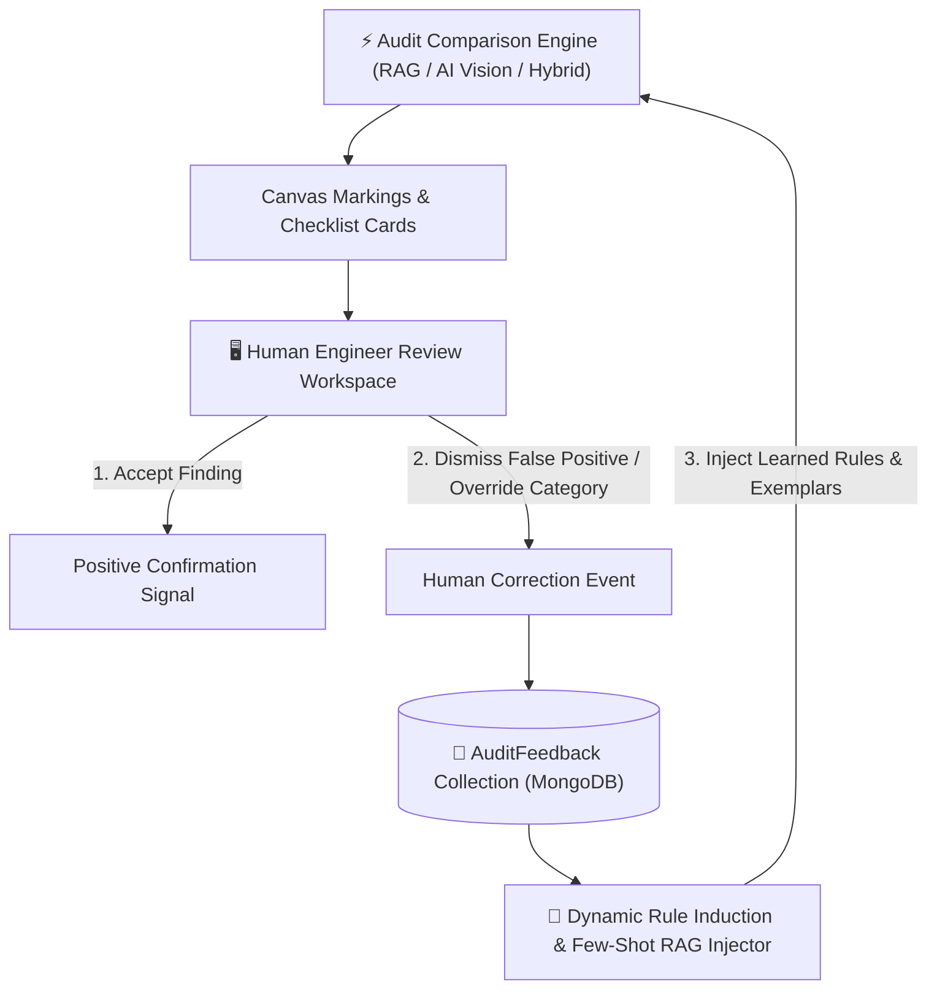

# 🔁 Continuous Learning & Human-in-the-Loop (HITL) Feedback

The core paradigm of **AI-2D-Checker** is **Active Learning through Human Feedback**.
Instead of acting as a static model that makes the same mistake twice, the system captures human engineer corrections in the 2D workspace and feeds them back into the audit pipeline.

---

## 🔂 The Self-Correcting Feedback Flywheel



---

## 🛠️ System Architecture

### 1. Human Feedback Capture (`AuditFeedbackDocument`)
Whenever a user:
- Marks an AI finding as **Dismissed / False Positive**
- Overrides a finding's **Category** (e.g. moving an item from `drawing_views` to `title_block`)
- Adds a **Correction Note** or manual pin annotation

The system records an `AuditFeedbackDocument` containing:
- `drawing_id` & `client_name`
- `entity_text` & `entity_handle`
- `original_status` vs `human_corrected_status`
- `original_category` vs `human_corrected_category`
- `spatial_coordinates` $(x, y)$

---

### 2. Few-Shot RAG Prompt Injection
During subsequent AI Vision or RAG+AI comparison runs for the same client or drawing family, the backend queries historical `AuditFeedbackDocument` entries:

```text
SYSTEM INSTRUCTION AUGMENTATION:
"Human Feedback Context for Client [KMTI]:
- Humans consistently dismiss callouts matching '12.5S' or '100S ~ 50S' as static tolerance table entries.
- Do NOT output '12.5S' under drawing_views. Mark as MATCHED or exclude."
```

---

### 3. Autonomous Rule Induction
When multiple human engineers dismiss the same pattern $N \ge 3$ times across a client directory, the system automatically promotes the pattern into deterministic filters (`safe_filter` in `orchestrator.py` & `zone_detector.py`).

---

## 🔗 Related Notes
- Return to [[00 - Map of Content (MOC)]]
- See [[System Overview]]
- See [[RAG Engine (Deterministic)]]
- See [[AI Vision Engine (Live DXF)]]
- See [[Japanese CAD Title Block & Tolerance Standards]]
