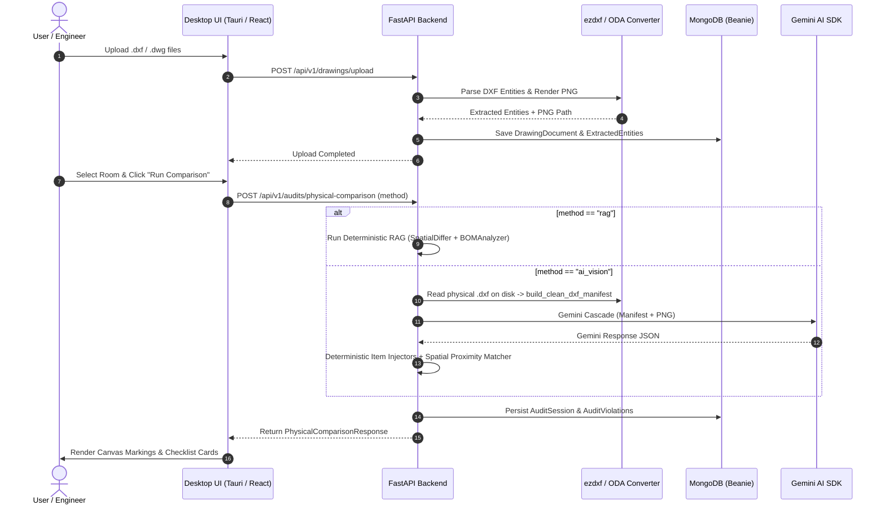

# 🔄 Data Flow & Pipelines

This document outlines the complete sequence of events from file upload to 2D view rendering, audit execution, and PDF report compilation.

---

## 🛰️ Complete End-to-End Pipeline

---

## 🔗 Related Notes
- Return to [[00 - Map of Content (MOC)]]
- See [[System Overview]]
- See [[RAG Engine (Deterministic)]]
- See [[AI Vision Engine (Live DXF)]]
