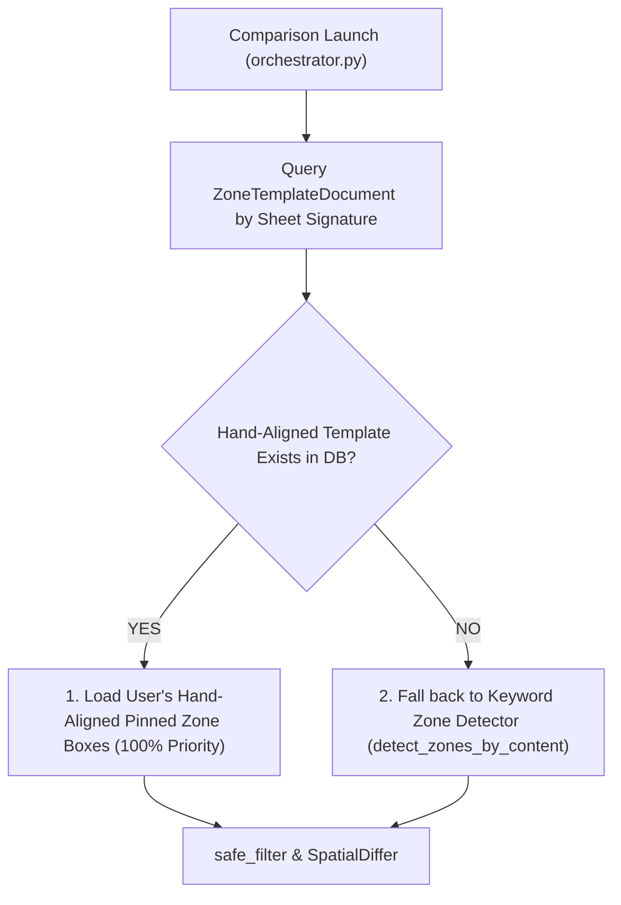

# 📐 Hand-Aligned Editable Zone Box Template Resolution

Hand-aligned **Editable Zone Boxes** (`ZoneTemplateDocument` / UI Zone Bounding Box Overlay Editor) allow human engineers to visually drag, expand, and pin exact bounding boxes per sheet layout template.

**Every aligned zone is saved** — all seven, including `notes` and `iso`. An earlier design filtered
to the sheet furniture only; commit `fe643f4` removed that filter deliberately, on the reasoning
that a zone a human has placed should stay where they put it, with `RESET` as the way back to
detection. The `STABLE_ZONES` constant in `TwoDWorkspace.tsx` survives only to drive the `*` caveat
marker in the zone picker, and no longer gates saving.

> [!IMPORTANT]
> Regions are merged `{...reference, ...revision}`, so the **revision's** box wins on any zone
> aligned differently on the two sides. That matters for `notes`, which can be two columns on one
> sheet and one on the other: the template carries the revision's shape and imposes it on both.

User-pinned hand-aligned zone boxes take **100% priority** in the comparison pipeline over automated fallback keyword detection heuristics.

---

## 🏛️ Zone Box Resolution Hierarchy

---

## 🛠️ Implementation Architecture

1. **[`services/backend/infrastructure/audit/bom/zone_template_resolver.py`](file:///d:/RAYSAN/ai-2d-checker/services/backend/infrastructure/audit/bom/zone_template_resolver.py)**
   - `resolve_zone_overrides()`: Derives the sheet signature (`zone_signature()`), checks MongoDB for a hand-aligned `ZoneTemplateDocument`, and converts normalized user fractions (`ZoneFractions`) to absolute CAD coordinates `[min_x, min_y, max_x, max_y]` via `fractions_to_absolute_bbox()`.
   - **The Y axis is flipped here.** `ZoneFractions` is stored Y-DOWN (fraction 0 = top of sheet, matching the client's `customRegions`); CAD is Y-UP. Getting it backwards mirrors every pinned zone, which looks plausible because zones cluster near the sheet's vertical centre. See [[Gotcha - Zone Detection Accuracy & Stability]].

2. **[`services/backend/infrastructure/audit/bom/table_extractor.py`](file:///d:/RAYSAN/ai-2d-checker/services/backend/infrastructure/audit/bom/table_extractor.py)**
   - `extract_dynamic_regions_async()`: Wraps dynamic region extraction and marks resolved zone confidence as `"user_pinned_template"`.

3. **[`services/backend/infrastructure/audit/comparison/orchestrator.py`](file:///d:/RAYSAN/ai-2d-checker/services/backend/infrastructure/audit/comparison/orchestrator.py)**
   - Evaluates `await extract_dynamic_regions_async(ref_entities, signature=ref_sig)` at comparison launch, enforcing user-pinned zone bounding boxes across all downstream spatial filters (`safe_filter`, `extract_title_ul_kv`, `SpatialDiffer`).

---

## 🧪 Verification & Test Suite
- `tests/test_zone_template_resolver.py` — 23 tests, runs with the suite.
- `tests/test_zone_template_growth.py` — pinned-BOM growth and the `views` exclusion contract.

> [!NOTE]
> This note previously cited `services/backend/tests/test_zone_template_resolver.py`. That path is
> in the shadow directory outside `pyproject.toml`'s `testpaths` and does not run — the real,
> executing test is at the repo root under `tests/`.
