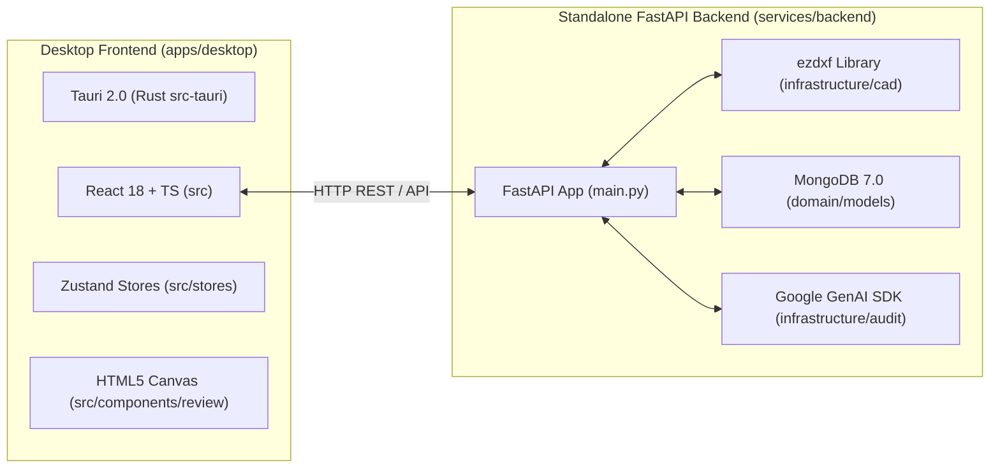

# 🏗️ System Overview

The **AI-2D-Checker** is a professional desktop & standalone backend application designed for industrial 2D mechanical CAD drawing verification (JIS B 0001 / ISO 128 standards).

---

## 🏛️ Technology Stack & Repository Layout

---

## 🔑 Key Module Directories

1. **Standalone FastAPI Backend** ([`services/backend`](file:///d:/RAYSAN/ai-2d-checker/services/backend)):
   - Application Entry: [`services/backend/main.py`](file:///d:/RAYSAN/ai-2d-checker/services/backend/main.py)
   - Routers & Endpoints: [`services/backend/api/routers`](file:///d:/RAYSAN/ai-2d-checker/services/backend/api/routers)
   - Audit Comparison Orchestrators: [`services/backend/infrastructure/audit/comparison`](file:///d:/RAYSAN/ai-2d-checker/services/backend/infrastructure/audit/comparison)
   - CAD Ingestion & Parsing: [`services/backend/infrastructure/cad`](file:///d:/RAYSAN/ai-2d-checker/services/backend/infrastructure/cad)

2. **Desktop UI Client** ([`apps/desktop`](file:///d:/RAYSAN/ai-2d-checker/apps/desktop)):
   - Tauri App Config: [`apps/desktop/src-tauri/tauri.conf.json`](file:///d:/RAYSAN/ai-2d-checker/apps/desktop/src-tauri/tauri.conf.json)
   - 2D Workspace Views: [`apps/desktop/src/components/review/TwoDWorkspace.tsx`](file:///d:/RAYSAN/ai-2d-checker/apps/desktop/src/components/review/TwoDWorkspace.tsx)
   - Imperative Canvas: [`apps/desktop/src/components/review/DrawingCanvas.tsx`](file:///d:/RAYSAN/ai-2d-checker/apps/desktop/src/components/review/DrawingCanvas.tsx)

3. **Domain Models & Persistence**:
   - MongoDB Beanie Models: [`services/backend/domain/models`](file:///d:/RAYSAN/ai-2d-checker/services/backend/domain/models) (`DrawingDocument`, `AuditSession`, `AuditViolation`, `ExtractedEntity`).

---

## 🔗 Related Notes
- Return to [[00 - Map of Content (MOC)]]
- See [[Data Flow & Pipelines]]
- See [[00 - AI Agent Navigation & System Gap Analysis]]
