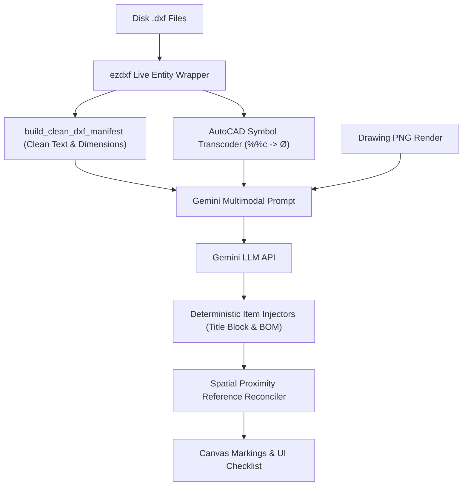

# 👁️ AI Vision Engine (Live DXF)

> [!WARNING] **REMOVED 2026-08-07 — this engine no longer exists.**
> `method == "ai_vision"` was deleted, backend and frontend, by
> [[ADR-006 Removing the Three AI Comparison Methods]], which closed the deletion question
> [[ADR-004 Deterministic-Only Scope]] had explicitly left open. Implementation:
> `live_dxf_orchestrator.py + full_ai_orchestrator.py` — recoverable from git history only.
>
> **This note is kept as the record of what the engine did and why**, not as a description of
> the system. Everything below is past tense in fact if not in grammar. `comparison_method` is
> now `Literal["rag"]`, and the deterministic differ is the only engine there is.

The **AI Vision Engine** (`method == "ai_vision"`) performs live multimodal drawing audit comparisons by reading physical `.dxf` disk files on the fly and pairing them with high-resolution drawing PNG image renders inside Gemini LLM prompts.

---

## 💡 Architecture & Design

> [!IMPORTANT]
> **Real DXF Integration**: Operates directly on uploaded `.dxf` (or on-the-fly converted `.dwg`) files in `storage/uploads/`, matching how external AIs (ChatGPT, Gemini, Claude) inspect physical drawing files.

---

## 🌟 Key Features

1. **Compact Entity Manifest (`build_clean_dxf_manifest`)**:
   - Prunes non-semantic raw float line/polygon vertex numbers.
   - Extracts 100% of text annotations, dimension callouts, handles `[1B2A]`, title block attributes, and BOM rows.
   - **8x Token Payload Reduction**: Reduces prompt size from 300KB to ~15KB, dropping latency from **83 seconds to ~8–12 seconds**.

2. **AutoCAD Symbol Transcoding**:
   - Transcodes legacy AutoCAD control escape codes:
     - `%%c` / `%%C` $\rightarrow$ **`Ø`** (Diameter)
     - `%%d` / `%%D` $\rightarrow$ **`°`** (Degree)
     - `%%p` / `%%P` $\rightarrow$ **`±`** (Plus/Minus)

3. **100% Guaranteed Item Coverage**:
   - Combines Gemini's visual notes reasoning with deterministic injectors for Title Block fields, BOM table rows, Assembly Balloons, and Auto-Matched callouts.

---

## 🔗 Related Notes
- Return to [[00 - Map of Content (MOC)]]
- Compare with [[RAG Engine (Deterministic)]]
- See [[Hybrid Engine (Cross-Verification)]]
