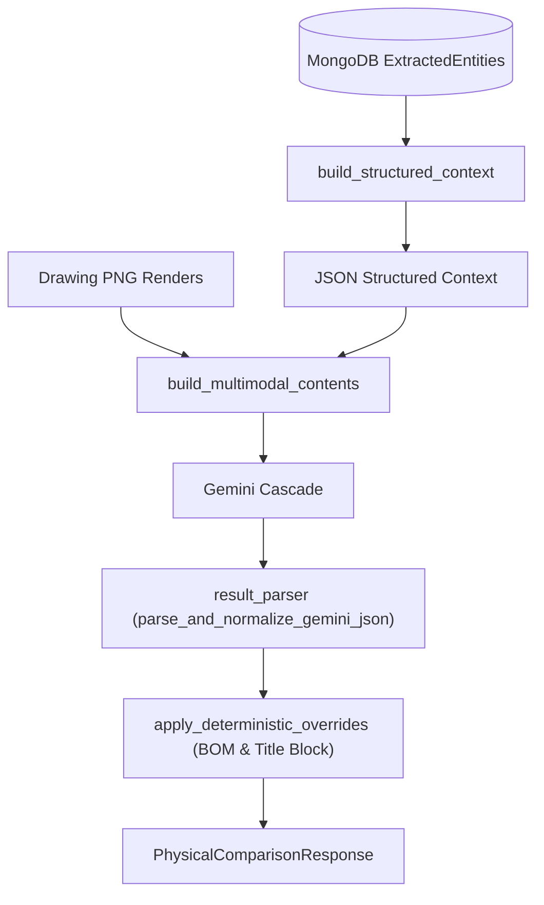

# 🤖 RAG + AI Engine

The **RAG + AI Engine** (`method == "rag_ai"`) combines database-ingested structured CAD context (`ExtractedEntity` models from MongoDB) with Gemini LLM reasoning.

---

## 🛠️ Pipeline Flow

---

## 🔗 Related Notes
- Return to [[00 - Map of Content (MOC)]]
- See [[RAG Engine (Deterministic)]]
- See [[AI Vision Engine (Live DXF)]]
