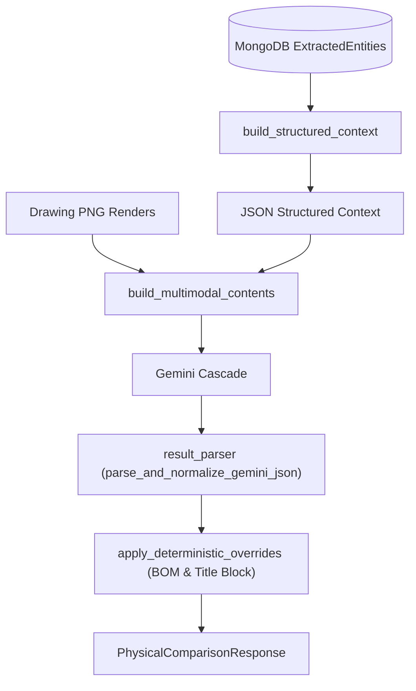

# 🤖 RAG + AI Engine

> [!WARNING] **REMOVED 2026-08-07 — this engine no longer exists.**
> `method == "rag_ai"` was deleted, backend and frontend, by
> [[ADR-006 Removing the Three AI Comparison Methods]], which closed the deletion question
> [[ADR-004 Deterministic-Only Scope]] had explicitly left open. Implementation:
> `full_ai_orchestrator.py + the full_ai/ package` — recoverable from git history only.
>
> **This note is kept as the record of what the engine did and why**, not as a description of
> the system. Everything below is past tense in fact if not in grammar. `comparison_method` is
> now `Literal["rag"]`, and the deterministic differ is the only engine there is.

The **RAG + AI Engine** (`method == "rag_ai"`) combines database-ingested structured CAD context (`ExtractedEntity` models from MongoDB) with Gemini LLM reasoning.

---

## 🛠️ Pipeline Flow

---

## 🔗 Related Notes
- Return to [[00 - Map of Content (MOC)]]
- See [[RAG Engine (Deterministic)]]
- See [[AI Vision Engine (Live DXF)]]
