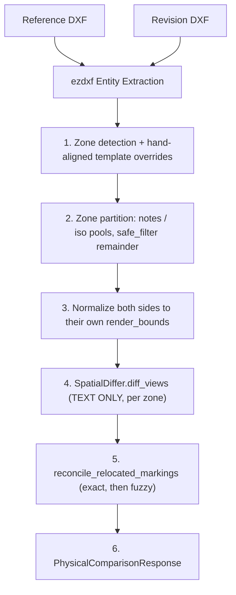

# ⚡ RAG Engine (Deterministic)

The **RAG Engine** (`method == "rag"`) is the 100% offline, rule-based mathematical comparison pipeline. It compares vector entities extracted directly from `.dxf` files without calling any cloud AI service.

---

## 🚀 Key Advantages

> [!NOTE]
> - **$0.00 API Cost**: Does not consume Gemini or OpenAI API tokens.
> - **100% Reproducible**: Guaranteed mathematical determinism without LLM hallucination risk.
> - **Fast, but the "~30–50ms" figure previously stated here was never measured** and predates
>   zone detection, geometry diffing and reconciliation. For scale, the zone pass alone measures
>   ~220ms on a 528-entity sheet (see [[ADR-002 Decoupled Zone Bounding Box Endpoint]]). Measure
>   before quoting a latency.

---

## 🛠️ Internal Pipeline Architecture

> [!IMPORTANT] Step 3 is not optional
> The two drawings are **not necessarily in the same coordinate space**. A DXF without a
> paper-space viewport stays in model units; one with a viewport is projected to paper units.
> Measured on the corpus pair that is a **2.500× difference**, which a translation-only
> pre-alignment cannot absorb — it emitted unchanged title-block text as REMOVED on one side and
> ADDED on the other. See [[Gotcha - Reference and Revision in Different Coordinate Spaces]].

---

## 🧮 Core Algorithms

### 1. 2D Global Shift Alignment (`SpatialDiffer.calculate_global_offset`)
Calculates the median $(X, Y)$ coordinate shift between drawings by comparing matching text anchors. Automatically aligns drawings if one was shifted in the CAD layout.

### 2. Surface Roughness & Tolerance Exclusions (`safe_filter`)
Automatically excludes static template regions:
- [[Zone Detector & Bounding Boxes]] filters out General Tolerance Tables (`指示外公差`, `Tolerances unless otherwise specified`).
- Regex pattern matcher excludes surface roughness $R_z$ range callouts (`12.5S`, `100S ~ 50S`, `6.3S ~ 1.6S`).

### 3. Spatial Neighbour Matching — thresholds are **sheet fractions**, not millimetres
An earlier version of this note stated a "150mm 2D Euclidean spatial radius limit". That is no
longer true and was never safe: an absolute radius means different things on two sheets at
different scales — 150 units is 13% of the corpus reference sheet and 32% of its revision.

Matching runs in a normalized frame, so the radii are fractions of the sheet
(`spatial_differ.py`): strict `0.005`, digital-twin `0.010`, fuzzy `0.150`. They are direct
conversions of the old absolute values against the reference sheet, so the tuning is preserved —
only the scale-blindness was fixed.

### 4. Geometry is NOT compared — accepted limitation
This engine compares **text only**. `SpatialDiffer.diff_views` pools on `entity_type == 'text'`, so
lines, circles, arcs, ellipses and splines are never diffed, and `diff_views` returns `[]` the
moment either side's pool is empty. Consequence: **a zone present on only one sheet and carrying no
text reports nothing at all** — an entire added isometric view is invisible to the audit.

A `geometry_differ.diff_geometry` pass was built for exactly this and **reverted on 2026-08-04**
(cache v33): clustering unmatched primitives produced findings like `Geometry: 10 line` that state
a count and a primitive type but no engineering content, and they crowded out the text findings.
Read [[Gotcha - The Differ Compared Text Only]] before proposing this again — the requirement it
failed is that a finding must say *what changed*, not how many primitives differ.

### 5. Marking Reconciliation (`marking_reconciler`)
Because zones are detected per drawing, the same content can land in different pools on the two
sides and be reported twice — REMOVED from one zone, ADDED to another. Unambiguous pairs are
merged: identical text → MATCHED, similar text → CHANGED.

---

## 🔗 Related Notes
- Return to [[00 - Map of Content (MOC)]]
- Compare with [[AI Vision Engine (Live DXF)]]
- See [[Zone Detector & Bounding Boxes]]
