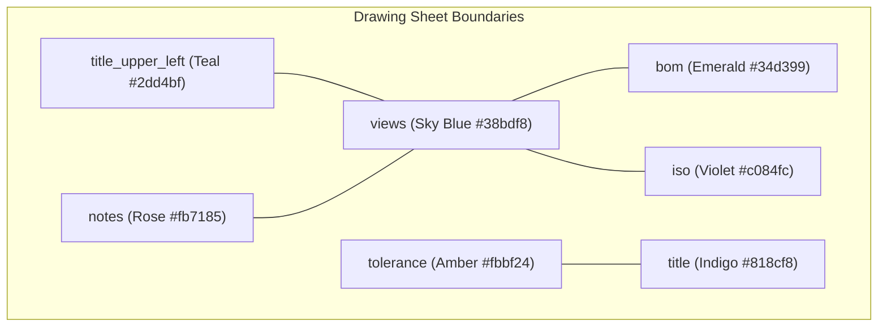

# 🔲 Zone Detector & Bounding Boxes

The **Zone Detector** (`zone_detector.py`) is a content-aware zone segmentation system that identifies where key engineering zones physically reside in CAD world coordinates $(x, y)$.

---

## 📐 The 7 Canonical Drawing Zones

`ZONE_ANCHORS` holds the *candidate* phrases. Which ones actually fire on a given drawing is a
different question, and is now recorded per drawing under `zones["_anchor_matches"]`. The right
column below is the **measured** answer on the 4-drawing corpus (2026-07-29) — use it, not the
candidate list, when deciding which anchor to tune.

| Zone Key | Description | Anchors that ACTUALLY fire (4/4 drawings unless noted) | Render Color |
| :--- | :--- | :--- | :--- |
| **`title`** | Bottom-Right Title Block | `approved`, `checked`, `designed`, `drawn`, `図面番号`, `設計`, plus `訂正` on 2 of 4 | Indigo `#818cf8` |
| **`title_upper_left`** | Top-Left Metadata Block | `part no`, `stock q'ty`, `t. q'ty`, `unit no`, `コードno`, `ユニットno`, `在庫棚入庫`, `総製作個数` | Teal `#2dd4bf` |
| **`bom`** | Bill of Materials / Parts Table | `finished weight`, `material weight`, `仕上重量`, `素材重量` | Emerald `#34d399` |
| **`tolerance`** | General Tolerance Legend Block | `tolerances unless otherwise specified`, `roughness range`, `表面粗さ` | Amber `#fbbf24` |
| **`notes`** | Technical Notes & Reqs | `なきこと`, `仕上げ`, `面取り` | Rose `#fb7185` |
| **`iso`** | 3D Isometric View | **none — resolved geometrically**, by ellipse density | Violet `#c084fc` |
| **`views`** | Main Geometry Drawing Views | **none — it is the sheet**; exclusion lives in `in_views()` | Sky Blue `#38bdf8` |

> [!WARNING] The documented anchors were not the operative ones
> This table previously listed `tolerance` as anchored by `指示外公差 / 指示無き公差 / 表示外公差 /
> 仕上精度`. **None of those fire on any corpus drawing** — the phrases that actually resolve the
> zone are the three above. Likewise `bom` was listed as `parts list / bill of materials / 部品表 /
> 材料明細`, none of which match either. Someone tuning from the old table would have been editing
> dead anchors. Check `_anchor_matches` before touching `ZONE_ANCHORS`.

---

## 🔍 Visual Bounding Box Endpoint (`GET /drawings/{id}/zones`)

To allow engineers and developers to debug zone detection professionally:
1. **Endpoint**: `GET /api/v1/drawings/{id}/zones` returns the exact CAD world coordinates `(xmin, ymin, xmax, ymax)` and resolution confidence. **Three** confidence values, not two:
   - `content_aware` — semantic anchor found and flood-filled. A measurement.
   - `percentage_fallback` — no anchor; percentage grid over real sheet bounds. A plausible guess, rendered dashed with a `?`.
   - `percentage_fallback_no_sheet_bounds` — `compute_drawing_bounds` returned nothing, so **all seven zones are the literal `(0, 0, 1000, 1000)` placeholder**. This one must never be drawn: seven identical rectangles near the origin read as a broken overlay rather than as failed bounds detection.
2. **Canvas Rendering**: Rendered inside `CanvasRenderer` with color-coded borders, semi-transparent fill, and top-left badge pills.
3. **Toggle Control**: **`Edit Zone Boxes`** in the ⋮ View menu of the 2D Review Workspace. The former read-only `Zones` toolbar button was removed — it drew a near-identical box set to the editor with different semantics, and there was no way to tell which one a drag would affect.

---

---

## 📏 Current accuracy (re-measured 2026-07-29)

The warning that used to sit here — `iso` never detected, `notes`/`views`/`tolerance` moving
33–64pp — described the state before the ingestion and detector fixes. Superseded:

| Zone | Spread | Detected |
| :--- | ---: | :--- |
| bom | 1.7pp | 4/4 |
| iso | 1.8pp | 2/4 — the two drawings that *have* an isometric view |
| views | 0.0pp | 4/4 — it is the sheet, so it cannot vary |
| notes | 11.3pp | 4/4 |
| tolerance | 11.3pp | 4/4 |
| title | 11.6pp | 4/4 |
| title_upper_left | 25.8pp | 4/4 |

> [!IMPORTANT] Two things not to misread
> - **`views` at 0.0pp is not stability.** The box is the sheet by definition. `views` is a
>   *predicate*: use `zone_detector.in_views(x, y, regions)`, which is
>   `inside(sheet) AND NOT inside(any other zone)`. The raw box admits every title block, BOM row
>   and notes line on the sheet. Any consumer using it as a containment region must subtract the
>   siblings via `views_exclusions()`.
> - **`iso` at 2/4 is correct, not a failure.** Roughly half of real sheets have no isometric view.
>   Returning nothing for those is the intended behaviour.
>
> The corpus is 4 drawings that are effectively **2 layouts × 2 near-copies**, n≈2. Read
> [[Gotcha - Zone Detection Accuracy & Stability]] before trusting a number here or tuning an anchor.

## Zone ownership when boxes overlap

The evidence behind `zone_ownership.py`'s precedence order, moved here from its module docstring
so the module states the rule and this note carries the measurement.

### Zones overlap by design

Not a defect to tune away: it is how the sheet is laid out and how the detector's quadrant priors
are written. Measured over the corpus (12 sides), counting the text entities inside each
intersection rather than the empty paper:

| zone pair | pinned | detected |
| :--- | ---: | ---: |
| `views` x `tolerance` | 72 | 1840 |
| `views` x `title` | 36 | 818 |
| `title` x `tolerance` | 570 | 622 |
| `views` x `bom` | 241 | 240 |
| `views` x `title_upper_left` | 147 | 216 |
| `bom` x `tolerance` | 0 | 72 |
| `title_upper_left` x `tolerance` | 0 | 54 |
| `title_upper_left` x `notes` | 1 | 31 |
| `bom` x `iso` | 1 | 24 |

Collisions are 5-30x worse without a hand-aligned template, which is the direction this system is
moving in. Two pairs are structural rather than accidental: `iso`'s quadrant prior is `x > 0.30w`
with no y bound, so it strictly contains `bom`'s `x > 0.50w and y > 0.35h`; and `notes`' prior is
`y > 0.15h` with no x bound, so it spans the whole of `title_upper_left`'s. Those two cannot be
separated by the priors at all.

### Why the module exists

Ownership was decided at four separate call sites, in an order that was implicit and incomplete:
`views_exclusions()` / `VIEWS_EXCLUDED_ZONES`, where `views` yields to everyone; the
`exclude_bboxes=[tolerance, title, bom]` list for `notes`; the same list again for `iso`; and a
fourth added to `extract_title_ul_kv` on 2026-08-12 and reverted the same day for costing
detection-only F1 0.7736 -> 0.7339.

`notes` vs `iso` had no rule in any of them. Neither pool excluded the other and the markings are
concatenated with no de-duplication, so an entity in that intersection is diffed twice and emitted
under two categories. The hole is latent rather than live: the census above finds `notes` x `iso`
firing on zero corpus sides, pinned or detected, so closing it moved no metric. It was closed
because it costs nothing to close and the priors permit it, not because it was hurting.

### Why the precedence is in that order

A zone with a drawn border outranks one without. That is the first cut, not the whole rule --
`ZONE_PRECEDENCE` in `zone_ownership.py` is the order itself, and two zones do not sit where the
border ranking alone would put them.

The ruled-border spike measured, for each zone, the best-IoU rectangle actually drawn on the sheet
-- chosen knowing the answer, so it bounds any rule rather than describing one:

    views 0.97 | title 0.95 | tolerance 0.85 | title_upper_left 0.62
    bom   0.37 | notes 0.08 | iso       0.06

`title` and `tolerance` are real ruled boxes and win. `notes` and `iso` score 0.06-0.08 because
these sheets carry no drawn box around either -- their best candidate is the whole sheet frame --
so they rank last among content zones. Both departures from that ranking were measured rather than
chosen:

- **`bom` joins the top tier** on a 0.37 ceiling, on the eval rather than the geometry:
  `bill_of_materials` and `title_block` score byte-identical detected vs templated, so detection
  needs no human for either. `shim` is there as a compact ruled parts table and a SAFE zone whose
  whole job is keeping its reference rows out of everyone else's pool.
- **`title_upper_left` does not outrank `notes`** on its 0.62 ceiling. Ranking it there dropped
  `notes_section` recall to **0.54**, because its *detected* box swallows the notes block whole --
  see [[Gotcha - Adding a Note Destroys the Notes Zone]]. It is a peer of `notes` and `iso`, with
  content breaking the tie.

`views` has the best border of all and still yields to everyone, because it is not a block: it is
the drawing AREA, defined by exclusion. That is a statement about what the zone means, not about
how well it can be found.

`notes` and `iso` tie deliberately, because geometry genuinely cannot rank them, which is the same
reason the notes box is unreliable in the first place. The tie is broken by content in
`notes_classifier.py`, not by an arbitrary extra rung.

## 🔗 Related Notes
- See [[Gotcha - Zone Detection Accuracy & Stability]]
- Return to [[00 - Map of Content (MOC)]]
- See [[RAG Engine (Deterministic)]]
- See [[CanvasRenderer & Entity Drawing]]
