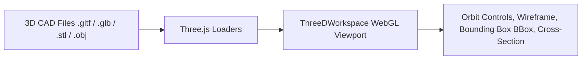

# 🧊 3D Workspace & Mesh Rendering

The **3D Workspace** (`ThreeDWorkspace.tsx`) is the 3D model inspection tab in the desktop application. It provides interactive 3D WebGL mesh rendering and cross-verification between 3D solid models and 2D blueprint drawings.

---

## 🛠️ Key Capabilities

1. **3D Model Loaders**: Supports `.gltf`, `.glb`, `.stl`, and `.obj` 3D solid geometry meshes.
2. **Interactive Controls**: Orbit rotation, pan, zoom, wireframe toggle, explode view, and lighting customization.
3. **2D/3D Association**: Allows engineers to associate 3D solid bounding dimensions against 2D orthogonal projection views.

---

## 🔗 Related Notes
- Return to [[00 - Map of Content (MOC)]]
- See [[System Overview]]
- See [[CanvasRenderer & Entity Drawing]]
