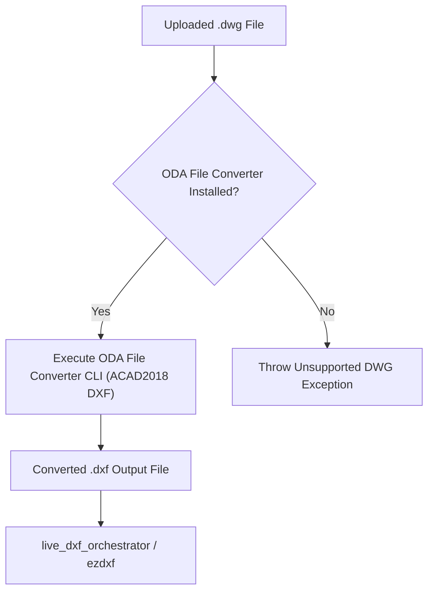

# 🔄 ODA DWG-to-DXF Converter

The **ODA Converter** (`ODAConverter` in `services/backend/infrastructure/cad/oda_converter.py`) handles conversion of proprietary AutoCAD `.dwg` binary files into standard ASCII/Binary `.dxf` files.

---

## 🛠️ How It Works

1. **Auto-Detection**: Scans the operating system for installed OpenDesign Alliance (ODA) File Converter executables.
2. **On-The-Fly Conversion**: When a `.dwg` file is uploaded or selected for live AI comparison, `ODAConverter` converts it to `ACAD2018 DXF` in temporary storage.
3. **Automatic Cleanup**: Temporary converted `.dxf` files are safely unlinked after audit execution completes.

---

## 🔗 Related Notes
- Return to [[00 - Map of Content (MOC)]]
- See [[ezdxf Entity Extraction]]
- See [[AI Vision Engine (Live DXF)]]
