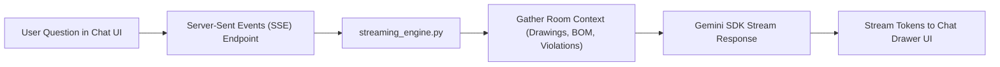

# 💬 Copilot AI Streaming Engine

The **Copilot Assistant** (`services/backend/infrastructure/ai/copilot/streaming_engine.py`) provides real-time AI conversation and CAD engineering guidance inside the desktop workspace.

---

## ⚡ Real-Time Streaming Architecture

1. **Context-Aware Assistance**: Automatically feeds current room findings, BOM discrepancies, and active drawing metadata into the system prompt.
2. **Server-Sent Events (SSE)**: Streams text tokens incrementally to the desktop UI for instant response rendering.

---

## 🔗 Related Notes
- Return to [[00 - Map of Content (MOC)]]
- See [[System Overview]]
- See [[AI Vision Engine (Live DXF)]]
