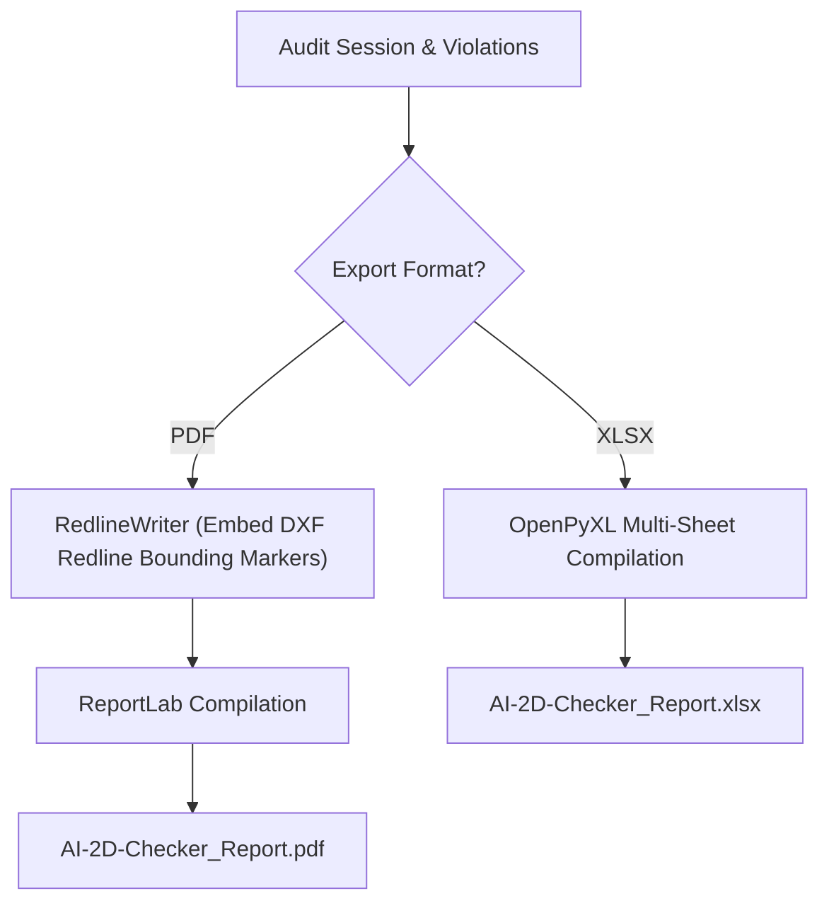

# 📄 PDF & XLSX Report Generation

The report export subsystem (`ReportGenerator` in `services/backend/infrastructure/audit/report_generator.py`) generates official audit PDF reports and detailed technical Excel sheets.

---

## 🛠️ Export Pipeline

1. **PDF Compilation (`/api/v1/reports/{session_id}/pdf`)**:
   - Embeds redline blueprint exports with color-coded violation boxes (`RedlineWriter`).
   - Formats non-conformances into structured tables sorted by severity (`critical`, `high`, `medium`, `low`).

2. **XLSX Technical Sheets (`/api/v1/reports/{session_id}/xlsx`)**:
   - Exports structured multi-tab Excel sheets containing BOM discrepancies, Title Block changes, and Drawing View checklist items.

---

## 🔗 Related Notes
- Return to [[00 - Map of Content (MOC)]]
- See [[RAG Engine (Deterministic)]]
- See [[System Overview]]
