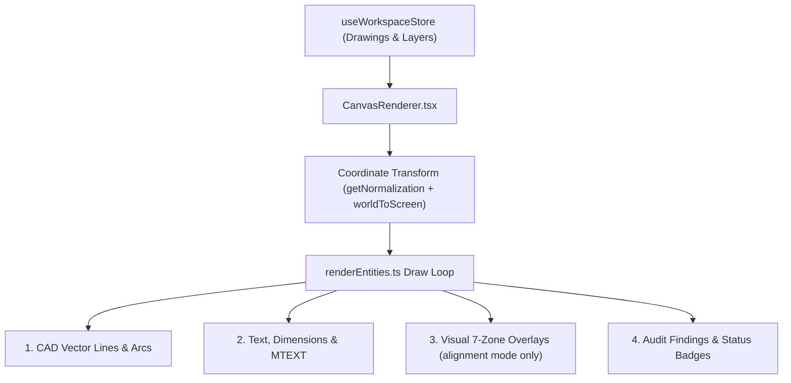

# 🖥️ CanvasRenderer & Entity Drawing

The **CanvasRenderer** (`CanvasRenderer.tsx` & `renderEntities.ts`) is the high-performance HTML5 Canvas rendering engine responsible for rendering 2D vector CAD drawings, annotations, and diagnostic zone overlays in the desktop app.

> [!NOTE] Vector is the only path — there is no `renderMode`.
> This note claimed "renders 2D vector CAD drawings" from 2026-07-28, but until 2026-08-11 the
> canvas defaulted to raster and displayed a server-rendered PNG.
> [[ADR-011 Vector as the Only Render Path]] removed `renderMode`, the PNG fetch, the mipmap
> chain and the light-theme recolour. The backend still generates the PNG — as the source of `render_bounds` and an input
> to title-block OCR — but nothing renders it to a user. Fidelity is measured by
> `tools/render_audit.py`, not by eye.

---

## 🎨 Rendering Architecture

---

## 🛠️ Key Utilities

1. **`cleanCadText(text)`**:
   - Strips residual AutoCAD MTEXT formatting/styling tags (`\P`, `\W...;`, `{...}`).
   - Transcodes legacy CP932 characters.

2. **`worldToScreen(wx, wy, norm, viewport)`**:
   - Maps 2D CAD world coordinates to screen pixel coordinates on the canvas.
   - Handles CAD Y-axis inversion (CAD $+Y$ goes up; Screen $+Y$ goes down).
   - Pan and zoom arrive together inside `viewport` (`{x, y, scale}`), not as separate
     arguments. Two sibling functions deliberately skip the Y-flip — see the header comment
     in `utils/coordinateTransform.ts` before using any of them.

3. **Zone BBox Overlay Layer** (`renderZoneEditor` in `renderEntities.ts`):
   - Renders 7-zone bounding boxes imperatively inside the `CanvasRenderer` pass to guarantee
     frame-perfect zoom & pan synchronization without SVG lag.
   - Drawn in **screen space after `ctx.restore()`**, converting corners itself, so stroke
     width and badge text stay a constant pixel size at any zoom. Drawing inside the world
     transform would require dividing every stroke width and font size by `scale`.
   - Boxes come from `customRegions` (Y-DOWN fractions, per drawing id); the detected payload
     is passed in only to mark whether each zone was measured or guessed.
   - Excluded from exports — `renderContent` is the same path `useComplianceReportExport`
     drives for PDF report images.

---

## 🔗 Related Notes
- Return to [[00 - Map of Content (MOC)]]
- See [[Zone Detector & Bounding Boxes]]
- See [[System Overview]]
