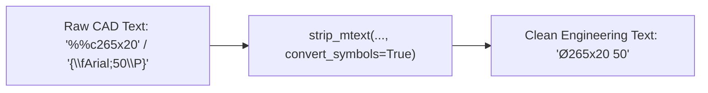

# 🔥 Gotcha — AutoCAD Control Escape Codes & MTEXT Formatting

## ⚠️ The Problem
Raw AutoCAD DXF files store engineering symbols using legacy control escape codes (`%%c265x20`) and MTEXT styling blocks (`{\fArial|b0;1.0\P}`). When comparing raw extracted strings, AI Vision or SpatialDiffer failed to match callouts like `Ø265x20` against `%%c265x20`.

---

## 🛠️ Transcoding Rules & Solution

We built `strip_mtext(text, convert_symbols=True)` in `services/backend/infrastructure/utils/text.py` and connected it across all entity parsing pipelines:

| Legacy Escape Code | Meaning | Clean Transcoded Symbol |
| :--- | :--- | :--- |
| **`%%c` / `%%C`** | Diameter Symbol | **`Ø`** |
| **`%%d` / `%%D`** | Degree Symbol | **`°`** |
| **`%%p` / `%%P`** | Plus/Minus Symbol | **`±`** |
| **`\P`** | MTEXT Paragraph Break | Replaced with single space |
| **`{\f...; ... }`** | MTEXT Font & Formatting Tags | Stripped out cleanly |

---

## 🔥 The sequel — that stripping was destroying Shift-JIS characters

The rules above are applied **before** `dxf_parser.transcode_value` decodes CP932. That
ordering is deliberate (see `strip_mtext`'s docstring on `convert_symbols`), but it means the
cleaner operates on **raw CP932 bytes held one-per-character in a latin-1 string**.

A CP932 trail byte is legal in `0x40–0x7E` and `0x80–0xFC`. That range contains the exact
characters MTEXT uses for markup:

| byte | char | stripped by |
| :--- | :--- | :--- |
| `0x5C` | `\` | the backslash-escape rule — which also ate the **following** byte |
| `0x7B` | `{` | the brace strip |
| `0x7D` | `}` | the brace strip |
| `0x7E` | `~` | `\~` non-breaking space |

So any character whose second byte was one of those got mutilated. This is the classic
Shift-JIS **dame-moji / 5C problem**, and it was live in the stored entities:

| intended | stored | cause |
| :--- | :--- | :--- |
| `素材調質施工` | `素材調質詩H` | 施 = `0x8E 0x7B` |
| `イソナイト施工` | `イャiイト詩H` | ソ = `0x83 0x5C` |
| `表示外公差` | `侮ｦ外公差` | 表 = `0x95 0x5C` |

> [!IMPORTANT]
> **Not cosmetic.** `ZONE_ANCHORS["tolerance"]` contains `表示外公差`. Stored as `侮ｦ外公差`,
> that anchor could never match anything — a silent contributor to the tolerance zone's
> measured instability (64.2pp spread, 4/6 detection). Any anchor, BOM header or title-block
> label containing an affected character was equally invisible. Affected characters include
> ソ 表 十 能 予 貼 暴 施 — all common in Japanese drafting vocabulary.

### Fix

`_mask_sjis_markup_collisions` swaps each dangerous two-byte character for a private-use
placeholder *before* any markup handling, and restores it afterwards.

- **Masking runs before the `\P` replacement**, not just before the brace strip — `\P` is
  `0x5C 0x50`, so that 0x5C can itself be the second half of a kanji.
- **Each masked character gets its own placeholder.** A shared sentinel would misalign the
  restoration whenever the cleaner legitimately deleted one (e.g. inside a stripped font
  group).
- **Raw-byte mode is detected, not passed in.** A byte-preserving string is latin-1
  encodable by construction; post-transcode text containing real Japanese is not. So
  `zone_detector`, `table_extractor` and `context_builder` — which run after transcoding —
  skip the masking entirely, with no flag to thread through.
- Only `0x5C 0x7B 0x7D 0x7E` need protecting. `0x25` (`%`, for `%%c`) is not a legal CP932
  trail byte, so the symbol table above was always safe.

Verified by reproducing the stored corruption byte-for-byte with the pre-fix code, then
confirming the fix restores the original. Pinned by `tests/test_sjis_markup_collision.py`.

> [!WARNING]
> This is an **ingestion** fix. Drawings already extracted still hold the corrupted text —
> `COMPARISON_CACHE_VERSION` → `v14` invalidates cached comparisons but cannot repair stored
> entities. Re-ingest. Same shape as [[Gotcha - Dropped ELLIPSE & SPLINE Geometry]].

---

## 🔗 Related Notes
- See [[ezdxf Entity Extraction]]
- See [[AI Vision Engine (Live DXF)]]
- See [[Gotcha - Zone Detection Accuracy & Stability]] — the tolerance anchor this was breaking
- See [[Gotcha - Dropped ELLIPSE & SPLINE Geometry]] — the other ingestion-stage data loss
- Return to [[00 - Map of Content (MOC)]]
