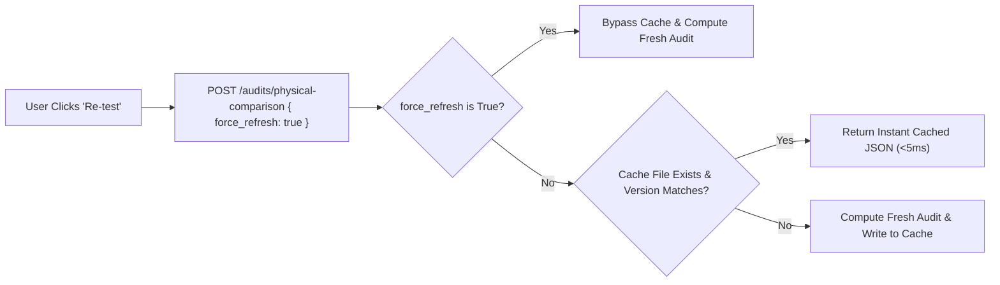

# 🔥 Gotcha — Comparison Cache Invalidation & Force Refresh

## ⚠️ The Problem
When testing logic updates in the backend (such as excluding General Tolerance tables or updating spatial matching), clicking **Re-test** in the desktop UI returned the **exact same result** without reflecting backend code fixes.

## 🔍 Root Cause Analysis
Backend terminal logs showed:
```text
[11:44:33] Comparison cache hit (rag) for reference 6a66cab4... and revision 6a66cac6...
[11:44:33] Access: POST /api/v1/audits/physical-comparison - Status: 200 - Duration: 0.1420s
```

`ComparisonCacheManager.get_cached_comparison` was serving pre-fix audit JSON payloads stored in `storage/cache/` keyed by `(ref_id, rev_id, method, cache_version)`. Code fixes were completely bypassed because the cache returned in 0.14s!

---

## 🛠️ The Solution (Two-Pronged Fix)



1. **`force_refresh` Parameter**:
   Added `force_refresh: bool` to `PhysicalComparisonRequest` in
   [`services/backend/api/schemas.py`](file:///d:/RAYSAN/ai-2d-checker/services/backend/api/schemas.py).
   When **Re-test** is clicked, the UI sends `force_refresh: true`, forcing all orchestrators to
   re-evaluate fresh code.

2. **Cache Version Levers (`COMPARISON_CACHE_VERSION`)**:
   Bumped `COMPARISON_CACHE_VERSION` in `cache_manager.py` whenever comparison math or zone detection logic changed, invalidating stale disk caches across all users.

> [!IMPORTANT] The version lever is used constantly — currently at **v17**
> This note was written at v3. Between v7 and v17 the lever was pulled for zone-anchor changes,
> the cap-then-pad fix, template resolution, ellipse/spline ingestion, coordinate-space
> normalization, marking reconciliation, the Shift-JIS repair, geometry diffing and the `views`
> predicate. Each entry in `cache_manager.py` carries a one-line note saying what invalidates.
>
> **A cache bump is not enough for an ingestion-stage fix.** It invalidates cached *comparisons*
> but cannot repair `ExtractedEntity` documents already written to MongoDB — those drawings must
> be re-ingested. This caught out both the ellipse/spline and Shift-JIS fixes.

---

## 🔗 Related Notes
- See [[RAG Engine (Deterministic)]]
- See [[ADR-002 Decoupled Zone Bounding Box Endpoint]]
- Return to [[00 - Map of Content (MOC)]]
